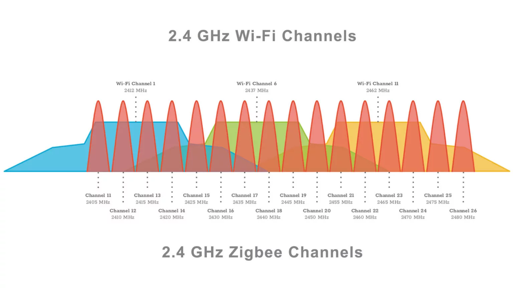
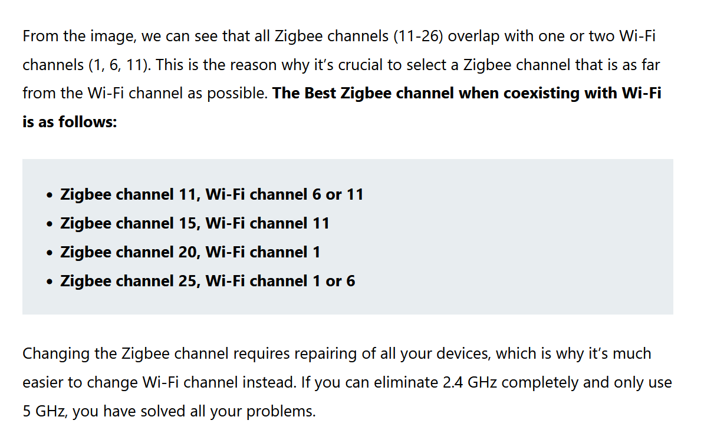
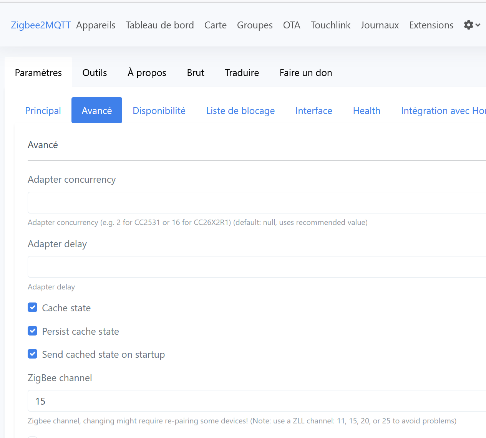
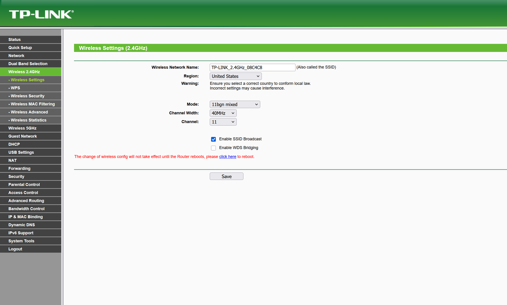

Cet [article](https://smarthomescene.com/guides/how-to-build-a-stable-and-robust-zigbee-network/) expliquant comment avoir un zigbee network solide et quels channels de zigbee et wifi overlappent:

Comme mon zigbee est sur le channel 15:

J'ai mis mon wifi 2.4 GHz sur le channel 11:

(EDIT) EN FAIT CE WIFI sur mon routeur est disabled.. c'est sur mon ubiquiti nanohd qu'il faut changer le port:

