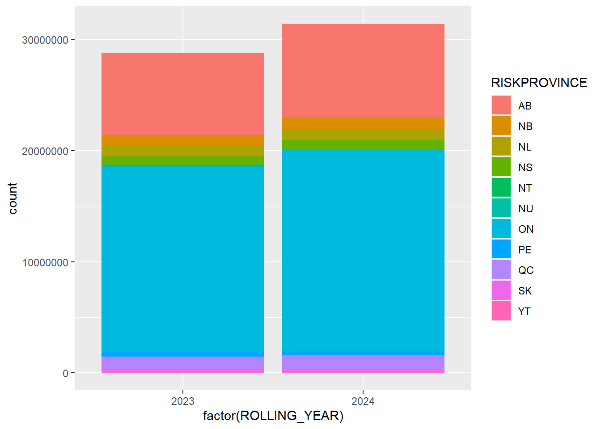

::: {.cell}

```{.r .cell-code}
library(ggplot2)
library(dbplyr)
library(aitoolbox)
library(dplyr)
library(DBI)
pool <- aitoolbox::connect_to_azure()

auto_plot <- function(pool, my_variable_name, table1, table2){
  a_float_table <- DBI::dbQuoteIdentifier(DBI::Id(schema = "BI_FLOAT_AY",   table = table1), conn = pool)
  another_float_table <- DBI::dbQuoteIdentifier(DBI::Id(schema = "BI_FLOAT_AY",   table = table2), conn = pool)
  
  my_sql_query <- "
    SELECT DISTINCT
    ROLLING_YEAR ,
    {`my_variable_name`},
  count(*) as count
    FROM (
            select ROLLING_YEAR, {`my_variable_name`}   from {a_float_table}
            union all
            select ROLLING_YEAR, {`my_variable_name`}  from {another_float_table}
  ) as combined
  GROUP BY ROLLING_YEAR, {`my_variable_name`}
  "
  
  updated_sql_query <- glue::glue_sql(my_sql_query, .con = pool)
  downloaded_data <- dbGetQuery(pool, updated_sql_query)
  
  downloaded_data %>%
    ggplot(aes(x = factor(ROLLING_YEAR), y = count, fill = .data[[my_variable_name]])) +
    geom_col() 
}
auto_plot(pool = pool ,
          my_variable_name = "RISKPROVINCE", 
          table1 = "LC_A_240829_090557", 
          table2 =  "LC_A_240829_090534")
```

::: {.cell-output-display}
{width=672}
:::
:::
