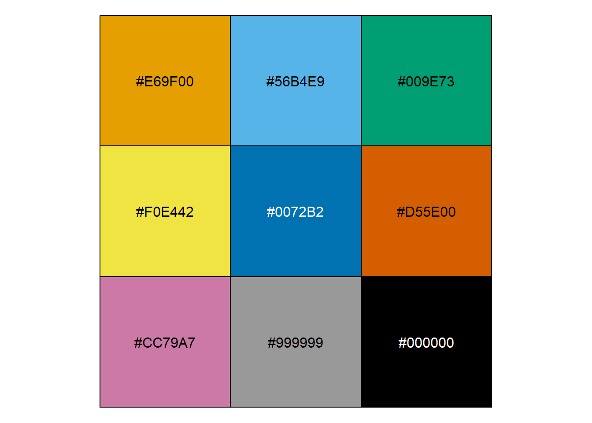

::: {.cell}

:::

# use plotly::schema()


schema allows you to browse available properties

::: {.cell}

```{.r .cell-code}
library(listviewer)
plotly::schema()
```
:::


# Building a plotly   


the absolute minimum


::: {.cell}

```{.r .cell-code}
plotly::plot_ly(df, x = ~ date, 
                y = ~ lifeExp, 
                color =  ~country, 
                type = "scatter", 
                mode = "markers+lines")
```

::: {.cell-output-display}


```{=html}
<div class="plotly html-widget html-fill-item" id="htmlwidget-3f31b2608c56d85cf182" style="width:100%;height:464px;"></div>
<script type="application/json" data-for="htmlwidget-3f31b2608c56d85cf182">{"x":{"visdat":{"543479ac105f":["function () ","plotlyVisDat"]},"cur_data":"543479ac105f","attrs":{"543479ac105f":{"x":{},"y":{},"mode":"markers+lines","color":{},"alpha_stroke":1,"sizes":[10,100],"spans":[1,20],"type":"scatter"}},"layout":{"margin":{"b":40,"l":60,"t":25,"r":10},"xaxis":{"domain":[0,1],"automargin":true,"title":"date"},"yaxis":{"domain":[0,1],"automargin":true,"title":"lifeExp"},"hovermode":"closest","showlegend":true},"source":"A","config":{"modeBarButtonsToAdd":["hoverclosest","hovercompare"],"showSendToCloud":false},"data":[{"x":["1992-01-01","1997-01-01","2002-01-01","2007-01-01"],"y":[41.670000000000002,41.759999999999998,42.130000000000003,43.829999999999998],"mode":"markers+lines","type":"scatter","name":"Afghanistan","marker":{"color":"rgba(102,194,165,1)","line":{"color":"rgba(102,194,165,1)"}},"textfont":{"color":"rgba(102,194,165,1)"},"error_y":{"color":"rgba(102,194,165,1)"},"error_x":{"color":"rgba(102,194,165,1)"},"line":{"color":"rgba(102,194,165,1)"},"xaxis":"x","yaxis":"y","frame":null},{"x":["1992-01-01","1997-01-01","2002-01-01","2007-01-01"],"y":[71.579999999999998,72.950000000000003,75.650000000000006,76.420000000000002],"mode":"markers+lines","type":"scatter","name":"Albania","marker":{"color":"rgba(252,141,98,1)","line":{"color":"rgba(252,141,98,1)"}},"textfont":{"color":"rgba(252,141,98,1)"},"error_y":{"color":"rgba(252,141,98,1)"},"error_x":{"color":"rgba(252,141,98,1)"},"line":{"color":"rgba(252,141,98,1)"},"xaxis":"x","yaxis":"y","frame":null},{"x":["1992-01-01","1997-01-01","2002-01-01","2007-01-01"],"y":[67.739999999999995,69.150000000000006,70.989999999999995,72.299999999999997],"mode":"markers+lines","type":"scatter","name":"Algeria","marker":{"color":"rgba(141,160,203,1)","line":{"color":"rgba(141,160,203,1)"}},"textfont":{"color":"rgba(141,160,203,1)"},"error_y":{"color":"rgba(141,160,203,1)"},"error_x":{"color":"rgba(141,160,203,1)"},"line":{"color":"rgba(141,160,203,1)"},"xaxis":"x","yaxis":"y","frame":null},{"x":["1992-01-01","1997-01-01","2002-01-01","2007-01-01"],"y":[40.649999999999999,40.960000000000001,41,42.729999999999997],"mode":"markers+lines","type":"scatter","name":"Angola","marker":{"color":"rgba(231,138,195,1)","line":{"color":"rgba(231,138,195,1)"}},"textfont":{"color":"rgba(231,138,195,1)"},"error_y":{"color":"rgba(231,138,195,1)"},"error_x":{"color":"rgba(231,138,195,1)"},"line":{"color":"rgba(231,138,195,1)"},"xaxis":"x","yaxis":"y","frame":null},{"x":["1992-01-01","1997-01-01","2002-01-01","2007-01-01"],"y":[71.870000000000005,73.280000000000001,74.340000000000003,75.319999999999993],"mode":"markers+lines","type":"scatter","name":"Argentina","marker":{"color":"rgba(166,216,84,1)","line":{"color":"rgba(166,216,84,1)"}},"textfont":{"color":"rgba(166,216,84,1)"},"error_y":{"color":"rgba(166,216,84,1)"},"error_x":{"color":"rgba(166,216,84,1)"},"line":{"color":"rgba(166,216,84,1)"},"xaxis":"x","yaxis":"y","frame":null},{"x":["1992-01-01","1997-01-01","2002-01-01","2007-01-01"],"y":[77.560000000000002,78.829999999999998,80.370000000000005,81.239999999999995],"mode":"markers+lines","type":"scatter","name":"Australia","marker":{"color":"rgba(255,217,47,1)","line":{"color":"rgba(255,217,47,1)"}},"textfont":{"color":"rgba(255,217,47,1)"},"error_y":{"color":"rgba(255,217,47,1)"},"error_x":{"color":"rgba(255,217,47,1)"},"line":{"color":"rgba(255,217,47,1)"},"xaxis":"x","yaxis":"y","frame":null},{"x":["1992-01-01","1997-01-01","2002-01-01","2007-01-01"],"y":[76.040000000000006,77.510000000000005,78.980000000000004,79.829999999999998],"mode":"markers+lines","type":"scatter","name":"Austria","marker":{"color":"rgba(229,196,148,1)","line":{"color":"rgba(229,196,148,1)"}},"textfont":{"color":"rgba(229,196,148,1)"},"error_y":{"color":"rgba(229,196,148,1)"},"error_x":{"color":"rgba(229,196,148,1)"},"line":{"color":"rgba(229,196,148,1)"},"xaxis":"x","yaxis":"y","frame":null},{"x":["1992-01-01","1997-01-01","2002-01-01","2007-01-01"],"y":[72.599999999999994,73.920000000000002,74.799999999999997,75.640000000000001],"mode":"markers+lines","type":"scatter","name":"Bahrain","marker":{"color":"rgba(179,179,179,1)","line":{"color":"rgba(179,179,179,1)"}},"textfont":{"color":"rgba(179,179,179,1)"},"error_y":{"color":"rgba(179,179,179,1)"},"error_x":{"color":"rgba(179,179,179,1)"},"line":{"color":"rgba(179,179,179,1)"},"xaxis":"x","yaxis":"y","frame":null}],"highlight":{"on":"plotly_click","persistent":false,"dynamic":false,"selectize":false,"opacityDim":0.20000000000000001,"selected":{"opacity":1},"debounce":0},"shinyEvents":["plotly_hover","plotly_click","plotly_selected","plotly_relayout","plotly_brushed","plotly_brushing","plotly_clickannotation","plotly_doubleclick","plotly_deselect","plotly_afterplot","plotly_sunburstclick"],"base_url":"https://plot.ly"},"evals":[],"jsHooks":[]}</script>
```


:::
:::


i like this hovermode   


::: {.cell}

```{.r .cell-code}
plotly::plot_ly(df, x = ~ date, 
                y = ~ lifeExp, 
                color =  ~country, 
                type = "scatter", 
                mode = "markers+lines") %>%
  plotly::layout(hovermode="x unified") 
```

::: {.cell-output-display}


```{=html}
<div class="plotly html-widget html-fill-item" id="htmlwidget-4845af1e39e1f6494b07" style="width:100%;height:464px;"></div>
<script type="application/json" data-for="htmlwidget-4845af1e39e1f6494b07">{"x":{"visdat":{"54342556fd4":["function () ","plotlyVisDat"]},"cur_data":"54342556fd4","attrs":{"54342556fd4":{"x":{},"y":{},"mode":"markers+lines","color":{},"alpha_stroke":1,"sizes":[10,100],"spans":[1,20],"type":"scatter"}},"layout":{"margin":{"b":40,"l":60,"t":25,"r":10},"hovermode":"x unified","xaxis":{"domain":[0,1],"automargin":true,"title":"date"},"yaxis":{"domain":[0,1],"automargin":true,"title":"lifeExp"},"showlegend":true},"source":"A","config":{"modeBarButtonsToAdd":["hoverclosest","hovercompare"],"showSendToCloud":false},"data":[{"x":["1992-01-01","1997-01-01","2002-01-01","2007-01-01"],"y":[41.670000000000002,41.759999999999998,42.130000000000003,43.829999999999998],"mode":"markers+lines","type":"scatter","name":"Afghanistan","marker":{"color":"rgba(102,194,165,1)","line":{"color":"rgba(102,194,165,1)"}},"textfont":{"color":"rgba(102,194,165,1)"},"error_y":{"color":"rgba(102,194,165,1)"},"error_x":{"color":"rgba(102,194,165,1)"},"line":{"color":"rgba(102,194,165,1)"},"xaxis":"x","yaxis":"y","frame":null},{"x":["1992-01-01","1997-01-01","2002-01-01","2007-01-01"],"y":[71.579999999999998,72.950000000000003,75.650000000000006,76.420000000000002],"mode":"markers+lines","type":"scatter","name":"Albania","marker":{"color":"rgba(252,141,98,1)","line":{"color":"rgba(252,141,98,1)"}},"textfont":{"color":"rgba(252,141,98,1)"},"error_y":{"color":"rgba(252,141,98,1)"},"error_x":{"color":"rgba(252,141,98,1)"},"line":{"color":"rgba(252,141,98,1)"},"xaxis":"x","yaxis":"y","frame":null},{"x":["1992-01-01","1997-01-01","2002-01-01","2007-01-01"],"y":[67.739999999999995,69.150000000000006,70.989999999999995,72.299999999999997],"mode":"markers+lines","type":"scatter","name":"Algeria","marker":{"color":"rgba(141,160,203,1)","line":{"color":"rgba(141,160,203,1)"}},"textfont":{"color":"rgba(141,160,203,1)"},"error_y":{"color":"rgba(141,160,203,1)"},"error_x":{"color":"rgba(141,160,203,1)"},"line":{"color":"rgba(141,160,203,1)"},"xaxis":"x","yaxis":"y","frame":null},{"x":["1992-01-01","1997-01-01","2002-01-01","2007-01-01"],"y":[40.649999999999999,40.960000000000001,41,42.729999999999997],"mode":"markers+lines","type":"scatter","name":"Angola","marker":{"color":"rgba(231,138,195,1)","line":{"color":"rgba(231,138,195,1)"}},"textfont":{"color":"rgba(231,138,195,1)"},"error_y":{"color":"rgba(231,138,195,1)"},"error_x":{"color":"rgba(231,138,195,1)"},"line":{"color":"rgba(231,138,195,1)"},"xaxis":"x","yaxis":"y","frame":null},{"x":["1992-01-01","1997-01-01","2002-01-01","2007-01-01"],"y":[71.870000000000005,73.280000000000001,74.340000000000003,75.319999999999993],"mode":"markers+lines","type":"scatter","name":"Argentina","marker":{"color":"rgba(166,216,84,1)","line":{"color":"rgba(166,216,84,1)"}},"textfont":{"color":"rgba(166,216,84,1)"},"error_y":{"color":"rgba(166,216,84,1)"},"error_x":{"color":"rgba(166,216,84,1)"},"line":{"color":"rgba(166,216,84,1)"},"xaxis":"x","yaxis":"y","frame":null},{"x":["1992-01-01","1997-01-01","2002-01-01","2007-01-01"],"y":[77.560000000000002,78.829999999999998,80.370000000000005,81.239999999999995],"mode":"markers+lines","type":"scatter","name":"Australia","marker":{"color":"rgba(255,217,47,1)","line":{"color":"rgba(255,217,47,1)"}},"textfont":{"color":"rgba(255,217,47,1)"},"error_y":{"color":"rgba(255,217,47,1)"},"error_x":{"color":"rgba(255,217,47,1)"},"line":{"color":"rgba(255,217,47,1)"},"xaxis":"x","yaxis":"y","frame":null},{"x":["1992-01-01","1997-01-01","2002-01-01","2007-01-01"],"y":[76.040000000000006,77.510000000000005,78.980000000000004,79.829999999999998],"mode":"markers+lines","type":"scatter","name":"Austria","marker":{"color":"rgba(229,196,148,1)","line":{"color":"rgba(229,196,148,1)"}},"textfont":{"color":"rgba(229,196,148,1)"},"error_y":{"color":"rgba(229,196,148,1)"},"error_x":{"color":"rgba(229,196,148,1)"},"line":{"color":"rgba(229,196,148,1)"},"xaxis":"x","yaxis":"y","frame":null},{"x":["1992-01-01","1997-01-01","2002-01-01","2007-01-01"],"y":[72.599999999999994,73.920000000000002,74.799999999999997,75.640000000000001],"mode":"markers+lines","type":"scatter","name":"Bahrain","marker":{"color":"rgba(179,179,179,1)","line":{"color":"rgba(179,179,179,1)"}},"textfont":{"color":"rgba(179,179,179,1)"},"error_y":{"color":"rgba(179,179,179,1)"},"error_x":{"color":"rgba(179,179,179,1)"},"line":{"color":"rgba(179,179,179,1)"},"xaxis":"x","yaxis":"y","frame":null}],"highlight":{"on":"plotly_click","persistent":false,"dynamic":false,"selectize":false,"opacityDim":0.20000000000000001,"selected":{"opacity":1},"debounce":0},"shinyEvents":["plotly_hover","plotly_click","plotly_selected","plotly_relayout","plotly_brushed","plotly_brushing","plotly_clickannotation","plotly_doubleclick","plotly_deselect","plotly_afterplot","plotly_sunburstclick"],"base_url":"https://plot.ly"},"evals":[],"jsHooks":[]}</script>
```


:::
:::


adding titles 


::: {.cell}

```{.r .cell-code}
plotly::plot_ly(df, x = ~ date, 
                y = ~ lifeExp, 
                color =  ~country, 
                type = "scatter", 
                mode = "markers+lines") %>%
  plotly::layout(hovermode="x unified")  %>%
  plotly::layout(
    title = list(text = "this is my title"))
```

::: {.cell-output-display}


```{=html}
<div class="plotly html-widget html-fill-item" id="htmlwidget-38dc4c900fc8d80754fc" style="width:100%;height:464px;"></div>
<script type="application/json" data-for="htmlwidget-38dc4c900fc8d80754fc">{"x":{"visdat":{"54345ce77da":["function () ","plotlyVisDat"]},"cur_data":"54345ce77da","attrs":{"54345ce77da":{"x":{},"y":{},"mode":"markers+lines","color":{},"alpha_stroke":1,"sizes":[10,100],"spans":[1,20],"type":"scatter"}},"layout":{"margin":{"b":40,"l":60,"t":25,"r":10},"hovermode":"x unified","title":{"text":"this is my title"},"xaxis":{"domain":[0,1],"automargin":true,"title":"date"},"yaxis":{"domain":[0,1],"automargin":true,"title":"lifeExp"},"showlegend":true},"source":"A","config":{"modeBarButtonsToAdd":["hoverclosest","hovercompare"],"showSendToCloud":false},"data":[{"x":["1992-01-01","1997-01-01","2002-01-01","2007-01-01"],"y":[41.670000000000002,41.759999999999998,42.130000000000003,43.829999999999998],"mode":"markers+lines","type":"scatter","name":"Afghanistan","marker":{"color":"rgba(102,194,165,1)","line":{"color":"rgba(102,194,165,1)"}},"textfont":{"color":"rgba(102,194,165,1)"},"error_y":{"color":"rgba(102,194,165,1)"},"error_x":{"color":"rgba(102,194,165,1)"},"line":{"color":"rgba(102,194,165,1)"},"xaxis":"x","yaxis":"y","frame":null},{"x":["1992-01-01","1997-01-01","2002-01-01","2007-01-01"],"y":[71.579999999999998,72.950000000000003,75.650000000000006,76.420000000000002],"mode":"markers+lines","type":"scatter","name":"Albania","marker":{"color":"rgba(252,141,98,1)","line":{"color":"rgba(252,141,98,1)"}},"textfont":{"color":"rgba(252,141,98,1)"},"error_y":{"color":"rgba(252,141,98,1)"},"error_x":{"color":"rgba(252,141,98,1)"},"line":{"color":"rgba(252,141,98,1)"},"xaxis":"x","yaxis":"y","frame":null},{"x":["1992-01-01","1997-01-01","2002-01-01","2007-01-01"],"y":[67.739999999999995,69.150000000000006,70.989999999999995,72.299999999999997],"mode":"markers+lines","type":"scatter","name":"Algeria","marker":{"color":"rgba(141,160,203,1)","line":{"color":"rgba(141,160,203,1)"}},"textfont":{"color":"rgba(141,160,203,1)"},"error_y":{"color":"rgba(141,160,203,1)"},"error_x":{"color":"rgba(141,160,203,1)"},"line":{"color":"rgba(141,160,203,1)"},"xaxis":"x","yaxis":"y","frame":null},{"x":["1992-01-01","1997-01-01","2002-01-01","2007-01-01"],"y":[40.649999999999999,40.960000000000001,41,42.729999999999997],"mode":"markers+lines","type":"scatter","name":"Angola","marker":{"color":"rgba(231,138,195,1)","line":{"color":"rgba(231,138,195,1)"}},"textfont":{"color":"rgba(231,138,195,1)"},"error_y":{"color":"rgba(231,138,195,1)"},"error_x":{"color":"rgba(231,138,195,1)"},"line":{"color":"rgba(231,138,195,1)"},"xaxis":"x","yaxis":"y","frame":null},{"x":["1992-01-01","1997-01-01","2002-01-01","2007-01-01"],"y":[71.870000000000005,73.280000000000001,74.340000000000003,75.319999999999993],"mode":"markers+lines","type":"scatter","name":"Argentina","marker":{"color":"rgba(166,216,84,1)","line":{"color":"rgba(166,216,84,1)"}},"textfont":{"color":"rgba(166,216,84,1)"},"error_y":{"color":"rgba(166,216,84,1)"},"error_x":{"color":"rgba(166,216,84,1)"},"line":{"color":"rgba(166,216,84,1)"},"xaxis":"x","yaxis":"y","frame":null},{"x":["1992-01-01","1997-01-01","2002-01-01","2007-01-01"],"y":[77.560000000000002,78.829999999999998,80.370000000000005,81.239999999999995],"mode":"markers+lines","type":"scatter","name":"Australia","marker":{"color":"rgba(255,217,47,1)","line":{"color":"rgba(255,217,47,1)"}},"textfont":{"color":"rgba(255,217,47,1)"},"error_y":{"color":"rgba(255,217,47,1)"},"error_x":{"color":"rgba(255,217,47,1)"},"line":{"color":"rgba(255,217,47,1)"},"xaxis":"x","yaxis":"y","frame":null},{"x":["1992-01-01","1997-01-01","2002-01-01","2007-01-01"],"y":[76.040000000000006,77.510000000000005,78.980000000000004,79.829999999999998],"mode":"markers+lines","type":"scatter","name":"Austria","marker":{"color":"rgba(229,196,148,1)","line":{"color":"rgba(229,196,148,1)"}},"textfont":{"color":"rgba(229,196,148,1)"},"error_y":{"color":"rgba(229,196,148,1)"},"error_x":{"color":"rgba(229,196,148,1)"},"line":{"color":"rgba(229,196,148,1)"},"xaxis":"x","yaxis":"y","frame":null},{"x":["1992-01-01","1997-01-01","2002-01-01","2007-01-01"],"y":[72.599999999999994,73.920000000000002,74.799999999999997,75.640000000000001],"mode":"markers+lines","type":"scatter","name":"Bahrain","marker":{"color":"rgba(179,179,179,1)","line":{"color":"rgba(179,179,179,1)"}},"textfont":{"color":"rgba(179,179,179,1)"},"error_y":{"color":"rgba(179,179,179,1)"},"error_x":{"color":"rgba(179,179,179,1)"},"line":{"color":"rgba(179,179,179,1)"},"xaxis":"x","yaxis":"y","frame":null}],"highlight":{"on":"plotly_click","persistent":false,"dynamic":false,"selectize":false,"opacityDim":0.20000000000000001,"selected":{"opacity":1},"debounce":0},"shinyEvents":["plotly_hover","plotly_click","plotly_selected","plotly_relayout","plotly_brushed","plotly_brushing","plotly_clickannotation","plotly_doubleclick","plotly_deselect","plotly_afterplot","plotly_sunburstclick"],"base_url":"https://plot.ly"},"evals":[],"jsHooks":[]}</script>
```


:::
:::


adding a subtitle inside the title


::: {.cell}

```{.r .cell-code}
plotly::plot_ly(df, x = ~ date, 
                y = ~ lifeExp, 
                color =  ~country, 
                type = "scatter", 
                mode = "markers+lines") %>%
  plotly::layout(hovermode="x unified")  %>%
  plotly::layout(
    title = list(text = paste0('this is my title',
                               '<br><sup>This is my subtitle','</sup>')
    )
  )
```

::: {.cell-output-display}


```{=html}
<div class="plotly html-widget html-fill-item" id="htmlwidget-3f2cb39ca61b46d0e17b" style="width:100%;height:464px;"></div>
<script type="application/json" data-for="htmlwidget-3f2cb39ca61b46d0e17b">{"x":{"visdat":{"543417c578e8":["function () ","plotlyVisDat"]},"cur_data":"543417c578e8","attrs":{"543417c578e8":{"x":{},"y":{},"mode":"markers+lines","color":{},"alpha_stroke":1,"sizes":[10,100],"spans":[1,20],"type":"scatter"}},"layout":{"margin":{"b":40,"l":60,"t":25,"r":10},"hovermode":"x unified","title":{"text":"this is my title<br><sup>This is my subtitle<\/sup>"},"xaxis":{"domain":[0,1],"automargin":true,"title":"date"},"yaxis":{"domain":[0,1],"automargin":true,"title":"lifeExp"},"showlegend":true},"source":"A","config":{"modeBarButtonsToAdd":["hoverclosest","hovercompare"],"showSendToCloud":false},"data":[{"x":["1992-01-01","1997-01-01","2002-01-01","2007-01-01"],"y":[41.670000000000002,41.759999999999998,42.130000000000003,43.829999999999998],"mode":"markers+lines","type":"scatter","name":"Afghanistan","marker":{"color":"rgba(102,194,165,1)","line":{"color":"rgba(102,194,165,1)"}},"textfont":{"color":"rgba(102,194,165,1)"},"error_y":{"color":"rgba(102,194,165,1)"},"error_x":{"color":"rgba(102,194,165,1)"},"line":{"color":"rgba(102,194,165,1)"},"xaxis":"x","yaxis":"y","frame":null},{"x":["1992-01-01","1997-01-01","2002-01-01","2007-01-01"],"y":[71.579999999999998,72.950000000000003,75.650000000000006,76.420000000000002],"mode":"markers+lines","type":"scatter","name":"Albania","marker":{"color":"rgba(252,141,98,1)","line":{"color":"rgba(252,141,98,1)"}},"textfont":{"color":"rgba(252,141,98,1)"},"error_y":{"color":"rgba(252,141,98,1)"},"error_x":{"color":"rgba(252,141,98,1)"},"line":{"color":"rgba(252,141,98,1)"},"xaxis":"x","yaxis":"y","frame":null},{"x":["1992-01-01","1997-01-01","2002-01-01","2007-01-01"],"y":[67.739999999999995,69.150000000000006,70.989999999999995,72.299999999999997],"mode":"markers+lines","type":"scatter","name":"Algeria","marker":{"color":"rgba(141,160,203,1)","line":{"color":"rgba(141,160,203,1)"}},"textfont":{"color":"rgba(141,160,203,1)"},"error_y":{"color":"rgba(141,160,203,1)"},"error_x":{"color":"rgba(141,160,203,1)"},"line":{"color":"rgba(141,160,203,1)"},"xaxis":"x","yaxis":"y","frame":null},{"x":["1992-01-01","1997-01-01","2002-01-01","2007-01-01"],"y":[40.649999999999999,40.960000000000001,41,42.729999999999997],"mode":"markers+lines","type":"scatter","name":"Angola","marker":{"color":"rgba(231,138,195,1)","line":{"color":"rgba(231,138,195,1)"}},"textfont":{"color":"rgba(231,138,195,1)"},"error_y":{"color":"rgba(231,138,195,1)"},"error_x":{"color":"rgba(231,138,195,1)"},"line":{"color":"rgba(231,138,195,1)"},"xaxis":"x","yaxis":"y","frame":null},{"x":["1992-01-01","1997-01-01","2002-01-01","2007-01-01"],"y":[71.870000000000005,73.280000000000001,74.340000000000003,75.319999999999993],"mode":"markers+lines","type":"scatter","name":"Argentina","marker":{"color":"rgba(166,216,84,1)","line":{"color":"rgba(166,216,84,1)"}},"textfont":{"color":"rgba(166,216,84,1)"},"error_y":{"color":"rgba(166,216,84,1)"},"error_x":{"color":"rgba(166,216,84,1)"},"line":{"color":"rgba(166,216,84,1)"},"xaxis":"x","yaxis":"y","frame":null},{"x":["1992-01-01","1997-01-01","2002-01-01","2007-01-01"],"y":[77.560000000000002,78.829999999999998,80.370000000000005,81.239999999999995],"mode":"markers+lines","type":"scatter","name":"Australia","marker":{"color":"rgba(255,217,47,1)","line":{"color":"rgba(255,217,47,1)"}},"textfont":{"color":"rgba(255,217,47,1)"},"error_y":{"color":"rgba(255,217,47,1)"},"error_x":{"color":"rgba(255,217,47,1)"},"line":{"color":"rgba(255,217,47,1)"},"xaxis":"x","yaxis":"y","frame":null},{"x":["1992-01-01","1997-01-01","2002-01-01","2007-01-01"],"y":[76.040000000000006,77.510000000000005,78.980000000000004,79.829999999999998],"mode":"markers+lines","type":"scatter","name":"Austria","marker":{"color":"rgba(229,196,148,1)","line":{"color":"rgba(229,196,148,1)"}},"textfont":{"color":"rgba(229,196,148,1)"},"error_y":{"color":"rgba(229,196,148,1)"},"error_x":{"color":"rgba(229,196,148,1)"},"line":{"color":"rgba(229,196,148,1)"},"xaxis":"x","yaxis":"y","frame":null},{"x":["1992-01-01","1997-01-01","2002-01-01","2007-01-01"],"y":[72.599999999999994,73.920000000000002,74.799999999999997,75.640000000000001],"mode":"markers+lines","type":"scatter","name":"Bahrain","marker":{"color":"rgba(179,179,179,1)","line":{"color":"rgba(179,179,179,1)"}},"textfont":{"color":"rgba(179,179,179,1)"},"error_y":{"color":"rgba(179,179,179,1)"},"error_x":{"color":"rgba(179,179,179,1)"},"line":{"color":"rgba(179,179,179,1)"},"xaxis":"x","yaxis":"y","frame":null}],"highlight":{"on":"plotly_click","persistent":false,"dynamic":false,"selectize":false,"opacityDim":0.20000000000000001,"selected":{"opacity":1},"debounce":0},"shinyEvents":["plotly_hover","plotly_click","plotly_selected","plotly_relayout","plotly_brushed","plotly_brushing","plotly_clickannotation","plotly_doubleclick","plotly_deselect","plotly_afterplot","plotly_sunburstclick"],"base_url":"https://plot.ly"},"evals":[],"jsHooks":[]}</script>
```


:::
:::


left-align the title    


::: {.cell}

```{.r .cell-code}
plotly::plot_ly(df, x = ~ date, 
                y = ~ lifeExp, 
                color =  ~country, 
                type = "scatter", 
                mode = "markers+lines") %>%
  plotly::layout(hovermode="x unified")  %>%
  plotly::layout(
    title = list(text = paste0('this is my title',
                               '<br><sup>This is my subtitle','</sup>'),
                 x = 0.02,
                 xanchor = "left"
    )
  )
```

::: {.cell-output-display}


```{=html}
<div class="plotly html-widget html-fill-item" id="htmlwidget-ae09d56bb366006fc0f9" style="width:100%;height:464px;"></div>
<script type="application/json" data-for="htmlwidget-ae09d56bb366006fc0f9">{"x":{"visdat":{"543443795dc3":["function () ","plotlyVisDat"]},"cur_data":"543443795dc3","attrs":{"543443795dc3":{"x":{},"y":{},"mode":"markers+lines","color":{},"alpha_stroke":1,"sizes":[10,100],"spans":[1,20],"type":"scatter"}},"layout":{"margin":{"b":40,"l":60,"t":25,"r":10},"hovermode":"x unified","title":{"text":"this is my title<br><sup>This is my subtitle<\/sup>","x":0.02,"xanchor":"left"},"xaxis":{"domain":[0,1],"automargin":true,"title":"date"},"yaxis":{"domain":[0,1],"automargin":true,"title":"lifeExp"},"showlegend":true},"source":"A","config":{"modeBarButtonsToAdd":["hoverclosest","hovercompare"],"showSendToCloud":false},"data":[{"x":["1992-01-01","1997-01-01","2002-01-01","2007-01-01"],"y":[41.670000000000002,41.759999999999998,42.130000000000003,43.829999999999998],"mode":"markers+lines","type":"scatter","name":"Afghanistan","marker":{"color":"rgba(102,194,165,1)","line":{"color":"rgba(102,194,165,1)"}},"textfont":{"color":"rgba(102,194,165,1)"},"error_y":{"color":"rgba(102,194,165,1)"},"error_x":{"color":"rgba(102,194,165,1)"},"line":{"color":"rgba(102,194,165,1)"},"xaxis":"x","yaxis":"y","frame":null},{"x":["1992-01-01","1997-01-01","2002-01-01","2007-01-01"],"y":[71.579999999999998,72.950000000000003,75.650000000000006,76.420000000000002],"mode":"markers+lines","type":"scatter","name":"Albania","marker":{"color":"rgba(252,141,98,1)","line":{"color":"rgba(252,141,98,1)"}},"textfont":{"color":"rgba(252,141,98,1)"},"error_y":{"color":"rgba(252,141,98,1)"},"error_x":{"color":"rgba(252,141,98,1)"},"line":{"color":"rgba(252,141,98,1)"},"xaxis":"x","yaxis":"y","frame":null},{"x":["1992-01-01","1997-01-01","2002-01-01","2007-01-01"],"y":[67.739999999999995,69.150000000000006,70.989999999999995,72.299999999999997],"mode":"markers+lines","type":"scatter","name":"Algeria","marker":{"color":"rgba(141,160,203,1)","line":{"color":"rgba(141,160,203,1)"}},"textfont":{"color":"rgba(141,160,203,1)"},"error_y":{"color":"rgba(141,160,203,1)"},"error_x":{"color":"rgba(141,160,203,1)"},"line":{"color":"rgba(141,160,203,1)"},"xaxis":"x","yaxis":"y","frame":null},{"x":["1992-01-01","1997-01-01","2002-01-01","2007-01-01"],"y":[40.649999999999999,40.960000000000001,41,42.729999999999997],"mode":"markers+lines","type":"scatter","name":"Angola","marker":{"color":"rgba(231,138,195,1)","line":{"color":"rgba(231,138,195,1)"}},"textfont":{"color":"rgba(231,138,195,1)"},"error_y":{"color":"rgba(231,138,195,1)"},"error_x":{"color":"rgba(231,138,195,1)"},"line":{"color":"rgba(231,138,195,1)"},"xaxis":"x","yaxis":"y","frame":null},{"x":["1992-01-01","1997-01-01","2002-01-01","2007-01-01"],"y":[71.870000000000005,73.280000000000001,74.340000000000003,75.319999999999993],"mode":"markers+lines","type":"scatter","name":"Argentina","marker":{"color":"rgba(166,216,84,1)","line":{"color":"rgba(166,216,84,1)"}},"textfont":{"color":"rgba(166,216,84,1)"},"error_y":{"color":"rgba(166,216,84,1)"},"error_x":{"color":"rgba(166,216,84,1)"},"line":{"color":"rgba(166,216,84,1)"},"xaxis":"x","yaxis":"y","frame":null},{"x":["1992-01-01","1997-01-01","2002-01-01","2007-01-01"],"y":[77.560000000000002,78.829999999999998,80.370000000000005,81.239999999999995],"mode":"markers+lines","type":"scatter","name":"Australia","marker":{"color":"rgba(255,217,47,1)","line":{"color":"rgba(255,217,47,1)"}},"textfont":{"color":"rgba(255,217,47,1)"},"error_y":{"color":"rgba(255,217,47,1)"},"error_x":{"color":"rgba(255,217,47,1)"},"line":{"color":"rgba(255,217,47,1)"},"xaxis":"x","yaxis":"y","frame":null},{"x":["1992-01-01","1997-01-01","2002-01-01","2007-01-01"],"y":[76.040000000000006,77.510000000000005,78.980000000000004,79.829999999999998],"mode":"markers+lines","type":"scatter","name":"Austria","marker":{"color":"rgba(229,196,148,1)","line":{"color":"rgba(229,196,148,1)"}},"textfont":{"color":"rgba(229,196,148,1)"},"error_y":{"color":"rgba(229,196,148,1)"},"error_x":{"color":"rgba(229,196,148,1)"},"line":{"color":"rgba(229,196,148,1)"},"xaxis":"x","yaxis":"y","frame":null},{"x":["1992-01-01","1997-01-01","2002-01-01","2007-01-01"],"y":[72.599999999999994,73.920000000000002,74.799999999999997,75.640000000000001],"mode":"markers+lines","type":"scatter","name":"Bahrain","marker":{"color":"rgba(179,179,179,1)","line":{"color":"rgba(179,179,179,1)"}},"textfont":{"color":"rgba(179,179,179,1)"},"error_y":{"color":"rgba(179,179,179,1)"},"error_x":{"color":"rgba(179,179,179,1)"},"line":{"color":"rgba(179,179,179,1)"},"xaxis":"x","yaxis":"y","frame":null}],"highlight":{"on":"plotly_click","persistent":false,"dynamic":false,"selectize":false,"opacityDim":0.20000000000000001,"selected":{"opacity":1},"debounce":0},"shinyEvents":["plotly_hover","plotly_click","plotly_selected","plotly_relayout","plotly_brushed","plotly_brushing","plotly_clickannotation","plotly_doubleclick","plotly_deselect","plotly_afterplot","plotly_sunburstclick"],"base_url":"https://plot.ly"},"evals":[],"jsHooks":[]}</script>
```


:::
:::


add some margin  above the title   , remove  some margin to the left of the y axis and below the x axis


::: {.cell}

```{.r .cell-code}
plotly::plot_ly(df, x = ~ date, 
                y = ~ lifeExp, 
                color =  ~country, 
                type = "scatter", 
                mode = "markers+lines") %>%
  plotly::layout(hovermode="x unified")  %>%
  plotly::layout(
    title = list(text = paste0('this is my title',
                               '<br><sup>This is my subtitle','</sup>'),
                 x = 0.02,
                 xanchor = "left"
    )
  ) %>%
  plotly::layout(
    margin = list(
      #l = 50, # less than default
      # r = 40,
      #b = 40, 
      t = 50#,
      #pad = 40
      
    )
  )
```

::: {.cell-output-display}


```{=html}
<div class="plotly html-widget html-fill-item" id="htmlwidget-d1c6fd2c574099ae573c" style="width:100%;height:464px;"></div>
<script type="application/json" data-for="htmlwidget-d1c6fd2c574099ae573c">{"x":{"visdat":{"543422f75608":["function () ","plotlyVisDat"]},"cur_data":"543422f75608","attrs":{"543422f75608":{"x":{},"y":{},"mode":"markers+lines","color":{},"alpha_stroke":1,"sizes":[10,100],"spans":[1,20],"type":"scatter"}},"layout":{"margin":{"b":40,"l":60,"t":50,"r":10},"hovermode":"x unified","title":{"text":"this is my title<br><sup>This is my subtitle<\/sup>","x":0.02,"xanchor":"left"},"xaxis":{"domain":[0,1],"automargin":true,"title":"date"},"yaxis":{"domain":[0,1],"automargin":true,"title":"lifeExp"},"showlegend":true},"source":"A","config":{"modeBarButtonsToAdd":["hoverclosest","hovercompare"],"showSendToCloud":false},"data":[{"x":["1992-01-01","1997-01-01","2002-01-01","2007-01-01"],"y":[41.670000000000002,41.759999999999998,42.130000000000003,43.829999999999998],"mode":"markers+lines","type":"scatter","name":"Afghanistan","marker":{"color":"rgba(102,194,165,1)","line":{"color":"rgba(102,194,165,1)"}},"textfont":{"color":"rgba(102,194,165,1)"},"error_y":{"color":"rgba(102,194,165,1)"},"error_x":{"color":"rgba(102,194,165,1)"},"line":{"color":"rgba(102,194,165,1)"},"xaxis":"x","yaxis":"y","frame":null},{"x":["1992-01-01","1997-01-01","2002-01-01","2007-01-01"],"y":[71.579999999999998,72.950000000000003,75.650000000000006,76.420000000000002],"mode":"markers+lines","type":"scatter","name":"Albania","marker":{"color":"rgba(252,141,98,1)","line":{"color":"rgba(252,141,98,1)"}},"textfont":{"color":"rgba(252,141,98,1)"},"error_y":{"color":"rgba(252,141,98,1)"},"error_x":{"color":"rgba(252,141,98,1)"},"line":{"color":"rgba(252,141,98,1)"},"xaxis":"x","yaxis":"y","frame":null},{"x":["1992-01-01","1997-01-01","2002-01-01","2007-01-01"],"y":[67.739999999999995,69.150000000000006,70.989999999999995,72.299999999999997],"mode":"markers+lines","type":"scatter","name":"Algeria","marker":{"color":"rgba(141,160,203,1)","line":{"color":"rgba(141,160,203,1)"}},"textfont":{"color":"rgba(141,160,203,1)"},"error_y":{"color":"rgba(141,160,203,1)"},"error_x":{"color":"rgba(141,160,203,1)"},"line":{"color":"rgba(141,160,203,1)"},"xaxis":"x","yaxis":"y","frame":null},{"x":["1992-01-01","1997-01-01","2002-01-01","2007-01-01"],"y":[40.649999999999999,40.960000000000001,41,42.729999999999997],"mode":"markers+lines","type":"scatter","name":"Angola","marker":{"color":"rgba(231,138,195,1)","line":{"color":"rgba(231,138,195,1)"}},"textfont":{"color":"rgba(231,138,195,1)"},"error_y":{"color":"rgba(231,138,195,1)"},"error_x":{"color":"rgba(231,138,195,1)"},"line":{"color":"rgba(231,138,195,1)"},"xaxis":"x","yaxis":"y","frame":null},{"x":["1992-01-01","1997-01-01","2002-01-01","2007-01-01"],"y":[71.870000000000005,73.280000000000001,74.340000000000003,75.319999999999993],"mode":"markers+lines","type":"scatter","name":"Argentina","marker":{"color":"rgba(166,216,84,1)","line":{"color":"rgba(166,216,84,1)"}},"textfont":{"color":"rgba(166,216,84,1)"},"error_y":{"color":"rgba(166,216,84,1)"},"error_x":{"color":"rgba(166,216,84,1)"},"line":{"color":"rgba(166,216,84,1)"},"xaxis":"x","yaxis":"y","frame":null},{"x":["1992-01-01","1997-01-01","2002-01-01","2007-01-01"],"y":[77.560000000000002,78.829999999999998,80.370000000000005,81.239999999999995],"mode":"markers+lines","type":"scatter","name":"Australia","marker":{"color":"rgba(255,217,47,1)","line":{"color":"rgba(255,217,47,1)"}},"textfont":{"color":"rgba(255,217,47,1)"},"error_y":{"color":"rgba(255,217,47,1)"},"error_x":{"color":"rgba(255,217,47,1)"},"line":{"color":"rgba(255,217,47,1)"},"xaxis":"x","yaxis":"y","frame":null},{"x":["1992-01-01","1997-01-01","2002-01-01","2007-01-01"],"y":[76.040000000000006,77.510000000000005,78.980000000000004,79.829999999999998],"mode":"markers+lines","type":"scatter","name":"Austria","marker":{"color":"rgba(229,196,148,1)","line":{"color":"rgba(229,196,148,1)"}},"textfont":{"color":"rgba(229,196,148,1)"},"error_y":{"color":"rgba(229,196,148,1)"},"error_x":{"color":"rgba(229,196,148,1)"},"line":{"color":"rgba(229,196,148,1)"},"xaxis":"x","yaxis":"y","frame":null},{"x":["1992-01-01","1997-01-01","2002-01-01","2007-01-01"],"y":[72.599999999999994,73.920000000000002,74.799999999999997,75.640000000000001],"mode":"markers+lines","type":"scatter","name":"Bahrain","marker":{"color":"rgba(179,179,179,1)","line":{"color":"rgba(179,179,179,1)"}},"textfont":{"color":"rgba(179,179,179,1)"},"error_y":{"color":"rgba(179,179,179,1)"},"error_x":{"color":"rgba(179,179,179,1)"},"line":{"color":"rgba(179,179,179,1)"},"xaxis":"x","yaxis":"y","frame":null}],"highlight":{"on":"plotly_click","persistent":false,"dynamic":false,"selectize":false,"opacityDim":0.20000000000000001,"selected":{"opacity":1},"debounce":0},"shinyEvents":["plotly_hover","plotly_click","plotly_selected","plotly_relayout","plotly_brushed","plotly_brushing","plotly_clickannotation","plotly_doubleclick","plotly_deselect","plotly_afterplot","plotly_sunburstclick"],"base_url":"https://plot.ly"},"evals":[],"jsHooks":[]}</script>
```


:::
:::


add a title to the legend


::: {.cell}

```{.r .cell-code}
plotly::plot_ly(df, x = ~ date, 
                y = ~ lifeExp, 
                color =  ~country, 
                type = "scatter", 
                mode = "markers+lines") %>%
  plotly::layout(hovermode="x unified")  %>%
  plotly::layout(
    title = list(text = paste0('this is my title',
                               '<br><sup>This is my subtitle','</sup>'),
                 x = 0.02,
                 xanchor = "left"
    )
  ) %>%
  plotly::layout(margin = list(t = 50)) %>% 
  plotly::layout(legend = list(title = list(text = "country")))
```

::: {.cell-output-display}


```{=html}
<div class="plotly html-widget html-fill-item" id="htmlwidget-85fe8796efab5d587260" style="width:100%;height:464px;"></div>
<script type="application/json" data-for="htmlwidget-85fe8796efab5d587260">{"x":{"visdat":{"543431261f04":["function () ","plotlyVisDat"]},"cur_data":"543431261f04","attrs":{"543431261f04":{"x":{},"y":{},"mode":"markers+lines","color":{},"alpha_stroke":1,"sizes":[10,100],"spans":[1,20],"type":"scatter"}},"layout":{"margin":{"b":40,"l":60,"t":50,"r":10},"hovermode":"x unified","title":{"text":"this is my title<br><sup>This is my subtitle<\/sup>","x":0.02,"xanchor":"left"},"legend":{"title":{"text":"country"}},"xaxis":{"domain":[0,1],"automargin":true,"title":"date"},"yaxis":{"domain":[0,1],"automargin":true,"title":"lifeExp"},"showlegend":true},"source":"A","config":{"modeBarButtonsToAdd":["hoverclosest","hovercompare"],"showSendToCloud":false},"data":[{"x":["1992-01-01","1997-01-01","2002-01-01","2007-01-01"],"y":[41.670000000000002,41.759999999999998,42.130000000000003,43.829999999999998],"mode":"markers+lines","type":"scatter","name":"Afghanistan","marker":{"color":"rgba(102,194,165,1)","line":{"color":"rgba(102,194,165,1)"}},"textfont":{"color":"rgba(102,194,165,1)"},"error_y":{"color":"rgba(102,194,165,1)"},"error_x":{"color":"rgba(102,194,165,1)"},"line":{"color":"rgba(102,194,165,1)"},"xaxis":"x","yaxis":"y","frame":null},{"x":["1992-01-01","1997-01-01","2002-01-01","2007-01-01"],"y":[71.579999999999998,72.950000000000003,75.650000000000006,76.420000000000002],"mode":"markers+lines","type":"scatter","name":"Albania","marker":{"color":"rgba(252,141,98,1)","line":{"color":"rgba(252,141,98,1)"}},"textfont":{"color":"rgba(252,141,98,1)"},"error_y":{"color":"rgba(252,141,98,1)"},"error_x":{"color":"rgba(252,141,98,1)"},"line":{"color":"rgba(252,141,98,1)"},"xaxis":"x","yaxis":"y","frame":null},{"x":["1992-01-01","1997-01-01","2002-01-01","2007-01-01"],"y":[67.739999999999995,69.150000000000006,70.989999999999995,72.299999999999997],"mode":"markers+lines","type":"scatter","name":"Algeria","marker":{"color":"rgba(141,160,203,1)","line":{"color":"rgba(141,160,203,1)"}},"textfont":{"color":"rgba(141,160,203,1)"},"error_y":{"color":"rgba(141,160,203,1)"},"error_x":{"color":"rgba(141,160,203,1)"},"line":{"color":"rgba(141,160,203,1)"},"xaxis":"x","yaxis":"y","frame":null},{"x":["1992-01-01","1997-01-01","2002-01-01","2007-01-01"],"y":[40.649999999999999,40.960000000000001,41,42.729999999999997],"mode":"markers+lines","type":"scatter","name":"Angola","marker":{"color":"rgba(231,138,195,1)","line":{"color":"rgba(231,138,195,1)"}},"textfont":{"color":"rgba(231,138,195,1)"},"error_y":{"color":"rgba(231,138,195,1)"},"error_x":{"color":"rgba(231,138,195,1)"},"line":{"color":"rgba(231,138,195,1)"},"xaxis":"x","yaxis":"y","frame":null},{"x":["1992-01-01","1997-01-01","2002-01-01","2007-01-01"],"y":[71.870000000000005,73.280000000000001,74.340000000000003,75.319999999999993],"mode":"markers+lines","type":"scatter","name":"Argentina","marker":{"color":"rgba(166,216,84,1)","line":{"color":"rgba(166,216,84,1)"}},"textfont":{"color":"rgba(166,216,84,1)"},"error_y":{"color":"rgba(166,216,84,1)"},"error_x":{"color":"rgba(166,216,84,1)"},"line":{"color":"rgba(166,216,84,1)"},"xaxis":"x","yaxis":"y","frame":null},{"x":["1992-01-01","1997-01-01","2002-01-01","2007-01-01"],"y":[77.560000000000002,78.829999999999998,80.370000000000005,81.239999999999995],"mode":"markers+lines","type":"scatter","name":"Australia","marker":{"color":"rgba(255,217,47,1)","line":{"color":"rgba(255,217,47,1)"}},"textfont":{"color":"rgba(255,217,47,1)"},"error_y":{"color":"rgba(255,217,47,1)"},"error_x":{"color":"rgba(255,217,47,1)"},"line":{"color":"rgba(255,217,47,1)"},"xaxis":"x","yaxis":"y","frame":null},{"x":["1992-01-01","1997-01-01","2002-01-01","2007-01-01"],"y":[76.040000000000006,77.510000000000005,78.980000000000004,79.829999999999998],"mode":"markers+lines","type":"scatter","name":"Austria","marker":{"color":"rgba(229,196,148,1)","line":{"color":"rgba(229,196,148,1)"}},"textfont":{"color":"rgba(229,196,148,1)"},"error_y":{"color":"rgba(229,196,148,1)"},"error_x":{"color":"rgba(229,196,148,1)"},"line":{"color":"rgba(229,196,148,1)"},"xaxis":"x","yaxis":"y","frame":null},{"x":["1992-01-01","1997-01-01","2002-01-01","2007-01-01"],"y":[72.599999999999994,73.920000000000002,74.799999999999997,75.640000000000001],"mode":"markers+lines","type":"scatter","name":"Bahrain","marker":{"color":"rgba(179,179,179,1)","line":{"color":"rgba(179,179,179,1)"}},"textfont":{"color":"rgba(179,179,179,1)"},"error_y":{"color":"rgba(179,179,179,1)"},"error_x":{"color":"rgba(179,179,179,1)"},"line":{"color":"rgba(179,179,179,1)"},"xaxis":"x","yaxis":"y","frame":null}],"highlight":{"on":"plotly_click","persistent":false,"dynamic":false,"selectize":false,"opacityDim":0.20000000000000001,"selected":{"opacity":1},"debounce":0},"shinyEvents":["plotly_hover","plotly_click","plotly_selected","plotly_relayout","plotly_brushed","plotly_brushing","plotly_clickannotation","plotly_doubleclick","plotly_deselect","plotly_afterplot","plotly_sunburstclick"],"base_url":"https://plot.ly"},"evals":[],"jsHooks":[]}</script>
```


:::
:::


use the x_axis title as a caption.

I could also use an annotation, but I have having the guess how much margin I have to add and where to position it.
https://stackoverflow.com/questions/45103559/plotly-adding-a-source-or-caption-to-a-chart


::: {.cell}

```{.r .cell-code}
plotly::plot_ly(df, x = ~ date, 
                y = ~ lifeExp, 
                color =  ~country, 
                type = "scatter", 
                mode = "markers+lines") %>%
  plotly::layout(hovermode="x unified")  %>%
  plotly::layout(
    title = list(text = paste0('this is my title',
                               '<br><sup>This is my subtitle','</sup>'),
                 x = 0.02,
                 xanchor = "left"
    )
  ) %>%
  plotly::layout(margin = list(t = 50)) %>% 
  plotly::layout(legend = list(title = list(text = "country"))) %>%
  plotly::layout(
    xaxis = list(
      title = list(text = "<sup>source: gapminder</sup>")
    )
  )
```

::: {.cell-output-display}


```{=html}
<div class="plotly html-widget html-fill-item" id="htmlwidget-1458529fe75fd90cbba6" style="width:100%;height:464px;"></div>
<script type="application/json" data-for="htmlwidget-1458529fe75fd90cbba6">{"x":{"visdat":{"54341f9c2ecc":["function () ","plotlyVisDat"]},"cur_data":"54341f9c2ecc","attrs":{"54341f9c2ecc":{"x":{},"y":{},"mode":"markers+lines","color":{},"alpha_stroke":1,"sizes":[10,100],"spans":[1,20],"type":"scatter"}},"layout":{"margin":{"b":40,"l":60,"t":50,"r":10},"hovermode":"x unified","title":{"text":"this is my title<br><sup>This is my subtitle<\/sup>","x":0.02,"xanchor":"left"},"legend":{"title":{"text":"country"}},"xaxis":{"domain":[0,1],"automargin":true,"title":{"text":"<sup>source: gapminder<\/sup>"}},"yaxis":{"domain":[0,1],"automargin":true,"title":"lifeExp"},"showlegend":true},"source":"A","config":{"modeBarButtonsToAdd":["hoverclosest","hovercompare"],"showSendToCloud":false},"data":[{"x":["1992-01-01","1997-01-01","2002-01-01","2007-01-01"],"y":[41.670000000000002,41.759999999999998,42.130000000000003,43.829999999999998],"mode":"markers+lines","type":"scatter","name":"Afghanistan","marker":{"color":"rgba(102,194,165,1)","line":{"color":"rgba(102,194,165,1)"}},"textfont":{"color":"rgba(102,194,165,1)"},"error_y":{"color":"rgba(102,194,165,1)"},"error_x":{"color":"rgba(102,194,165,1)"},"line":{"color":"rgba(102,194,165,1)"},"xaxis":"x","yaxis":"y","frame":null},{"x":["1992-01-01","1997-01-01","2002-01-01","2007-01-01"],"y":[71.579999999999998,72.950000000000003,75.650000000000006,76.420000000000002],"mode":"markers+lines","type":"scatter","name":"Albania","marker":{"color":"rgba(252,141,98,1)","line":{"color":"rgba(252,141,98,1)"}},"textfont":{"color":"rgba(252,141,98,1)"},"error_y":{"color":"rgba(252,141,98,1)"},"error_x":{"color":"rgba(252,141,98,1)"},"line":{"color":"rgba(252,141,98,1)"},"xaxis":"x","yaxis":"y","frame":null},{"x":["1992-01-01","1997-01-01","2002-01-01","2007-01-01"],"y":[67.739999999999995,69.150000000000006,70.989999999999995,72.299999999999997],"mode":"markers+lines","type":"scatter","name":"Algeria","marker":{"color":"rgba(141,160,203,1)","line":{"color":"rgba(141,160,203,1)"}},"textfont":{"color":"rgba(141,160,203,1)"},"error_y":{"color":"rgba(141,160,203,1)"},"error_x":{"color":"rgba(141,160,203,1)"},"line":{"color":"rgba(141,160,203,1)"},"xaxis":"x","yaxis":"y","frame":null},{"x":["1992-01-01","1997-01-01","2002-01-01","2007-01-01"],"y":[40.649999999999999,40.960000000000001,41,42.729999999999997],"mode":"markers+lines","type":"scatter","name":"Angola","marker":{"color":"rgba(231,138,195,1)","line":{"color":"rgba(231,138,195,1)"}},"textfont":{"color":"rgba(231,138,195,1)"},"error_y":{"color":"rgba(231,138,195,1)"},"error_x":{"color":"rgba(231,138,195,1)"},"line":{"color":"rgba(231,138,195,1)"},"xaxis":"x","yaxis":"y","frame":null},{"x":["1992-01-01","1997-01-01","2002-01-01","2007-01-01"],"y":[71.870000000000005,73.280000000000001,74.340000000000003,75.319999999999993],"mode":"markers+lines","type":"scatter","name":"Argentina","marker":{"color":"rgba(166,216,84,1)","line":{"color":"rgba(166,216,84,1)"}},"textfont":{"color":"rgba(166,216,84,1)"},"error_y":{"color":"rgba(166,216,84,1)"},"error_x":{"color":"rgba(166,216,84,1)"},"line":{"color":"rgba(166,216,84,1)"},"xaxis":"x","yaxis":"y","frame":null},{"x":["1992-01-01","1997-01-01","2002-01-01","2007-01-01"],"y":[77.560000000000002,78.829999999999998,80.370000000000005,81.239999999999995],"mode":"markers+lines","type":"scatter","name":"Australia","marker":{"color":"rgba(255,217,47,1)","line":{"color":"rgba(255,217,47,1)"}},"textfont":{"color":"rgba(255,217,47,1)"},"error_y":{"color":"rgba(255,217,47,1)"},"error_x":{"color":"rgba(255,217,47,1)"},"line":{"color":"rgba(255,217,47,1)"},"xaxis":"x","yaxis":"y","frame":null},{"x":["1992-01-01","1997-01-01","2002-01-01","2007-01-01"],"y":[76.040000000000006,77.510000000000005,78.980000000000004,79.829999999999998],"mode":"markers+lines","type":"scatter","name":"Austria","marker":{"color":"rgba(229,196,148,1)","line":{"color":"rgba(229,196,148,1)"}},"textfont":{"color":"rgba(229,196,148,1)"},"error_y":{"color":"rgba(229,196,148,1)"},"error_x":{"color":"rgba(229,196,148,1)"},"line":{"color":"rgba(229,196,148,1)"},"xaxis":"x","yaxis":"y","frame":null},{"x":["1992-01-01","1997-01-01","2002-01-01","2007-01-01"],"y":[72.599999999999994,73.920000000000002,74.799999999999997,75.640000000000001],"mode":"markers+lines","type":"scatter","name":"Bahrain","marker":{"color":"rgba(179,179,179,1)","line":{"color":"rgba(179,179,179,1)"}},"textfont":{"color":"rgba(179,179,179,1)"},"error_y":{"color":"rgba(179,179,179,1)"},"error_x":{"color":"rgba(179,179,179,1)"},"line":{"color":"rgba(179,179,179,1)"},"xaxis":"x","yaxis":"y","frame":null}],"highlight":{"on":"plotly_click","persistent":false,"dynamic":false,"selectize":false,"opacityDim":0.20000000000000001,"selected":{"opacity":1},"debounce":0},"shinyEvents":["plotly_hover","plotly_click","plotly_selected","plotly_relayout","plotly_brushed","plotly_brushing","plotly_clickannotation","plotly_doubleclick","plotly_deselect","plotly_afterplot","plotly_sunburstclick"],"base_url":"https://plot.ly"},"evals":[],"jsHooks":[]}</script>
```


:::
:::


adjust the title size to fit ggplot theme.   


::: {.cell}

```{.r .cell-code}
plotly::plot_ly(df, x = ~ date, 
                y = ~ lifeExp, 
                color =  ~country, 
                type = "scatter", 
                mode = "markers+lines") %>%
  plotly::layout(hovermode="x unified")  %>%
  plotly::layout(
    title = list(text = paste0('this is my title',
                               '<br><sup>This is my subtitle','</sup>'),
                 x = 0.02,
                 xanchor = "left",
                 font = list(size =ggplot2::theme_get()$text$size  * 1.4)
    )
  ) %>%
  plotly::layout(margin = list(t = 50)) %>% 
  plotly::layout(legend = list(title = list(text = "country",
                                            font = list(size = ggplot2::theme_get()$text$size)),
                               font = list(size = ggplot2::theme_get()$text$size * as.numeric(ggplot2::theme_get()$axis.text$size ))
  )
  ) %>%
  plotly::layout(
    xaxis = list(
      title = list(text = "<sup>source: gapminder</sup>",
                   font = list(size = ggplot2::theme_get()$text$size)),
      tickfont = list(size = ggplot2::theme_get()$text$size * as.numeric(ggplot2::theme_get()$axis.text$size ))
    )
  ) %>% 
  plotly::layout(
    yaxis = list(
      title = list(text = "lifeExp", font = list(size = ggplot2::theme_get()$text$size)),
      tickfont = list(size = ggplot2::theme_get()$text$size * as.numeric(ggplot2::theme_get()$axis.text$size ))
    )
  )  
```

::: {.cell-output-display}


```{=html}
<div class="plotly html-widget html-fill-item" id="htmlwidget-05697651765c765f552a" style="width:100%;height:464px;"></div>
<script type="application/json" data-for="htmlwidget-05697651765c765f552a">{"x":{"visdat":{"543432a958a":["function () ","plotlyVisDat"]},"cur_data":"543432a958a","attrs":{"543432a958a":{"x":{},"y":{},"mode":"markers+lines","color":{},"alpha_stroke":1,"sizes":[10,100],"spans":[1,20],"type":"scatter"}},"layout":{"margin":{"b":40,"l":60,"t":50,"r":10},"hovermode":"x unified","title":{"text":"this is my title<br><sup>This is my subtitle<\/sup>","x":0.02,"xanchor":"left","font":{"size":15.399999999999999}},"legend":{"title":{"text":"country","font":{"size":11}},"font":{"size":8.8000000000000007}},"xaxis":{"domain":[0,1],"automargin":true,"title":{"text":"<sup>source: gapminder<\/sup>","font":{"size":11}},"tickfont":{"size":8.8000000000000007}},"yaxis":{"domain":[0,1],"automargin":true,"title":{"text":"lifeExp","font":{"size":11}},"tickfont":{"size":8.8000000000000007}},"showlegend":true},"source":"A","config":{"modeBarButtonsToAdd":["hoverclosest","hovercompare"],"showSendToCloud":false},"data":[{"x":["1992-01-01","1997-01-01","2002-01-01","2007-01-01"],"y":[41.670000000000002,41.759999999999998,42.130000000000003,43.829999999999998],"mode":"markers+lines","type":"scatter","name":"Afghanistan","marker":{"color":"rgba(102,194,165,1)","line":{"color":"rgba(102,194,165,1)"}},"textfont":{"color":"rgba(102,194,165,1)"},"error_y":{"color":"rgba(102,194,165,1)"},"error_x":{"color":"rgba(102,194,165,1)"},"line":{"color":"rgba(102,194,165,1)"},"xaxis":"x","yaxis":"y","frame":null},{"x":["1992-01-01","1997-01-01","2002-01-01","2007-01-01"],"y":[71.579999999999998,72.950000000000003,75.650000000000006,76.420000000000002],"mode":"markers+lines","type":"scatter","name":"Albania","marker":{"color":"rgba(252,141,98,1)","line":{"color":"rgba(252,141,98,1)"}},"textfont":{"color":"rgba(252,141,98,1)"},"error_y":{"color":"rgba(252,141,98,1)"},"error_x":{"color":"rgba(252,141,98,1)"},"line":{"color":"rgba(252,141,98,1)"},"xaxis":"x","yaxis":"y","frame":null},{"x":["1992-01-01","1997-01-01","2002-01-01","2007-01-01"],"y":[67.739999999999995,69.150000000000006,70.989999999999995,72.299999999999997],"mode":"markers+lines","type":"scatter","name":"Algeria","marker":{"color":"rgba(141,160,203,1)","line":{"color":"rgba(141,160,203,1)"}},"textfont":{"color":"rgba(141,160,203,1)"},"error_y":{"color":"rgba(141,160,203,1)"},"error_x":{"color":"rgba(141,160,203,1)"},"line":{"color":"rgba(141,160,203,1)"},"xaxis":"x","yaxis":"y","frame":null},{"x":["1992-01-01","1997-01-01","2002-01-01","2007-01-01"],"y":[40.649999999999999,40.960000000000001,41,42.729999999999997],"mode":"markers+lines","type":"scatter","name":"Angola","marker":{"color":"rgba(231,138,195,1)","line":{"color":"rgba(231,138,195,1)"}},"textfont":{"color":"rgba(231,138,195,1)"},"error_y":{"color":"rgba(231,138,195,1)"},"error_x":{"color":"rgba(231,138,195,1)"},"line":{"color":"rgba(231,138,195,1)"},"xaxis":"x","yaxis":"y","frame":null},{"x":["1992-01-01","1997-01-01","2002-01-01","2007-01-01"],"y":[71.870000000000005,73.280000000000001,74.340000000000003,75.319999999999993],"mode":"markers+lines","type":"scatter","name":"Argentina","marker":{"color":"rgba(166,216,84,1)","line":{"color":"rgba(166,216,84,1)"}},"textfont":{"color":"rgba(166,216,84,1)"},"error_y":{"color":"rgba(166,216,84,1)"},"error_x":{"color":"rgba(166,216,84,1)"},"line":{"color":"rgba(166,216,84,1)"},"xaxis":"x","yaxis":"y","frame":null},{"x":["1992-01-01","1997-01-01","2002-01-01","2007-01-01"],"y":[77.560000000000002,78.829999999999998,80.370000000000005,81.239999999999995],"mode":"markers+lines","type":"scatter","name":"Australia","marker":{"color":"rgba(255,217,47,1)","line":{"color":"rgba(255,217,47,1)"}},"textfont":{"color":"rgba(255,217,47,1)"},"error_y":{"color":"rgba(255,217,47,1)"},"error_x":{"color":"rgba(255,217,47,1)"},"line":{"color":"rgba(255,217,47,1)"},"xaxis":"x","yaxis":"y","frame":null},{"x":["1992-01-01","1997-01-01","2002-01-01","2007-01-01"],"y":[76.040000000000006,77.510000000000005,78.980000000000004,79.829999999999998],"mode":"markers+lines","type":"scatter","name":"Austria","marker":{"color":"rgba(229,196,148,1)","line":{"color":"rgba(229,196,148,1)"}},"textfont":{"color":"rgba(229,196,148,1)"},"error_y":{"color":"rgba(229,196,148,1)"},"error_x":{"color":"rgba(229,196,148,1)"},"line":{"color":"rgba(229,196,148,1)"},"xaxis":"x","yaxis":"y","frame":null},{"x":["1992-01-01","1997-01-01","2002-01-01","2007-01-01"],"y":[72.599999999999994,73.920000000000002,74.799999999999997,75.640000000000001],"mode":"markers+lines","type":"scatter","name":"Bahrain","marker":{"color":"rgba(179,179,179,1)","line":{"color":"rgba(179,179,179,1)"}},"textfont":{"color":"rgba(179,179,179,1)"},"error_y":{"color":"rgba(179,179,179,1)"},"error_x":{"color":"rgba(179,179,179,1)"},"line":{"color":"rgba(179,179,179,1)"},"xaxis":"x","yaxis":"y","frame":null}],"highlight":{"on":"plotly_click","persistent":false,"dynamic":false,"selectize":false,"opacityDim":0.20000000000000001,"selected":{"opacity":1},"debounce":0},"shinyEvents":["plotly_hover","plotly_click","plotly_selected","plotly_relayout","plotly_brushed","plotly_brushing","plotly_clickannotation","plotly_doubleclick","plotly_deselect","plotly_afterplot","plotly_sunburstclick"],"base_url":"https://plot.ly"},"evals":[],"jsHooks":[]}</script>
```


:::
:::


pick the color palette.
note, when passing a vector of colors, you have to give the exact number of colors, otherwise it will interpolate.  

here is my palette:

::: {.cell}

```{.r .cell-code}
scales::show_col(pal)
```

::: {.cell-output-display}
{width=672}
:::
:::


here is what happens if I don't have the correct number of colors in the palette (9, colors, 8 countries).. what happens from "yellow" onward?


::: {.cell}

```{.r .cell-code}
plotly::plot_ly(df, x = ~ date, 
                y = ~ lifeExp, 
                color =  ~country, 
                colors = pal,
                type = "scatter", 
                mode = "markers+lines") %>%
  plotly::layout(hovermode="x unified")  %>%
  plotly::layout(
    title = list(text = paste0('Colors randomly interpolated because I provided 9 colors and 8 countries',
                               '<br><sup>This is my subtitle','</sup>'),
                 x = 0.02,
                 xanchor = "left",
                 font = list(size =ggplot2::theme_get()$text$size  * 1.4)
    )
  ) %>%
  plotly::layout(margin = list(t = 50)) %>% 
  plotly::layout(legend = list(title = list(text = "country",
                                            font = list(size = ggplot2::theme_get()$text$size)),
                               font = list(size = ggplot2::theme_get()$text$size * as.numeric(ggplot2::theme_get()$axis.text$size ))
  )
  ) %>%
  plotly::layout(
    xaxis = list(
      title = list(text = "<sup>source: gapminder</sup>",
                   font = list(size = ggplot2::theme_get()$text$size)),
      tickfont = list(size = ggplot2::theme_get()$text$size * as.numeric(ggplot2::theme_get()$axis.text$size ))
    )
  ) %>% 
  plotly::layout(
    yaxis = list(
      title = list(text = "lifeExp", font = list(size = ggplot2::theme_get()$text$size)),
      tickfont = list(size = ggplot2::theme_get()$text$size * as.numeric(ggplot2::theme_get()$axis.text$size ))
    )
  )  
```

::: {.cell-output-display}


```{=html}
<div class="plotly html-widget html-fill-item" id="htmlwidget-a1bc05073a91889b568f" style="width:100%;height:464px;"></div>
<script type="application/json" data-for="htmlwidget-a1bc05073a91889b568f">{"x":{"visdat":{"54347c1874c4":["function () ","plotlyVisDat"]},"cur_data":"54347c1874c4","attrs":{"54347c1874c4":{"x":{},"y":{},"mode":"markers+lines","color":{},"colors":["#E69F00","#56B4E9","#009E73","#F0E442","#0072B2","#D55E00","#CC79A7","#999999","#000000"],"alpha_stroke":1,"sizes":[10,100],"spans":[1,20],"type":"scatter"}},"layout":{"margin":{"b":40,"l":60,"t":50,"r":10},"hovermode":"x unified","title":{"text":"Colors randomly interpolated because I provided 9 colors and 8 countries<br><sup>This is my subtitle<\/sup>","x":0.02,"xanchor":"left","font":{"size":15.399999999999999}},"legend":{"title":{"text":"country","font":{"size":11}},"font":{"size":8.8000000000000007}},"xaxis":{"domain":[0,1],"automargin":true,"title":{"text":"<sup>source: gapminder<\/sup>","font":{"size":11}},"tickfont":{"size":8.8000000000000007}},"yaxis":{"domain":[0,1],"automargin":true,"title":{"text":"lifeExp","font":{"size":11}},"tickfont":{"size":8.8000000000000007}},"showlegend":true},"source":"A","config":{"modeBarButtonsToAdd":["hoverclosest","hovercompare"],"showSendToCloud":false},"data":[{"x":["1992-01-01","1997-01-01","2002-01-01","2007-01-01"],"y":[41.670000000000002,41.759999999999998,42.130000000000003,43.829999999999998],"mode":"markers+lines","type":"scatter","name":"Afghanistan","marker":{"color":"rgba(230,159,0,1)","line":{"color":"rgba(230,159,0,1)"}},"textfont":{"color":"rgba(230,159,0,1)"},"error_y":{"color":"rgba(230,159,0,1)"},"error_x":{"color":"rgba(230,159,0,1)"},"line":{"color":"rgba(230,159,0,1)"},"xaxis":"x","yaxis":"y","frame":null},{"x":["1992-01-01","1997-01-01","2002-01-01","2007-01-01"],"y":[71.579999999999998,72.950000000000003,75.650000000000006,76.420000000000002],"mode":"markers+lines","type":"scatter","name":"Albania","marker":{"color":"rgba(80,177,216,1)","line":{"color":"rgba(80,177,216,1)"}},"textfont":{"color":"rgba(80,177,216,1)"},"error_y":{"color":"rgba(80,177,216,1)"},"error_x":{"color":"rgba(80,177,216,1)"},"line":{"color":"rgba(80,177,216,1)"},"xaxis":"x","yaxis":"y","frame":null},{"x":["1992-01-01","1997-01-01","2002-01-01","2007-01-01"],"y":[67.739999999999995,69.150000000000006,70.989999999999995,72.299999999999997],"mode":"markers+lines","type":"scatter","name":"Algeria","marker":{"color":"rgba(110,178,105,1)","line":{"color":"rgba(110,178,105,1)"}},"textfont":{"color":"rgba(110,178,105,1)"},"error_y":{"color":"rgba(110,178,105,1)"},"error_x":{"color":"rgba(110,178,105,1)"},"line":{"color":"rgba(110,178,105,1)"},"xaxis":"x","yaxis":"y","frame":null},{"x":["1992-01-01","1997-01-01","2002-01-01","2007-01-01"],"y":[40.649999999999999,40.960000000000001,41,42.729999999999997],"mode":"markers+lines","type":"scatter","name":"Angola","marker":{"color":"rgba(174,176,126,1)","line":{"color":"rgba(174,176,126,1)"}},"textfont":{"color":"rgba(174,176,126,1)"},"error_y":{"color":"rgba(174,176,126,1)"},"error_x":{"color":"rgba(174,176,126,1)"},"line":{"color":"rgba(174,176,126,1)"},"xaxis":"x","yaxis":"y","frame":null},{"x":["1992-01-01","1997-01-01","2002-01-01","2007-01-01"],"y":[71.870000000000005,73.280000000000001,74.340000000000003,75.319999999999993],"mode":"markers+lines","type":"scatter","name":"Argentina","marker":{"color":"rgba(167,104,90,1)","line":{"color":"rgba(167,104,90,1)"}},"textfont":{"color":"rgba(167,104,90,1)"},"error_y":{"color":"rgba(167,104,90,1)"},"error_x":{"color":"rgba(167,104,90,1)"},"line":{"color":"rgba(167,104,90,1)"},"xaxis":"x","yaxis":"y","frame":null},{"x":["1992-01-01","1997-01-01","2002-01-01","2007-01-01"],"y":[77.560000000000002,78.829999999999998,80.370000000000005,81.239999999999995],"mode":"markers+lines","type":"scatter","name":"Australia","marker":{"color":"rgba(211,113,126,1)","line":{"color":"rgba(211,113,126,1)"}},"textfont":{"color":"rgba(211,113,126,1)"},"error_y":{"color":"rgba(211,113,126,1)"},"error_x":{"color":"rgba(211,113,126,1)"},"line":{"color":"rgba(211,113,126,1)"},"xaxis":"x","yaxis":"y","frame":null},{"x":["1992-01-01","1997-01-01","2002-01-01","2007-01-01"],"y":[76.040000000000006,77.510000000000005,78.980000000000004,79.829999999999998],"mode":"markers+lines","type":"scatter","name":"Austria","marker":{"color":"rgba(161,149,155,1)","line":{"color":"rgba(161,149,155,1)"}},"textfont":{"color":"rgba(161,149,155,1)"},"error_y":{"color":"rgba(161,149,155,1)"},"error_x":{"color":"rgba(161,149,155,1)"},"line":{"color":"rgba(161,149,155,1)"},"xaxis":"x","yaxis":"y","frame":null},{"x":["1992-01-01","1997-01-01","2002-01-01","2007-01-01"],"y":[72.599999999999994,73.920000000000002,74.799999999999997,75.640000000000001],"mode":"markers+lines","type":"scatter","name":"Bahrain","marker":{"color":"rgba(0,0,0,1)","line":{"color":"rgba(0,0,0,1)"}},"textfont":{"color":"rgba(0,0,0,1)"},"error_y":{"color":"rgba(0,0,0,1)"},"error_x":{"color":"rgba(0,0,0,1)"},"line":{"color":"rgba(0,0,0,1)"},"xaxis":"x","yaxis":"y","frame":null}],"highlight":{"on":"plotly_click","persistent":false,"dynamic":false,"selectize":false,"opacityDim":0.20000000000000001,"selected":{"opacity":1},"debounce":0},"shinyEvents":["plotly_hover","plotly_click","plotly_selected","plotly_relayout","plotly_brushed","plotly_brushing","plotly_clickannotation","plotly_doubleclick","plotly_deselect","plotly_afterplot","plotly_sunburstclick"],"base_url":"https://plot.ly"},"evals":[],"jsHooks":[]}</script>
```


:::
:::


here is the proper way (pal[1:8])


::: {.cell}

```{.r .cell-code}
plotly::plot_ly(df, x = ~ date, 
                y = ~ lifeExp, 
                color =  ~country, 
                colors = pal[1:8],
                type = "scatter", 
                mode = "markers+lines") %>%
  plotly::layout(hovermode="x unified")  %>%
  plotly::layout(
    title = list(text = paste0('this is my title',
                               '<br><sup>This is my subtitle','</sup>'),
                 x = 0.02,
                 xanchor = "left",
                 font = list(size =ggplot2::theme_get()$text$size  * 1.4)
    )
  ) %>%
  plotly::layout(margin = list(t = 50)) %>% 
  plotly::layout(legend = list(title = list(text = "country",
                                            font = list(size = ggplot2::theme_get()$text$size)),
                               font = list(size = ggplot2::theme_get()$text$size * as.numeric(ggplot2::theme_get()$axis.text$size ))
  )
  ) %>%
  plotly::layout(
    xaxis = list(
      title = list(text = "<sup>source: gapminder</sup>",
                   font = list(size = ggplot2::theme_get()$text$size)),
      tickfont = list(size = ggplot2::theme_get()$text$size * as.numeric(ggplot2::theme_get()$axis.text$size ))
    )
  ) %>% 
  plotly::layout(
    yaxis = list(
      title = list(text = "lifeExp", font = list(size = ggplot2::theme_get()$text$size)),
      tickfont = list(size = ggplot2::theme_get()$text$size * as.numeric(ggplot2::theme_get()$axis.text$size ))
    )
  )  
```

::: {.cell-output-display}


```{=html}
<div class="plotly html-widget html-fill-item" id="htmlwidget-8f152254026844fd8505" style="width:100%;height:464px;"></div>
<script type="application/json" data-for="htmlwidget-8f152254026844fd8505">{"x":{"visdat":{"54347524553c":["function () ","plotlyVisDat"]},"cur_data":"54347524553c","attrs":{"54347524553c":{"x":{},"y":{},"mode":"markers+lines","color":{},"colors":["#E69F00","#56B4E9","#009E73","#F0E442","#0072B2","#D55E00","#CC79A7","#999999"],"alpha_stroke":1,"sizes":[10,100],"spans":[1,20],"type":"scatter"}},"layout":{"margin":{"b":40,"l":60,"t":50,"r":10},"hovermode":"x unified","title":{"text":"this is my title<br><sup>This is my subtitle<\/sup>","x":0.02,"xanchor":"left","font":{"size":15.399999999999999}},"legend":{"title":{"text":"country","font":{"size":11}},"font":{"size":8.8000000000000007}},"xaxis":{"domain":[0,1],"automargin":true,"title":{"text":"<sup>source: gapminder<\/sup>","font":{"size":11}},"tickfont":{"size":8.8000000000000007}},"yaxis":{"domain":[0,1],"automargin":true,"title":{"text":"lifeExp","font":{"size":11}},"tickfont":{"size":8.8000000000000007}},"showlegend":true},"source":"A","config":{"modeBarButtonsToAdd":["hoverclosest","hovercompare"],"showSendToCloud":false},"data":[{"x":["1992-01-01","1997-01-01","2002-01-01","2007-01-01"],"y":[41.670000000000002,41.759999999999998,42.130000000000003,43.829999999999998],"mode":"markers+lines","type":"scatter","name":"Afghanistan","marker":{"color":"rgba(230,159,0,1)","line":{"color":"rgba(230,159,0,1)"}},"textfont":{"color":"rgba(230,159,0,1)"},"error_y":{"color":"rgba(230,159,0,1)"},"error_x":{"color":"rgba(230,159,0,1)"},"line":{"color":"rgba(230,159,0,1)"},"xaxis":"x","yaxis":"y","frame":null},{"x":["1992-01-01","1997-01-01","2002-01-01","2007-01-01"],"y":[71.579999999999998,72.950000000000003,75.650000000000006,76.420000000000002],"mode":"markers+lines","type":"scatter","name":"Albania","marker":{"color":"rgba(86,180,233,1)","line":{"color":"rgba(86,180,233,1)"}},"textfont":{"color":"rgba(86,180,233,1)"},"error_y":{"color":"rgba(86,180,233,1)"},"error_x":{"color":"rgba(86,180,233,1)"},"line":{"color":"rgba(86,180,233,1)"},"xaxis":"x","yaxis":"y","frame":null},{"x":["1992-01-01","1997-01-01","2002-01-01","2007-01-01"],"y":[67.739999999999995,69.150000000000006,70.989999999999995,72.299999999999997],"mode":"markers+lines","type":"scatter","name":"Algeria","marker":{"color":"rgba(0,158,115,1)","line":{"color":"rgba(0,158,115,1)"}},"textfont":{"color":"rgba(0,158,115,1)"},"error_y":{"color":"rgba(0,158,115,1)"},"error_x":{"color":"rgba(0,158,115,1)"},"line":{"color":"rgba(0,158,115,1)"},"xaxis":"x","yaxis":"y","frame":null},{"x":["1992-01-01","1997-01-01","2002-01-01","2007-01-01"],"y":[40.649999999999999,40.960000000000001,41,42.729999999999997],"mode":"markers+lines","type":"scatter","name":"Angola","marker":{"color":"rgba(240,228,66,1)","line":{"color":"rgba(240,228,66,1)"}},"textfont":{"color":"rgba(240,228,66,1)"},"error_y":{"color":"rgba(240,228,66,1)"},"error_x":{"color":"rgba(240,228,66,1)"},"line":{"color":"rgba(240,228,66,1)"},"xaxis":"x","yaxis":"y","frame":null},{"x":["1992-01-01","1997-01-01","2002-01-01","2007-01-01"],"y":[71.870000000000005,73.280000000000001,74.340000000000003,75.319999999999993],"mode":"markers+lines","type":"scatter","name":"Argentina","marker":{"color":"rgba(0,114,178,1)","line":{"color":"rgba(0,114,178,1)"}},"textfont":{"color":"rgba(0,114,178,1)"},"error_y":{"color":"rgba(0,114,178,1)"},"error_x":{"color":"rgba(0,114,178,1)"},"line":{"color":"rgba(0,114,178,1)"},"xaxis":"x","yaxis":"y","frame":null},{"x":["1992-01-01","1997-01-01","2002-01-01","2007-01-01"],"y":[77.560000000000002,78.829999999999998,80.370000000000005,81.239999999999995],"mode":"markers+lines","type":"scatter","name":"Australia","marker":{"color":"rgba(213,94,0,1)","line":{"color":"rgba(213,94,0,1)"}},"textfont":{"color":"rgba(213,94,0,1)"},"error_y":{"color":"rgba(213,94,0,1)"},"error_x":{"color":"rgba(213,94,0,1)"},"line":{"color":"rgba(213,94,0,1)"},"xaxis":"x","yaxis":"y","frame":null},{"x":["1992-01-01","1997-01-01","2002-01-01","2007-01-01"],"y":[76.040000000000006,77.510000000000005,78.980000000000004,79.829999999999998],"mode":"markers+lines","type":"scatter","name":"Austria","marker":{"color":"rgba(204,121,167,1)","line":{"color":"rgba(204,121,167,1)"}},"textfont":{"color":"rgba(204,121,167,1)"},"error_y":{"color":"rgba(204,121,167,1)"},"error_x":{"color":"rgba(204,121,167,1)"},"line":{"color":"rgba(204,121,167,1)"},"xaxis":"x","yaxis":"y","frame":null},{"x":["1992-01-01","1997-01-01","2002-01-01","2007-01-01"],"y":[72.599999999999994,73.920000000000002,74.799999999999997,75.640000000000001],"mode":"markers+lines","type":"scatter","name":"Bahrain","marker":{"color":"rgba(153,153,153,1)","line":{"color":"rgba(153,153,153,1)"}},"textfont":{"color":"rgba(153,153,153,1)"},"error_y":{"color":"rgba(153,153,153,1)"},"error_x":{"color":"rgba(153,153,153,1)"},"line":{"color":"rgba(153,153,153,1)"},"xaxis":"x","yaxis":"y","frame":null}],"highlight":{"on":"plotly_click","persistent":false,"dynamic":false,"selectize":false,"opacityDim":0.20000000000000001,"selected":{"opacity":1},"debounce":0},"shinyEvents":["plotly_hover","plotly_click","plotly_selected","plotly_relayout","plotly_brushed","plotly_brushing","plotly_clickannotation","plotly_doubleclick","plotly_deselect","plotly_afterplot","plotly_sunburstclick"],"base_url":"https://plot.ly"},"evals":[],"jsHooks":[]}</script>
```


:::
:::


format y axis as percent, format x axis as date
note, I used %-d  instead of %d to remove left-padding with 0  ( I want Jan 1,  not Jan 01)


::: {.cell}

```{.r .cell-code}
plotly::plot_ly(df, x = ~ date, 
                y = ~ pop_percent, 
                color =  ~country, 
                colors = pal[1:8],
                type = "scatter", 
                mode = "markers+lines") %>%
  plotly::layout(hovermode="x unified")  %>%
  plotly::layout(
    title = list(text = paste0('this is my title',
                               '<br><sup>This is my subtitle','</sup>'),
                 x = 0.02,
                 xanchor = "left",
                 font = list(size =ggplot2::theme_get()$text$size  * 1.4)
    )
  ) %>%
  plotly::layout(margin = list(t = 50)) %>% 
  plotly::layout(legend = list(title = list(text = "country",
                                            font = list(size = ggplot2::theme_get()$text$size)),
                               font = list(size = ggplot2::theme_get()$text$size * as.numeric(ggplot2::theme_get()$axis.text$size ))
  )
  ) %>%
  plotly::layout(
    xaxis = list(
      title = list(text = "<sup>source: gapminder</sup>",
                   font = list(size = ggplot2::theme_get()$text$size)),
      tickfont = list(size = ggplot2::theme_get()$text$size * as.numeric(ggplot2::theme_get()$axis.text$size )),
      tickformat = "%b %-d<br>%Y"
    )
  ) %>% 
  plotly::layout(
    yaxis = list(
      title = list(text = "pop_percent", font = list(size = ggplot2::theme_get()$text$size)),
      tickfont = list(size = ggplot2::theme_get()$text$size * as.numeric(ggplot2::theme_get()$axis.text$size )),
      tickformat = ".0%"
    )
  )  
```

::: {.cell-output-display}


```{=html}
<div class="plotly html-widget html-fill-item" id="htmlwidget-054772d191ace4ea4a22" style="width:100%;height:464px;"></div>
<script type="application/json" data-for="htmlwidget-054772d191ace4ea4a22">{"x":{"visdat":{"54342f081d1":["function () ","plotlyVisDat"]},"cur_data":"54342f081d1","attrs":{"54342f081d1":{"x":{},"y":{},"mode":"markers+lines","color":{},"colors":["#E69F00","#56B4E9","#009E73","#F0E442","#0072B2","#D55E00","#CC79A7","#999999"],"alpha_stroke":1,"sizes":[10,100],"spans":[1,20],"type":"scatter"}},"layout":{"margin":{"b":40,"l":60,"t":50,"r":10},"hovermode":"x unified","title":{"text":"this is my title<br><sup>This is my subtitle<\/sup>","x":0.02,"xanchor":"left","font":{"size":15.399999999999999}},"legend":{"title":{"text":"country","font":{"size":11}},"font":{"size":8.8000000000000007}},"xaxis":{"domain":[0,1],"automargin":true,"title":{"text":"<sup>source: gapminder<\/sup>","font":{"size":11}},"tickfont":{"size":8.8000000000000007},"tickformat":"%b %-d<br>%Y"},"yaxis":{"domain":[0,1],"automargin":true,"title":{"text":"pop_percent","font":{"size":11}},"tickfont":{"size":8.8000000000000007},"tickformat":".0%"},"showlegend":true},"source":"A","config":{"modeBarButtonsToAdd":["hoverclosest","hovercompare"],"showSendToCloud":false},"data":[{"x":["1992-01-01","1997-01-01","2002-01-01","2007-01-01"],"y":[0.14243477567732263,0.17359792536115867,0.18361960069887981,0.21134746849027963],"mode":"markers+lines","type":"scatter","name":"Afghanistan","marker":{"color":"rgba(230,159,0,1)","line":{"color":"rgba(230,159,0,1)"}},"textfont":{"color":"rgba(230,159,0,1)"},"error_y":{"color":"rgba(230,159,0,1)"},"error_x":{"color":"rgba(230,159,0,1)"},"line":{"color":"rgba(230,159,0,1)"},"xaxis":"x","yaxis":"y","frame":null},{"x":["1992-01-01","1997-01-01","2002-01-01","2007-01-01"],"y":[0.0290361128982707,0.026773256577933856,0.025495537707553296,0.023862127898240052],"mode":"markers+lines","type":"scatter","name":"Albania","marker":{"color":"rgba(86,180,233,1)","line":{"color":"rgba(86,180,233,1)"}},"textfont":{"color":"rgba(86,180,233,1)"},"error_y":{"color":"rgba(86,180,233,1)"},"error_x":{"color":"rgba(86,180,233,1)"},"line":{"color":"rgba(86,180,233,1)"},"xaxis":"x","yaxis":"y","frame":null},{"x":["1992-01-01","1997-01-01","2002-01-01","2007-01-01"],"y":[0.22955147649835772,0.22705481002035033,0.22735635751639854,0.22091275724433967],"mode":"markers+lines","type":"scatter","name":"Algeria","marker":{"color":"rgba(0,158,115,1)","line":{"color":"rgba(0,158,115,1)"}},"textfont":{"color":"rgba(0,158,115,1)"},"error_y":{"color":"rgba(0,158,115,1)"},"error_x":{"color":"rgba(0,158,115,1)"},"line":{"color":"rgba(0,158,115,1)"},"xaxis":"x","yaxis":"y","frame":null},{"x":["1992-01-01","1997-01-01","2002-01-01","2007-01-01"],"y":[0.076254106825237256,0.077124743443700072,0.078961455812968886,0.082315537734107241],"mode":"markers+lines","type":"scatter","name":"Angola","marker":{"color":"rgba(240,228,66,1)","line":{"color":"rgba(240,228,66,1)"}},"textfont":{"color":"rgba(240,228,66,1)"},"error_y":{"color":"rgba(240,228,66,1)"},"error_x":{"color":"rgba(240,228,66,1)"},"line":{"color":"rgba(240,228,66,1)"},"xaxis":"x","yaxis":"y","frame":null},{"x":["1992-01-01","1997-01-01","2002-01-01","2007-01-01"],"y":[0.29641858164303453,0.28275200097219894,0.27854330862436499,0.26709723465716895],"mode":"markers+lines","type":"scatter","name":"Argentina","marker":{"color":"rgba(0,114,178,1)","line":{"color":"rgba(0,114,178,1)"}},"textfont":{"color":"rgba(0,114,178,1)"},"error_y":{"color":"rgba(0,114,178,1)"},"error_x":{"color":"rgba(0,114,178,1)"},"line":{"color":"rgba(0,114,178,1)"},"xaxis":"x","yaxis":"y","frame":null},{"x":["1992-01-01","1997-01-01","2002-01-01","2007-01-01"],"y":[0.15259550970930141,0.14499606313310717,0.14204197463132551,0.13542558156333045],"mode":"markers+lines","type":"scatter","name":"Australia","marker":{"color":"rgba(213,94,0,1)","line":{"color":"rgba(213,94,0,1)"}},"textfont":{"color":"rgba(213,94,0,1)"},"error_y":{"color":"rgba(213,94,0,1)"},"error_x":{"color":"rgba(213,94,0,1)"},"line":{"color":"rgba(213,94,0,1)"},"xaxis":"x","yaxis":"y","frame":null},{"x":["1992-01-01","1997-01-01","2002-01-01","2007-01-01"],"y":[0.069087651178600662,0.063026390226745027,0.059211881233100817,0.054343291428443727],"mode":"markers+lines","type":"scatter","name":"Austria","marker":{"color":"rgba(204,121,167,1)","line":{"color":"rgba(204,121,167,1)"}},"textfont":{"color":"rgba(204,121,167,1)"},"error_y":{"color":"rgba(204,121,167,1)"},"error_x":{"color":"rgba(204,121,167,1)"},"line":{"color":"rgba(204,121,167,1)"},"xaxis":"x","yaxis":"y","frame":null},{"x":["1992-01-01","1997-01-01","2002-01-01","2007-01-01"],"y":[0.0046217855698750619,0.004674810264805894,0.0047698837754081673,0.004696000984090269],"mode":"markers+lines","type":"scatter","name":"Bahrain","marker":{"color":"rgba(153,153,153,1)","line":{"color":"rgba(153,153,153,1)"}},"textfont":{"color":"rgba(153,153,153,1)"},"error_y":{"color":"rgba(153,153,153,1)"},"error_x":{"color":"rgba(153,153,153,1)"},"line":{"color":"rgba(153,153,153,1)"},"xaxis":"x","yaxis":"y","frame":null}],"highlight":{"on":"plotly_click","persistent":false,"dynamic":false,"selectize":false,"opacityDim":0.20000000000000001,"selected":{"opacity":1},"debounce":0},"shinyEvents":["plotly_hover","plotly_click","plotly_selected","plotly_relayout","plotly_brushed","plotly_brushing","plotly_clickannotation","plotly_doubleclick","plotly_deselect","plotly_afterplot","plotly_sunburstclick"],"base_url":"https://plot.ly"},"evals":[],"jsHooks":[]}</script>
```


:::
:::


# A single_plotly_timeseries function  


::: {.cell}

```{.r .cell-code}
single_plotly_timeseries <-  function(df,  x_var, y_var, color_var = NULL, caption = NULL, title = NULL, subtitle = NULL,text_size = 15, tickformat = NULL, showlegend = TRUE,  ...) {
  
  
  if (!is.null(subtitle)){ complete_title <- paste0(title, "<br><sup>", subtitle, "</sup>")}
  else{complete_title <- title}
  
  # if(!is.null(title)){ top_margin <- pmax(50, text_size+2)
  # } else {top_margin <- pmax(15, text_size+2) }
  
  top_margin <- pmax(15, text_size+2) +  as.numeric(!is.null(title))*2*text_size + as.numeric(!is.null(subtitle)) *2 *text_size
  max_abs_y_var <- max(abs(df[y_var]), na.rm = TRUE)
  
  plotly::plot_ly(df, x = ~.data[[x_var]], y = ~.data[[y_var]], ...) %>%  
    { if(!is.null(color_var)){ # add color var if required
      plotly::add_trace(.,
                        type = "scatter",
                        mode = "markers+lines+text",
                        color =  ~.data[[color_var]],
                        showlegend = showlegend
      ) %>%
        plotly::layout(
          legend = list( # update legend fond and size
            font = list(size = text_size * 0.8),
            title = list(
              text = color_var,
              font = list(size = text_size)
            )
          )
        )
    } else{
      plotly::add_trace(.,
                        type = "scatter",
                        mode = "markers+lines+text"
      )
    }
    }  %>% 
    plotly::layout(hovermode="x unified")  %>%
    plotly::layout(
      title = list(text = complete_title,
                   x = 0.02,
                   xanchor = "left",
                   font = list(size =text_size  * 1.4)
      )
    ) %>%
    plotly::layout(margin = list(t = top_margin)) %>%
    plotly::layout(
      xaxis = list(
        title = list(text = paste0("<sup>", caption, "</sup>") ,
                     font = list(size = text_size)),
        tickfont = list(size = text_size * 0.8),
        tickformat = "%b %-d<br>%Y"
      )
    ) %>%
    plotly::layout(
      yaxis = list(
        title = list(text = y_var, font = list(size = text_size)),
        tickfont = list(size = text_size * 0.8)#,
        #tickformat = ".0%"
      )
    ) %>% 
    { if(!is.null(tickformat)){ # if tickformat is set, use it
      plotly::layout(.,  yaxis = list(tickformat = tickformat))
    } else if (max_abs_y_var < 1){ # if no forced tickformat and maximum absolute value <1, then use percent
      plotly::layout(.,  yaxis = list(tickformat = ".0%"))
    } else {  # just use the default tick format
      .}
    } 
}
```
:::


function demo:

::: {.cell}

```{.r .cell-code}
single_plotly_timeseries(df, "date", "lifeExp", "country", title = "Clever title", subtitle = "cunning subtitle", caption = "source: gapminder")
```

::: {.cell-output-display}


```{=html}
<div class="plotly html-widget html-fill-item" id="htmlwidget-361c1677c2903ef21c12" style="width:100%;height:464px;"></div>
<script type="application/json" data-for="htmlwidget-361c1677c2903ef21c12">{"x":{"visdat":{"54341c287804":["function () ","plotlyVisDat"]},"cur_data":"54341c287804","attrs":{"54341c287804":{"x":{},"y":{},"alpha_stroke":1,"sizes":[10,100],"spans":[1,20],"type":"scatter","mode":"markers+lines+text","color":{},"showlegend":true,"inherit":true}},"layout":{"margin":{"b":40,"l":60,"t":77,"r":10},"legend":{"font":{"size":12},"title":{"text":"country","font":{"size":15}}},"hovermode":"x unified","title":{"text":"Clever title<br><sup>cunning subtitle<\/sup>","x":0.02,"xanchor":"left","font":{"size":21}},"xaxis":{"domain":[0,1],"automargin":true,"title":{"text":"<sup>source: gapminder<\/sup>","font":{"size":15}},"tickfont":{"size":12},"tickformat":"%b %-d<br>%Y"},"yaxis":{"domain":[0,1],"automargin":true,"title":{"text":"lifeExp","font":{"size":15}},"tickfont":{"size":12}},"showlegend":true},"source":"A","config":{"modeBarButtonsToAdd":["hoverclosest","hovercompare"],"showSendToCloud":false},"data":[{"x":["1992-01-01","1997-01-01","2002-01-01","2007-01-01"],"y":[41.670000000000002,41.759999999999998,42.130000000000003,43.829999999999998],"type":"scatter","mode":"markers+lines+text","showlegend":true,"name":"Afghanistan","marker":{"color":"rgba(102,194,165,1)","line":{"color":"rgba(102,194,165,1)"}},"textfont":{"color":"rgba(102,194,165,1)"},"error_y":{"color":"rgba(102,194,165,1)"},"error_x":{"color":"rgba(102,194,165,1)"},"line":{"color":"rgba(102,194,165,1)"},"xaxis":"x","yaxis":"y","frame":null},{"x":["1992-01-01","1997-01-01","2002-01-01","2007-01-01"],"y":[71.579999999999998,72.950000000000003,75.650000000000006,76.420000000000002],"type":"scatter","mode":"markers+lines+text","showlegend":true,"name":"Albania","marker":{"color":"rgba(252,141,98,1)","line":{"color":"rgba(252,141,98,1)"}},"textfont":{"color":"rgba(252,141,98,1)"},"error_y":{"color":"rgba(252,141,98,1)"},"error_x":{"color":"rgba(252,141,98,1)"},"line":{"color":"rgba(252,141,98,1)"},"xaxis":"x","yaxis":"y","frame":null},{"x":["1992-01-01","1997-01-01","2002-01-01","2007-01-01"],"y":[67.739999999999995,69.150000000000006,70.989999999999995,72.299999999999997],"type":"scatter","mode":"markers+lines+text","showlegend":true,"name":"Algeria","marker":{"color":"rgba(141,160,203,1)","line":{"color":"rgba(141,160,203,1)"}},"textfont":{"color":"rgba(141,160,203,1)"},"error_y":{"color":"rgba(141,160,203,1)"},"error_x":{"color":"rgba(141,160,203,1)"},"line":{"color":"rgba(141,160,203,1)"},"xaxis":"x","yaxis":"y","frame":null},{"x":["1992-01-01","1997-01-01","2002-01-01","2007-01-01"],"y":[40.649999999999999,40.960000000000001,41,42.729999999999997],"type":"scatter","mode":"markers+lines+text","showlegend":true,"name":"Angola","marker":{"color":"rgba(231,138,195,1)","line":{"color":"rgba(231,138,195,1)"}},"textfont":{"color":"rgba(231,138,195,1)"},"error_y":{"color":"rgba(231,138,195,1)"},"error_x":{"color":"rgba(231,138,195,1)"},"line":{"color":"rgba(231,138,195,1)"},"xaxis":"x","yaxis":"y","frame":null},{"x":["1992-01-01","1997-01-01","2002-01-01","2007-01-01"],"y":[71.870000000000005,73.280000000000001,74.340000000000003,75.319999999999993],"type":"scatter","mode":"markers+lines+text","showlegend":true,"name":"Argentina","marker":{"color":"rgba(166,216,84,1)","line":{"color":"rgba(166,216,84,1)"}},"textfont":{"color":"rgba(166,216,84,1)"},"error_y":{"color":"rgba(166,216,84,1)"},"error_x":{"color":"rgba(166,216,84,1)"},"line":{"color":"rgba(166,216,84,1)"},"xaxis":"x","yaxis":"y","frame":null},{"x":["1992-01-01","1997-01-01","2002-01-01","2007-01-01"],"y":[77.560000000000002,78.829999999999998,80.370000000000005,81.239999999999995],"type":"scatter","mode":"markers+lines+text","showlegend":true,"name":"Australia","marker":{"color":"rgba(255,217,47,1)","line":{"color":"rgba(255,217,47,1)"}},"textfont":{"color":"rgba(255,217,47,1)"},"error_y":{"color":"rgba(255,217,47,1)"},"error_x":{"color":"rgba(255,217,47,1)"},"line":{"color":"rgba(255,217,47,1)"},"xaxis":"x","yaxis":"y","frame":null},{"x":["1992-01-01","1997-01-01","2002-01-01","2007-01-01"],"y":[76.040000000000006,77.510000000000005,78.980000000000004,79.829999999999998],"type":"scatter","mode":"markers+lines+text","showlegend":true,"name":"Austria","marker":{"color":"rgba(229,196,148,1)","line":{"color":"rgba(229,196,148,1)"}},"textfont":{"color":"rgba(229,196,148,1)"},"error_y":{"color":"rgba(229,196,148,1)"},"error_x":{"color":"rgba(229,196,148,1)"},"line":{"color":"rgba(229,196,148,1)"},"xaxis":"x","yaxis":"y","frame":null},{"x":["1992-01-01","1997-01-01","2002-01-01","2007-01-01"],"y":[72.599999999999994,73.920000000000002,74.799999999999997,75.640000000000001],"type":"scatter","mode":"markers+lines+text","showlegend":true,"name":"Bahrain","marker":{"color":"rgba(179,179,179,1)","line":{"color":"rgba(179,179,179,1)"}},"textfont":{"color":"rgba(179,179,179,1)"},"error_y":{"color":"rgba(179,179,179,1)"},"error_x":{"color":"rgba(179,179,179,1)"},"line":{"color":"rgba(179,179,179,1)"},"xaxis":"x","yaxis":"y","frame":null}],"highlight":{"on":"plotly_click","persistent":false,"dynamic":false,"selectize":false,"opacityDim":0.20000000000000001,"selected":{"opacity":1},"debounce":0},"shinyEvents":["plotly_hover","plotly_click","plotly_selected","plotly_relayout","plotly_brushed","plotly_brushing","plotly_clickannotation","plotly_doubleclick","plotly_deselect","plotly_afterplot","plotly_sunburstclick"],"base_url":"https://plot.ly"},"evals":[],"jsHooks":[]}</script>
```


:::
:::


function demo, auto set yaxis to format : 

::: {.cell}

```{.r .cell-code}
single_plotly_timeseries(df, "date", "pop_percent", "country", title = "Clever title", subtitle = "cunning subtitle", caption = "source: gapminder")
```

::: {.cell-output-display}


```{=html}
<div class="plotly html-widget html-fill-item" id="htmlwidget-b1c121542799d611b2c2" style="width:100%;height:464px;"></div>
<script type="application/json" data-for="htmlwidget-b1c121542799d611b2c2">{"x":{"visdat":{"54344a4b77b2":["function () ","plotlyVisDat"]},"cur_data":"54344a4b77b2","attrs":{"54344a4b77b2":{"x":{},"y":{},"alpha_stroke":1,"sizes":[10,100],"spans":[1,20],"type":"scatter","mode":"markers+lines+text","color":{},"showlegend":true,"inherit":true}},"layout":{"margin":{"b":40,"l":60,"t":77,"r":10},"legend":{"font":{"size":12},"title":{"text":"country","font":{"size":15}}},"hovermode":"x unified","title":{"text":"Clever title<br><sup>cunning subtitle<\/sup>","x":0.02,"xanchor":"left","font":{"size":21}},"xaxis":{"domain":[0,1],"automargin":true,"title":{"text":"<sup>source: gapminder<\/sup>","font":{"size":15}},"tickfont":{"size":12},"tickformat":"%b %-d<br>%Y"},"yaxis":{"domain":[0,1],"automargin":true,"title":{"text":"pop_percent","font":{"size":15}},"tickfont":{"size":12},"tickformat":".0%"},"showlegend":true},"source":"A","config":{"modeBarButtonsToAdd":["hoverclosest","hovercompare"],"showSendToCloud":false},"data":[{"x":["1992-01-01","1997-01-01","2002-01-01","2007-01-01"],"y":[0.14243477567732263,0.17359792536115867,0.18361960069887981,0.21134746849027963],"type":"scatter","mode":"markers+lines+text","showlegend":true,"name":"Afghanistan","marker":{"color":"rgba(102,194,165,1)","line":{"color":"rgba(102,194,165,1)"}},"textfont":{"color":"rgba(102,194,165,1)"},"error_y":{"color":"rgba(102,194,165,1)"},"error_x":{"color":"rgba(102,194,165,1)"},"line":{"color":"rgba(102,194,165,1)"},"xaxis":"x","yaxis":"y","frame":null},{"x":["1992-01-01","1997-01-01","2002-01-01","2007-01-01"],"y":[0.0290361128982707,0.026773256577933856,0.025495537707553296,0.023862127898240052],"type":"scatter","mode":"markers+lines+text","showlegend":true,"name":"Albania","marker":{"color":"rgba(252,141,98,1)","line":{"color":"rgba(252,141,98,1)"}},"textfont":{"color":"rgba(252,141,98,1)"},"error_y":{"color":"rgba(252,141,98,1)"},"error_x":{"color":"rgba(252,141,98,1)"},"line":{"color":"rgba(252,141,98,1)"},"xaxis":"x","yaxis":"y","frame":null},{"x":["1992-01-01","1997-01-01","2002-01-01","2007-01-01"],"y":[0.22955147649835772,0.22705481002035033,0.22735635751639854,0.22091275724433967],"type":"scatter","mode":"markers+lines+text","showlegend":true,"name":"Algeria","marker":{"color":"rgba(141,160,203,1)","line":{"color":"rgba(141,160,203,1)"}},"textfont":{"color":"rgba(141,160,203,1)"},"error_y":{"color":"rgba(141,160,203,1)"},"error_x":{"color":"rgba(141,160,203,1)"},"line":{"color":"rgba(141,160,203,1)"},"xaxis":"x","yaxis":"y","frame":null},{"x":["1992-01-01","1997-01-01","2002-01-01","2007-01-01"],"y":[0.076254106825237256,0.077124743443700072,0.078961455812968886,0.082315537734107241],"type":"scatter","mode":"markers+lines+text","showlegend":true,"name":"Angola","marker":{"color":"rgba(231,138,195,1)","line":{"color":"rgba(231,138,195,1)"}},"textfont":{"color":"rgba(231,138,195,1)"},"error_y":{"color":"rgba(231,138,195,1)"},"error_x":{"color":"rgba(231,138,195,1)"},"line":{"color":"rgba(231,138,195,1)"},"xaxis":"x","yaxis":"y","frame":null},{"x":["1992-01-01","1997-01-01","2002-01-01","2007-01-01"],"y":[0.29641858164303453,0.28275200097219894,0.27854330862436499,0.26709723465716895],"type":"scatter","mode":"markers+lines+text","showlegend":true,"name":"Argentina","marker":{"color":"rgba(166,216,84,1)","line":{"color":"rgba(166,216,84,1)"}},"textfont":{"color":"rgba(166,216,84,1)"},"error_y":{"color":"rgba(166,216,84,1)"},"error_x":{"color":"rgba(166,216,84,1)"},"line":{"color":"rgba(166,216,84,1)"},"xaxis":"x","yaxis":"y","frame":null},{"x":["1992-01-01","1997-01-01","2002-01-01","2007-01-01"],"y":[0.15259550970930141,0.14499606313310717,0.14204197463132551,0.13542558156333045],"type":"scatter","mode":"markers+lines+text","showlegend":true,"name":"Australia","marker":{"color":"rgba(255,217,47,1)","line":{"color":"rgba(255,217,47,1)"}},"textfont":{"color":"rgba(255,217,47,1)"},"error_y":{"color":"rgba(255,217,47,1)"},"error_x":{"color":"rgba(255,217,47,1)"},"line":{"color":"rgba(255,217,47,1)"},"xaxis":"x","yaxis":"y","frame":null},{"x":["1992-01-01","1997-01-01","2002-01-01","2007-01-01"],"y":[0.069087651178600662,0.063026390226745027,0.059211881233100817,0.054343291428443727],"type":"scatter","mode":"markers+lines+text","showlegend":true,"name":"Austria","marker":{"color":"rgba(229,196,148,1)","line":{"color":"rgba(229,196,148,1)"}},"textfont":{"color":"rgba(229,196,148,1)"},"error_y":{"color":"rgba(229,196,148,1)"},"error_x":{"color":"rgba(229,196,148,1)"},"line":{"color":"rgba(229,196,148,1)"},"xaxis":"x","yaxis":"y","frame":null},{"x":["1992-01-01","1997-01-01","2002-01-01","2007-01-01"],"y":[0.0046217855698750619,0.004674810264805894,0.0047698837754081673,0.004696000984090269],"type":"scatter","mode":"markers+lines+text","showlegend":true,"name":"Bahrain","marker":{"color":"rgba(179,179,179,1)","line":{"color":"rgba(179,179,179,1)"}},"textfont":{"color":"rgba(179,179,179,1)"},"error_y":{"color":"rgba(179,179,179,1)"},"error_x":{"color":"rgba(179,179,179,1)"},"line":{"color":"rgba(179,179,179,1)"},"xaxis":"x","yaxis":"y","frame":null}],"highlight":{"on":"plotly_click","persistent":false,"dynamic":false,"selectize":false,"opacityDim":0.20000000000000001,"selected":{"opacity":1},"debounce":0},"shinyEvents":["plotly_hover","plotly_click","plotly_selected","plotly_relayout","plotly_brushed","plotly_brushing","plotly_clickannotation","plotly_doubleclick","plotly_deselect","plotly_afterplot","plotly_sunburstclick"],"base_url":"https://plot.ly"},"evals":[],"jsHooks":[]}</script>
```


:::
:::


function demo, use ... to set height

::: {.cell}

```{.r .cell-code}
single_plotly_timeseries(df, "date", "pop_percent", "country", title = "Clever title", subtitle = "cunning subtitle", caption = "source: gapminder", height = 800)
```

::: {.cell-output-display}


```{=html}
<div id="htmlwidget-6a892f032a3978b957ee" style="width:100%;height:773px;" class="plotly html-widget"></div>
<script type="application/json" data-for="htmlwidget-6a892f032a3978b957ee">{"x":{"visdat":{"54342f09623a":["function () ","plotlyVisDat"]},"cur_data":"54342f09623a","attrs":{"54342f09623a":{"x":{},"y":{},"alpha_stroke":1,"sizes":[10,100],"spans":[1,20],"type":"scatter","mode":"markers+lines+text","color":{},"showlegend":true,"inherit":true}},"layout":{"height":800,"margin":{"b":40,"l":60,"t":77,"r":10},"legend":{"font":{"size":12},"title":{"text":"country","font":{"size":15}}},"hovermode":"x unified","title":{"text":"Clever title<br><sup>cunning subtitle<\/sup>","x":0.02,"xanchor":"left","font":{"size":21}},"xaxis":{"domain":[0,1],"automargin":true,"title":{"text":"<sup>source: gapminder<\/sup>","font":{"size":15}},"tickfont":{"size":12},"tickformat":"%b %-d<br>%Y"},"yaxis":{"domain":[0,1],"automargin":true,"title":{"text":"pop_percent","font":{"size":15}},"tickfont":{"size":12},"tickformat":".0%"},"showlegend":true},"source":"A","config":{"modeBarButtonsToAdd":["hoverclosest","hovercompare"],"showSendToCloud":false},"data":[{"x":["1992-01-01","1997-01-01","2002-01-01","2007-01-01"],"y":[0.14243477567732263,0.17359792536115867,0.18361960069887981,0.21134746849027963],"type":"scatter","mode":"markers+lines+text","showlegend":true,"name":"Afghanistan","marker":{"color":"rgba(102,194,165,1)","line":{"color":"rgba(102,194,165,1)"}},"textfont":{"color":"rgba(102,194,165,1)"},"error_y":{"color":"rgba(102,194,165,1)"},"error_x":{"color":"rgba(102,194,165,1)"},"line":{"color":"rgba(102,194,165,1)"},"xaxis":"x","yaxis":"y","frame":null},{"x":["1992-01-01","1997-01-01","2002-01-01","2007-01-01"],"y":[0.0290361128982707,0.026773256577933856,0.025495537707553296,0.023862127898240052],"type":"scatter","mode":"markers+lines+text","showlegend":true,"name":"Albania","marker":{"color":"rgba(252,141,98,1)","line":{"color":"rgba(252,141,98,1)"}},"textfont":{"color":"rgba(252,141,98,1)"},"error_y":{"color":"rgba(252,141,98,1)"},"error_x":{"color":"rgba(252,141,98,1)"},"line":{"color":"rgba(252,141,98,1)"},"xaxis":"x","yaxis":"y","frame":null},{"x":["1992-01-01","1997-01-01","2002-01-01","2007-01-01"],"y":[0.22955147649835772,0.22705481002035033,0.22735635751639854,0.22091275724433967],"type":"scatter","mode":"markers+lines+text","showlegend":true,"name":"Algeria","marker":{"color":"rgba(141,160,203,1)","line":{"color":"rgba(141,160,203,1)"}},"textfont":{"color":"rgba(141,160,203,1)"},"error_y":{"color":"rgba(141,160,203,1)"},"error_x":{"color":"rgba(141,160,203,1)"},"line":{"color":"rgba(141,160,203,1)"},"xaxis":"x","yaxis":"y","frame":null},{"x":["1992-01-01","1997-01-01","2002-01-01","2007-01-01"],"y":[0.076254106825237256,0.077124743443700072,0.078961455812968886,0.082315537734107241],"type":"scatter","mode":"markers+lines+text","showlegend":true,"name":"Angola","marker":{"color":"rgba(231,138,195,1)","line":{"color":"rgba(231,138,195,1)"}},"textfont":{"color":"rgba(231,138,195,1)"},"error_y":{"color":"rgba(231,138,195,1)"},"error_x":{"color":"rgba(231,138,195,1)"},"line":{"color":"rgba(231,138,195,1)"},"xaxis":"x","yaxis":"y","frame":null},{"x":["1992-01-01","1997-01-01","2002-01-01","2007-01-01"],"y":[0.29641858164303453,0.28275200097219894,0.27854330862436499,0.26709723465716895],"type":"scatter","mode":"markers+lines+text","showlegend":true,"name":"Argentina","marker":{"color":"rgba(166,216,84,1)","line":{"color":"rgba(166,216,84,1)"}},"textfont":{"color":"rgba(166,216,84,1)"},"error_y":{"color":"rgba(166,216,84,1)"},"error_x":{"color":"rgba(166,216,84,1)"},"line":{"color":"rgba(166,216,84,1)"},"xaxis":"x","yaxis":"y","frame":null},{"x":["1992-01-01","1997-01-01","2002-01-01","2007-01-01"],"y":[0.15259550970930141,0.14499606313310717,0.14204197463132551,0.13542558156333045],"type":"scatter","mode":"markers+lines+text","showlegend":true,"name":"Australia","marker":{"color":"rgba(255,217,47,1)","line":{"color":"rgba(255,217,47,1)"}},"textfont":{"color":"rgba(255,217,47,1)"},"error_y":{"color":"rgba(255,217,47,1)"},"error_x":{"color":"rgba(255,217,47,1)"},"line":{"color":"rgba(255,217,47,1)"},"xaxis":"x","yaxis":"y","frame":null},{"x":["1992-01-01","1997-01-01","2002-01-01","2007-01-01"],"y":[0.069087651178600662,0.063026390226745027,0.059211881233100817,0.054343291428443727],"type":"scatter","mode":"markers+lines+text","showlegend":true,"name":"Austria","marker":{"color":"rgba(229,196,148,1)","line":{"color":"rgba(229,196,148,1)"}},"textfont":{"color":"rgba(229,196,148,1)"},"error_y":{"color":"rgba(229,196,148,1)"},"error_x":{"color":"rgba(229,196,148,1)"},"line":{"color":"rgba(229,196,148,1)"},"xaxis":"x","yaxis":"y","frame":null},{"x":["1992-01-01","1997-01-01","2002-01-01","2007-01-01"],"y":[0.0046217855698750619,0.004674810264805894,0.0047698837754081673,0.004696000984090269],"type":"scatter","mode":"markers+lines+text","showlegend":true,"name":"Bahrain","marker":{"color":"rgba(179,179,179,1)","line":{"color":"rgba(179,179,179,1)"}},"textfont":{"color":"rgba(179,179,179,1)"},"error_y":{"color":"rgba(179,179,179,1)"},"error_x":{"color":"rgba(179,179,179,1)"},"line":{"color":"rgba(179,179,179,1)"},"xaxis":"x","yaxis":"y","frame":null}],"highlight":{"on":"plotly_click","persistent":false,"dynamic":false,"selectize":false,"opacityDim":0.20000000000000001,"selected":{"opacity":1},"debounce":0},"shinyEvents":["plotly_hover","plotly_click","plotly_selected","plotly_relayout","plotly_brushed","plotly_brushing","plotly_clickannotation","plotly_doubleclick","plotly_deselect","plotly_afterplot","plotly_sunburstclick"],"base_url":"https://plot.ly"},"evals":[],"jsHooks":[]}</script>
```


:::
:::


# subplots  


::: {.cell}

```{.r .cell-code}
p1 <- plot_ly(economics, x = ~date, y = ~unemploy) %>% 
  add_lines(name = "unemploy")
p2 <- plot_ly(economics, x = ~date, y = ~uempmed) %>% 
  add_lines(name = "uempmed")
subplot(p1, p2)
```

::: {.cell-output-display}


```{=html}
<div class="plotly html-widget html-fill-item" id="htmlwidget-669b64b31c5d9bd3bea3" style="width:100%;height:464px;"></div>
<script type="application/json" data-for="htmlwidget-669b64b31c5d9bd3bea3">{"x":{"data":[{"x":["1967-07-01","1967-08-01","1967-09-01","1967-10-01","1967-11-01","1967-12-01","1968-01-01","1968-02-01","1968-03-01","1968-04-01","1968-05-01","1968-06-01","1968-07-01","1968-08-01","1968-09-01","1968-10-01","1968-11-01","1968-12-01","1969-01-01","1969-02-01","1969-03-01","1969-04-01","1969-05-01","1969-06-01","1969-07-01","1969-08-01","1969-09-01","1969-10-01","1969-11-01","1969-12-01","1970-01-01","1970-02-01","1970-03-01","1970-04-01","1970-05-01","1970-06-01","1970-07-01","1970-08-01","1970-09-01","1970-10-01","1970-11-01","1970-12-01","1971-01-01","1971-02-01","1971-03-01","1971-04-01","1971-05-01","1971-06-01","1971-07-01","1971-08-01","1971-09-01","1971-10-01","1971-11-01","1971-12-01","1972-01-01","1972-02-01","1972-03-01","1972-04-01","1972-05-01","1972-06-01","1972-07-01","1972-08-01","1972-09-01","1972-10-01","1972-11-01","1972-12-01","1973-01-01","1973-02-01","1973-03-01","1973-04-01","1973-05-01","1973-06-01","1973-07-01","1973-08-01","1973-09-01","1973-10-01","1973-11-01","1973-12-01","1974-01-01","1974-02-01","1974-03-01","1974-04-01","1974-05-01","1974-06-01","1974-07-01","1974-08-01","1974-09-01","1974-10-01","1974-11-01","1974-12-01","1975-01-01","1975-02-01","1975-03-01","1975-04-01","1975-05-01","1975-06-01","1975-07-01","1975-08-01","1975-09-01","1975-10-01","1975-11-01","1975-12-01","1976-01-01","1976-02-01","1976-03-01","1976-04-01","1976-05-01","1976-06-01","1976-07-01","1976-08-01","1976-09-01","1976-10-01","1976-11-01","1976-12-01","1977-01-01","1977-02-01","1977-03-01","1977-04-01","1977-05-01","1977-06-01","1977-07-01","1977-08-01","1977-09-01","1977-10-01","1977-11-01","1977-12-01","1978-01-01","1978-02-01","1978-03-01","1978-04-01","1978-05-01","1978-06-01","1978-07-01","1978-08-01","1978-09-01","1978-10-01","1978-11-01","1978-12-01","1979-01-01","1979-02-01","1979-03-01","1979-04-01","1979-05-01","1979-06-01","1979-07-01","1979-08-01","1979-09-01","1979-10-01","1979-11-01","1979-12-01","1980-01-01","1980-02-01","1980-03-01","1980-04-01","1980-05-01","1980-06-01","1980-07-01","1980-08-01","1980-09-01","1980-10-01","1980-11-01","1980-12-01","1981-01-01","1981-02-01","1981-03-01","1981-04-01","1981-05-01","1981-06-01","1981-07-01","1981-08-01","1981-09-01","1981-10-01","1981-11-01","1981-12-01","1982-01-01","1982-02-01","1982-03-01","1982-04-01","1982-05-01","1982-06-01","1982-07-01","1982-08-01","1982-09-01","1982-10-01","1982-11-01","1982-12-01","1983-01-01","1983-02-01","1983-03-01","1983-04-01","1983-05-01","1983-06-01","1983-07-01","1983-08-01","1983-09-01","1983-10-01","1983-11-01","1983-12-01","1984-01-01","1984-02-01","1984-03-01","1984-04-01","1984-05-01","1984-06-01","1984-07-01","1984-08-01","1984-09-01","1984-10-01","1984-11-01","1984-12-01","1985-01-01","1985-02-01","1985-03-01","1985-04-01","1985-05-01","1985-06-01","1985-07-01","1985-08-01","1985-09-01","1985-10-01","1985-11-01","1985-12-01","1986-01-01","1986-02-01","1986-03-01","1986-04-01","1986-05-01","1986-06-01","1986-07-01","1986-08-01","1986-09-01","1986-10-01","1986-11-01","1986-12-01","1987-01-01","1987-02-01","1987-03-01","1987-04-01","1987-05-01","1987-06-01","1987-07-01","1987-08-01","1987-09-01","1987-10-01","1987-11-01","1987-12-01","1988-01-01","1988-02-01","1988-03-01","1988-04-01","1988-05-01","1988-06-01","1988-07-01","1988-08-01","1988-09-01","1988-10-01","1988-11-01","1988-12-01","1989-01-01","1989-02-01","1989-03-01","1989-04-01","1989-05-01","1989-06-01","1989-07-01","1989-08-01","1989-09-01","1989-10-01","1989-11-01","1989-12-01","1990-01-01","1990-02-01","1990-03-01","1990-04-01","1990-05-01","1990-06-01","1990-07-01","1990-08-01","1990-09-01","1990-10-01","1990-11-01","1990-12-01","1991-01-01","1991-02-01","1991-03-01","1991-04-01","1991-05-01","1991-06-01","1991-07-01","1991-08-01","1991-09-01","1991-10-01","1991-11-01","1991-12-01","1992-01-01","1992-02-01","1992-03-01","1992-04-01","1992-05-01","1992-06-01","1992-07-01","1992-08-01","1992-09-01","1992-10-01","1992-11-01","1992-12-01","1993-01-01","1993-02-01","1993-03-01","1993-04-01","1993-05-01","1993-06-01","1993-07-01","1993-08-01","1993-09-01","1993-10-01","1993-11-01","1993-12-01","1994-01-01","1994-02-01","1994-03-01","1994-04-01","1994-05-01","1994-06-01","1994-07-01","1994-08-01","1994-09-01","1994-10-01","1994-11-01","1994-12-01","1995-01-01","1995-02-01","1995-03-01","1995-04-01","1995-05-01","1995-06-01","1995-07-01","1995-08-01","1995-09-01","1995-10-01","1995-11-01","1995-12-01","1996-01-01","1996-02-01","1996-03-01","1996-04-01","1996-05-01","1996-06-01","1996-07-01","1996-08-01","1996-09-01","1996-10-01","1996-11-01","1996-12-01","1997-01-01","1997-02-01","1997-03-01","1997-04-01","1997-05-01","1997-06-01","1997-07-01","1997-08-01","1997-09-01","1997-10-01","1997-11-01","1997-12-01","1998-01-01","1998-02-01","1998-03-01","1998-04-01","1998-05-01","1998-06-01","1998-07-01","1998-08-01","1998-09-01","1998-10-01","1998-11-01","1998-12-01","1999-01-01","1999-02-01","1999-03-01","1999-04-01","1999-05-01","1999-06-01","1999-07-01","1999-08-01","1999-09-01","1999-10-01","1999-11-01","1999-12-01","2000-01-01","2000-02-01","2000-03-01","2000-04-01","2000-05-01","2000-06-01","2000-07-01","2000-08-01","2000-09-01","2000-10-01","2000-11-01","2000-12-01","2001-01-01","2001-02-01","2001-03-01","2001-04-01","2001-05-01","2001-06-01","2001-07-01","2001-08-01","2001-09-01","2001-10-01","2001-11-01","2001-12-01","2002-01-01","2002-02-01","2002-03-01","2002-04-01","2002-05-01","2002-06-01","2002-07-01","2002-08-01","2002-09-01","2002-10-01","2002-11-01","2002-12-01","2003-01-01","2003-02-01","2003-03-01","2003-04-01","2003-05-01","2003-06-01","2003-07-01","2003-08-01","2003-09-01","2003-10-01","2003-11-01","2003-12-01","2004-01-01","2004-02-01","2004-03-01","2004-04-01","2004-05-01","2004-06-01","2004-07-01","2004-08-01","2004-09-01","2004-10-01","2004-11-01","2004-12-01","2005-01-01","2005-02-01","2005-03-01","2005-04-01","2005-05-01","2005-06-01","2005-07-01","2005-08-01","2005-09-01","2005-10-01","2005-11-01","2005-12-01","2006-01-01","2006-02-01","2006-03-01","2006-04-01","2006-05-01","2006-06-01","2006-07-01","2006-08-01","2006-09-01","2006-10-01","2006-11-01","2006-12-01","2007-01-01","2007-02-01","2007-03-01","2007-04-01","2007-05-01","2007-06-01","2007-07-01","2007-08-01","2007-09-01","2007-10-01","2007-11-01","2007-12-01","2008-01-01","2008-02-01","2008-03-01","2008-04-01","2008-05-01","2008-06-01","2008-07-01","2008-08-01","2008-09-01","2008-10-01","2008-11-01","2008-12-01","2009-01-01","2009-02-01","2009-03-01","2009-04-01","2009-05-01","2009-06-01","2009-07-01","2009-08-01","2009-09-01","2009-10-01","2009-11-01","2009-12-01","2010-01-01","2010-02-01","2010-03-01","2010-04-01","2010-05-01","2010-06-01","2010-07-01","2010-08-01","2010-09-01","2010-10-01","2010-11-01","2010-12-01","2011-01-01","2011-02-01","2011-03-01","2011-04-01","2011-05-01","2011-06-01","2011-07-01","2011-08-01","2011-09-01","2011-10-01","2011-11-01","2011-12-01","2012-01-01","2012-02-01","2012-03-01","2012-04-01","2012-05-01","2012-06-01","2012-07-01","2012-08-01","2012-09-01","2012-10-01","2012-11-01","2012-12-01","2013-01-01","2013-02-01","2013-03-01","2013-04-01","2013-05-01","2013-06-01","2013-07-01","2013-08-01","2013-09-01","2013-10-01","2013-11-01","2013-12-01","2014-01-01","2014-02-01","2014-03-01","2014-04-01","2014-05-01","2014-06-01","2014-07-01","2014-08-01","2014-09-01","2014-10-01","2014-11-01","2014-12-01","2015-01-01","2015-02-01","2015-03-01","2015-04-01"],"y":[2944,2945,2958,3143,3066,3018,2878,3001,2877,2709,2740,2938,2883,2768,2686,2689,2715,2685,2718,2692,2712,2758,2713,2816,2868,2856,3040,3049,2856,2884,3201,3453,3635,3797,3919,4071,4175,4256,4456,4591,4898,5076,4986,4903,4987,4959,4996,4949,5035,5134,5042,4954,5161,5154,5019,4928,5038,4959,4922,4923,4913,4939,4849,4875,4602,4543,4326,4452,4394,4459,4329,4363,4305,4305,4350,4144,4396,4489,4644,4731,4634,4618,4705,4927,5063,5022,5437,5523,6140,6636,7501,7520,7978,8210,8433,8220,8127,7928,7923,7897,7794,7744,7534,7326,7230,7330,7053,7322,7490,7518,7380,7430,7620,7545,7280,7443,7307,7059,6911,7134,6829,6925,6751,6763,6815,6386,6489,6318,6337,6180,6127,6028,6309,6080,6125,5947,6077,6228,6109,6173,6109,6069,5840,5959,5996,6320,6190,6296,6238,6325,6683,6702,6729,7358,7984,8098,8363,8281,8021,8088,8023,7718,8071,8051,7982,7869,8174,8098,7863,8036,8230,8646,9029,9267,9397,9705,9895,10244,10335,10538,10849,10881,11217,11529,11938,12051,11534,11545,11408,11268,11154,11246,10548,10623,10282,9887,9499,9331,9008,8791,8746,8762,8456,8226,8537,8519,8367,8381,8198,8358,8423,8321,8339,8395,8302,8460,8513,8196,8248,8298,8128,8138,7795,8402,8383,8364,8439,8508,8319,8135,8310,8243,8159,7883,7892,7865,7862,7542,7574,7398,7268,7261,7102,7227,7035,6936,6953,6929,6876,6601,6779,6546,6605,6843,6604,6568,6537,6518,6682,6359,6205,6468,6375,6577,6495,6511,6590,6630,6725,6667,6752,6651,6598,6797,6742,6590,6922,7188,7368,7459,7764,7901,8015,8265,8586,8439,8736,8692,8586,8666,8722,8842,8931,9198,9283,9454,9460,9415,9744,10040,9850,9787,9781,9398,9565,9557,9325,9183,9056,9110,9149,9121,8930,8763,8714,8750,8542,8477,8630,8583,8470,8331,7915,7927,7946,7933,7734,7632,7375,7230,7375,7187,7153,7645,7430,7427,7527,7484,7478,7328,7426,7423,7491,7313,7318,7415,7423,7095,7337,6882,6979,7031,7236,7253,7158,7102,7000,6873,6655,6799,6655,6608,6656,6454,6308,6476,6368,6306,6422,5941,6047,6212,6259,6179,6300,6280,6100,6032,5976,6111,5783,6004,5796,5951,6025,5838,5915,5778,5716,5653,5708,5858,5733,5481,5758,5651,5747,5853,5625,5534,5639,5634,6023,6089,6141,6271,6226,6484,6583,7042,7142,7694,8003,8258,8182,8215,8304,8599,8399,8393,8390,8304,8251,8307,8520,8640,8520,8618,8588,8842,8957,9266,9011,8896,8921,8732,8576,8317,8370,8167,8491,8170,8212,8286,8136,7990,7927,8061,7932,7934,7784,7980,7737,7672,7651,7524,7406,7345,7553,7453,7566,7279,7064,7184,7072,7120,6980,7001,7175,7091,6847,6727,6872,6762,7116,6927,6731,6850,6766,6979,7149,7067,7170,7237,7240,7645,7685,7497,7822,7637,8395,8575,8937,9438,9494,10074,10538,11286,12058,12898,13426,13853,14499,14707,14601,14814,15009,15352,15219,15098,15046,15113,15202,15325,14849,14474,14512,14648,14579,14516,15081,14348,14013,13820,13737,13957,13855,13962,13763,13818,13948,13594,13302,13093,12797,12813,12713,12646,12660,12692,12656,12471,12115,12124,12005,12298,12471,11950,11689,11760,11654,11751,11335,11279,11270,11136,10787,10404,10202,10349,10380,9702,9859,9460,9608,9599,9262,8990,9090,8717,8903,8610,8504,8526],"type":"scatter","mode":"lines","name":"unemploy","marker":{"color":"rgba(31,119,180,1)","line":{"color":"rgba(31,119,180,1)"}},"error_y":{"color":"rgba(31,119,180,1)"},"error_x":{"color":"rgba(31,119,180,1)"},"line":{"color":"rgba(31,119,180,1)"},"xaxis":"x","yaxis":"y","frame":null},{"x":["1967-07-01","1967-08-01","1967-09-01","1967-10-01","1967-11-01","1967-12-01","1968-01-01","1968-02-01","1968-03-01","1968-04-01","1968-05-01","1968-06-01","1968-07-01","1968-08-01","1968-09-01","1968-10-01","1968-11-01","1968-12-01","1969-01-01","1969-02-01","1969-03-01","1969-04-01","1969-05-01","1969-06-01","1969-07-01","1969-08-01","1969-09-01","1969-10-01","1969-11-01","1969-12-01","1970-01-01","1970-02-01","1970-03-01","1970-04-01","1970-05-01","1970-06-01","1970-07-01","1970-08-01","1970-09-01","1970-10-01","1970-11-01","1970-12-01","1971-01-01","1971-02-01","1971-03-01","1971-04-01","1971-05-01","1971-06-01","1971-07-01","1971-08-01","1971-09-01","1971-10-01","1971-11-01","1971-12-01","1972-01-01","1972-02-01","1972-03-01","1972-04-01","1972-05-01","1972-06-01","1972-07-01","1972-08-01","1972-09-01","1972-10-01","1972-11-01","1972-12-01","1973-01-01","1973-02-01","1973-03-01","1973-04-01","1973-05-01","1973-06-01","1973-07-01","1973-08-01","1973-09-01","1973-10-01","1973-11-01","1973-12-01","1974-01-01","1974-02-01","1974-03-01","1974-04-01","1974-05-01","1974-06-01","1974-07-01","1974-08-01","1974-09-01","1974-10-01","1974-11-01","1974-12-01","1975-01-01","1975-02-01","1975-03-01","1975-04-01","1975-05-01","1975-06-01","1975-07-01","1975-08-01","1975-09-01","1975-10-01","1975-11-01","1975-12-01","1976-01-01","1976-02-01","1976-03-01","1976-04-01","1976-05-01","1976-06-01","1976-07-01","1976-08-01","1976-09-01","1976-10-01","1976-11-01","1976-12-01","1977-01-01","1977-02-01","1977-03-01","1977-04-01","1977-05-01","1977-06-01","1977-07-01","1977-08-01","1977-09-01","1977-10-01","1977-11-01","1977-12-01","1978-01-01","1978-02-01","1978-03-01","1978-04-01","1978-05-01","1978-06-01","1978-07-01","1978-08-01","1978-09-01","1978-10-01","1978-11-01","1978-12-01","1979-01-01","1979-02-01","1979-03-01","1979-04-01","1979-05-01","1979-06-01","1979-07-01","1979-08-01","1979-09-01","1979-10-01","1979-11-01","1979-12-01","1980-01-01","1980-02-01","1980-03-01","1980-04-01","1980-05-01","1980-06-01","1980-07-01","1980-08-01","1980-09-01","1980-10-01","1980-11-01","1980-12-01","1981-01-01","1981-02-01","1981-03-01","1981-04-01","1981-05-01","1981-06-01","1981-07-01","1981-08-01","1981-09-01","1981-10-01","1981-11-01","1981-12-01","1982-01-01","1982-02-01","1982-03-01","1982-04-01","1982-05-01","1982-06-01","1982-07-01","1982-08-01","1982-09-01","1982-10-01","1982-11-01","1982-12-01","1983-01-01","1983-02-01","1983-03-01","1983-04-01","1983-05-01","1983-06-01","1983-07-01","1983-08-01","1983-09-01","1983-10-01","1983-11-01","1983-12-01","1984-01-01","1984-02-01","1984-03-01","1984-04-01","1984-05-01","1984-06-01","1984-07-01","1984-08-01","1984-09-01","1984-10-01","1984-11-01","1984-12-01","1985-01-01","1985-02-01","1985-03-01","1985-04-01","1985-05-01","1985-06-01","1985-07-01","1985-08-01","1985-09-01","1985-10-01","1985-11-01","1985-12-01","1986-01-01","1986-02-01","1986-03-01","1986-04-01","1986-05-01","1986-06-01","1986-07-01","1986-08-01","1986-09-01","1986-10-01","1986-11-01","1986-12-01","1987-01-01","1987-02-01","1987-03-01","1987-04-01","1987-05-01","1987-06-01","1987-07-01","1987-08-01","1987-09-01","1987-10-01","1987-11-01","1987-12-01","1988-01-01","1988-02-01","1988-03-01","1988-04-01","1988-05-01","1988-06-01","1988-07-01","1988-08-01","1988-09-01","1988-10-01","1988-11-01","1988-12-01","1989-01-01","1989-02-01","1989-03-01","1989-04-01","1989-05-01","1989-06-01","1989-07-01","1989-08-01","1989-09-01","1989-10-01","1989-11-01","1989-12-01","1990-01-01","1990-02-01","1990-03-01","1990-04-01","1990-05-01","1990-06-01","1990-07-01","1990-08-01","1990-09-01","1990-10-01","1990-11-01","1990-12-01","1991-01-01","1991-02-01","1991-03-01","1991-04-01","1991-05-01","1991-06-01","1991-07-01","1991-08-01","1991-09-01","1991-10-01","1991-11-01","1991-12-01","1992-01-01","1992-02-01","1992-03-01","1992-04-01","1992-05-01","1992-06-01","1992-07-01","1992-08-01","1992-09-01","1992-10-01","1992-11-01","1992-12-01","1993-01-01","1993-02-01","1993-03-01","1993-04-01","1993-05-01","1993-06-01","1993-07-01","1993-08-01","1993-09-01","1993-10-01","1993-11-01","1993-12-01","1994-01-01","1994-02-01","1994-03-01","1994-04-01","1994-05-01","1994-06-01","1994-07-01","1994-08-01","1994-09-01","1994-10-01","1994-11-01","1994-12-01","1995-01-01","1995-02-01","1995-03-01","1995-04-01","1995-05-01","1995-06-01","1995-07-01","1995-08-01","1995-09-01","1995-10-01","1995-11-01","1995-12-01","1996-01-01","1996-02-01","1996-03-01","1996-04-01","1996-05-01","1996-06-01","1996-07-01","1996-08-01","1996-09-01","1996-10-01","1996-11-01","1996-12-01","1997-01-01","1997-02-01","1997-03-01","1997-04-01","1997-05-01","1997-06-01","1997-07-01","1997-08-01","1997-09-01","1997-10-01","1997-11-01","1997-12-01","1998-01-01","1998-02-01","1998-03-01","1998-04-01","1998-05-01","1998-06-01","1998-07-01","1998-08-01","1998-09-01","1998-10-01","1998-11-01","1998-12-01","1999-01-01","1999-02-01","1999-03-01","1999-04-01","1999-05-01","1999-06-01","1999-07-01","1999-08-01","1999-09-01","1999-10-01","1999-11-01","1999-12-01","2000-01-01","2000-02-01","2000-03-01","2000-04-01","2000-05-01","2000-06-01","2000-07-01","2000-08-01","2000-09-01","2000-10-01","2000-11-01","2000-12-01","2001-01-01","2001-02-01","2001-03-01","2001-04-01","2001-05-01","2001-06-01","2001-07-01","2001-08-01","2001-09-01","2001-10-01","2001-11-01","2001-12-01","2002-01-01","2002-02-01","2002-03-01","2002-04-01","2002-05-01","2002-06-01","2002-07-01","2002-08-01","2002-09-01","2002-10-01","2002-11-01","2002-12-01","2003-01-01","2003-02-01","2003-03-01","2003-04-01","2003-05-01","2003-06-01","2003-07-01","2003-08-01","2003-09-01","2003-10-01","2003-11-01","2003-12-01","2004-01-01","2004-02-01","2004-03-01","2004-04-01","2004-05-01","2004-06-01","2004-07-01","2004-08-01","2004-09-01","2004-10-01","2004-11-01","2004-12-01","2005-01-01","2005-02-01","2005-03-01","2005-04-01","2005-05-01","2005-06-01","2005-07-01","2005-08-01","2005-09-01","2005-10-01","2005-11-01","2005-12-01","2006-01-01","2006-02-01","2006-03-01","2006-04-01","2006-05-01","2006-06-01","2006-07-01","2006-08-01","2006-09-01","2006-10-01","2006-11-01","2006-12-01","2007-01-01","2007-02-01","2007-03-01","2007-04-01","2007-05-01","2007-06-01","2007-07-01","2007-08-01","2007-09-01","2007-10-01","2007-11-01","2007-12-01","2008-01-01","2008-02-01","2008-03-01","2008-04-01","2008-05-01","2008-06-01","2008-07-01","2008-08-01","2008-09-01","2008-10-01","2008-11-01","2008-12-01","2009-01-01","2009-02-01","2009-03-01","2009-04-01","2009-05-01","2009-06-01","2009-07-01","2009-08-01","2009-09-01","2009-10-01","2009-11-01","2009-12-01","2010-01-01","2010-02-01","2010-03-01","2010-04-01","2010-05-01","2010-06-01","2010-07-01","2010-08-01","2010-09-01","2010-10-01","2010-11-01","2010-12-01","2011-01-01","2011-02-01","2011-03-01","2011-04-01","2011-05-01","2011-06-01","2011-07-01","2011-08-01","2011-09-01","2011-10-01","2011-11-01","2011-12-01","2012-01-01","2012-02-01","2012-03-01","2012-04-01","2012-05-01","2012-06-01","2012-07-01","2012-08-01","2012-09-01","2012-10-01","2012-11-01","2012-12-01","2013-01-01","2013-02-01","2013-03-01","2013-04-01","2013-05-01","2013-06-01","2013-07-01","2013-08-01","2013-09-01","2013-10-01","2013-11-01","2013-12-01","2014-01-01","2014-02-01","2014-03-01","2014-04-01","2014-05-01","2014-06-01","2014-07-01","2014-08-01","2014-09-01","2014-10-01","2014-11-01","2014-12-01","2015-01-01","2015-02-01","2015-03-01","2015-04-01"],"y":[4.5,4.7000000000000002,4.5999999999999996,4.9000000000000004,4.7000000000000002,4.7999999999999998,5.0999999999999996,4.5,4.0999999999999996,4.5999999999999996,4.4000000000000004,4.4000000000000004,4.5,4.2000000000000002,4.5999999999999996,4.7999999999999998,4.4000000000000004,4.4000000000000004,4.4000000000000004,4.9000000000000004,4,4,4.2000000000000002,4.4000000000000004,4.4000000000000004,4.4000000000000004,4.7000000000000002,4.5,4.7999999999999998,4.5999999999999996,4.5999999999999996,4.5,4.5999999999999996,4.0999999999999996,4.7000000000000002,4.9000000000000004,5.0999999999999996,5.4000000000000004,5.2000000000000002,5.2000000000000002,5.5999999999999996,5.9000000000000004,6.2000000000000002,6.2999999999999998,6.4000000000000004,6.5,6.7000000000000002,5.7000000000000002,6.2000000000000002,6.4000000000000004,5.7999999999999998,6.5,6.4000000000000004,6.2000000000000002,6.2000000000000002,6.5999999999999996,6.5999999999999996,6.7000000000000002,6.5999999999999996,5.4000000000000004,6.0999999999999996,6,5.5999999999999996,5.7000000000000002,5.7000000000000002,6.0999999999999996,5.7000000000000002,5.2000000000000002,5.5,5,4.9000000000000004,5,5.2000000000000002,4.9000000000000004,5.4000000000000004,5.5,5.0999999999999996,4.7000000000000002,5,5.0999999999999996,4.7999999999999998,5,4.5999999999999996,5.2999999999999998,5.7000000000000002,5,5.2999999999999998,5.5,5.2000000000000002,5.7000000000000002,6.2999999999999998,7.0999999999999996,7.2000000000000002,8.6999999999999993,9.4000000000000004,8.8000000000000007,8.5999999999999996,9.1999999999999993,9.1999999999999993,8.5999999999999996,9.5,9,9,8.1999999999999993,8.6999999999999993,8.1999999999999993,8.3000000000000007,7.7999999999999998,7.7000000000000002,7.9000000000000004,7.7999999999999998,7.7000000000000002,8.4000000000000004,8,7.5,7.2000000000000002,7.2000000000000002,7.2999999999999998,7.9000000000000004,6.2000000000000002,7.0999999999999996,7,6.7000000000000002,6.9000000000000004,7,6.7999999999999998,6.5,6.7000000000000002,6.2000000000000002,6.0999999999999996,5.7000000000000002,6,5.7999999999999998,5.7999999999999998,5.5999999999999996,5.9000000000000004,5.5,5.5999999999999996,5.9000000000000004,5.9000000000000004,5.9000000000000004,5.4000000000000004,5.5999999999999996,5.5999999999999996,5.9000000000000004,4.7999999999999998,5.5,5.5,5.2999999999999998,5.7000000000000002,5.2999999999999998,5.7999999999999998,6,5.7999999999999998,5.7000000000000002,6.4000000000000004,7,7.5,7.7000000000000002,7.5,7.7000000000000002,7.5,7.4000000000000004,7.0999999999999996,7.0999999999999996,7.4000000000000004,6.9000000000000004,6.5999999999999996,7.0999999999999996,7.2000000000000002,6.7999999999999998,6.7999999999999998,6.9000000000000004,6.9000000000000004,7.0999999999999996,7.5,7.7000000000000002,8.0999999999999996,8.5,9.5,8.5,8.6999999999999993,9.5,9.6999999999999993,10,10.199999999999999,11.1,9.8000000000000007,10.4,10.9,12.300000000000001,11.300000000000001,10.1,9.3000000000000007,9.3000000000000007,9.4000000000000004,9.3000000000000007,8.6999999999999993,9.0999999999999996,8.3000000000000007,8.3000000000000007,8.1999999999999993,9.0999999999999996,7.5,7.5,7.2999999999999998,7.5999999999999996,7.2000000000000002,7.2000000000000002,7.2999999999999998,6.7999999999999998,7.0999999999999996,7.0999999999999996,6.9000000000000004,6.9000000000000004,6.5999999999999996,6.9000000000000004,7.0999999999999996,6.9000000000000004,7.0999999999999996,7,6.7999999999999998,6.7000000000000002,6.9000000000000004,6.7999999999999998,6.7000000000000002,6.7999999999999998,7,6.9000000000000004,7.0999999999999996,7.4000000000000004,7,7.0999999999999996,7.0999999999999996,6.9000000000000004,6.5999999999999996,6.5999999999999996,7.0999999999999996,6.5999999999999996,6.5,6.5,6.4000000000000004,6,6.2999999999999998,6.2000000000000002,6,6.2000000000000002,6.2999999999999998,6.4000000000000004,5.9000000000000004,5.9000000000000004,5.7999999999999998,6.0999999999999996,5.9000000000000004,5.7000000000000002,5.5999999999999996,5.7000000000000002,5.9000000000000004,5.5999999999999996,5.4000000000000004,5.4000000000000004,5.4000000000000004,5.2999999999999998,5.4000000000000004,5.5999999999999996,5,4.9000000000000004,4.9000000000000004,4.7999999999999998,4.9000000000000004,5.0999999999999996,5.2999999999999998,5.0999999999999996,4.7999999999999998,5.2000000000000002,5.2000000000000002,5.4000000000000004,5.4000000000000004,5.5999999999999996,5.7999999999999998,5.7000000000000002,5.9000000000000004,6,6.2000000000000002,6.7000000000000002,6.5999999999999996,6.4000000000000004,6.9000000000000004,7,7.2999999999999998,6.7999999999999998,7.2000000000000002,7.5,7.7999999999999998,8.0999999999999996,8.1999999999999993,8.3000000000000007,8.5,8.8000000000000007,8.6999999999999993,8.5999999999999996,8.8000000000000007,8.5999999999999996,9,9,9.3000000000000007,8.5999999999999996,8.5,8.5,8.4000000000000004,8.0999999999999996,8.3000000000000007,8.1999999999999993,8.1999999999999993,8.3000000000000007,8,8.3000000000000007,8.3000000000000007,8.5999999999999996,9.1999999999999993,9.3000000000000007,9.0999999999999996,9.1999999999999993,9.3000000000000007,9,8.9000000000000004,9.1999999999999993,10,9,8.6999999999999993,8,8.0999999999999996,8.3000000000000007,8.3000000000000007,9.0999999999999996,7.9000000000000004,8.5,8.3000000000000007,7.9000000000000004,8.1999999999999993,8,8.3000000000000007,8.3000000000000007,7.7999999999999998,8.3000000000000007,8.5999999999999996,8.5999999999999996,8.3000000000000007,8.3000000000000007,8.4000000000000004,8.5,8.3000000000000007,7.7000000000000002,7.7999999999999998,7.7999999999999998,8.0999999999999996,7.9000000000000004,8.3000000000000007,8,8,8.3000000000000007,7.7999999999999998,8.1999999999999993,7.7000000000000002,7.5999999999999996,7.5,7.4000000000000004,7,6.7999999999999998,6.7000000000000002,6,6.9000000000000004,6.7000000000000002,6.7999999999999998,6.7000000000000002,5.7999999999999998,6.5999999999999996,6.7999999999999998,6.9000000000000004,6.7999999999999998,6.7999999999999998,6.2000000000000002,6.5,6.2999999999999998,5.7999999999999998,6.5,6,6.0999999999999996,6.2000000000000002,5.7999999999999998,5.7999999999999998,6.0999999999999996,6,6.0999999999999996,5.7999999999999998,5.7000000000000002,6,6.2999999999999998,5.2000000000000002,6.0999999999999996,6.0999999999999996,6,5.7999999999999998,6.0999999999999996,6.5999999999999996,5.9000000000000004,6.2999999999999998,6,6.7999999999999998,6.9000000000000004,7.2000000000000002,7.2999999999999998,7.7000000000000002,8.1999999999999993,8.4000000000000004,8.3000000000000007,8.4000000000000004,8.9000000000000004,9.5,11,8.9000000000000004,9,9.5,9.5999999999999996,9.3000000000000007,9.5999999999999996,9.5999999999999996,9.5,9.6999999999999993,10.199999999999999,9.9000000000000004,11.5,10.300000000000001,10.1,10.199999999999999,10.4,10.300000000000001,10.4,10.6,10.199999999999999,10.199999999999999,9.5,9.9000000000000004,11,8.9000000000000004,9.1999999999999993,9.5999999999999996,9.5,9.6999999999999993,9.5,9.4000000000000004,9.1999999999999993,9.3000000000000007,9,9.0999999999999996,9,8.8000000000000007,9.1999999999999993,8.4000000000000004,8.5999999999999996,8.5,8.6999999999999993,8.5999999999999996,9.0999999999999996,8.6999999999999993,8.4000000000000004,8.5,7.2999999999999998,8,8.4000000000000004,8,7.9000000000000004,8.3000000000000007,7.5,8.3000000000000007,8.5,9.0999999999999996,8.5999999999999996,8.1999999999999993,7.7000000000000002,8.6999999999999993,8.8000000000000007,8.6999999999999993,8.4000000000000004,8.5999999999999996,8.4000000000000004,9,8.6999999999999993,8.6999999999999993,9.4000000000000004,7.9000000000000004,9,9.6999999999999993,9.6999999999999993,10.199999999999999,10.4,9.8000000000000007,10.5,10.699999999999999,11.699999999999999,12.300000000000001,13.1,14.199999999999999,17.199999999999999,16,16.300000000000001,17.800000000000001,18.899999999999999,19.800000000000001,20.100000000000001,20,19.899999999999999,20.399999999999999,22.100000000000001,22.300000000000001,25.199999999999999,22.300000000000001,21,20.300000000000001,21.199999999999999,21,21.899999999999999,21.5,21.100000000000001,21.5,20.899999999999999,21.600000000000001,22.399999999999999,22,22.399999999999999,22,20.600000000000001,20.800000000000001,20.5,20.800000000000001,19.699999999999999,19.199999999999999,19.100000000000001,19.899999999999999,20.399999999999999,17.5,18.399999999999999,18.800000000000001,19.899999999999999,18.600000000000001,17.699999999999999,15.800000000000001,17.199999999999999,17.600000000000001,17.100000000000001,17.100000000000001,17,16.199999999999999,16.5,16.5,16.300000000000001,17.100000000000001,17.300000000000001,15.4,15.9,15.800000000000001,15.699999999999999,14.6,13.800000000000001,13.1,12.9,13.4,13.6,13,12.9,13.199999999999999,12.9,12,11.5],"type":"scatter","mode":"lines","name":"uempmed","marker":{"color":"rgba(255,127,14,1)","line":{"color":"rgba(255,127,14,1)"}},"error_y":{"color":"rgba(255,127,14,1)"},"error_x":{"color":"rgba(255,127,14,1)"},"line":{"color":"rgba(255,127,14,1)"},"xaxis":"x2","yaxis":"y2","frame":null}],"layout":{"xaxis":{"domain":[0,0.47999999999999998],"automargin":true,"anchor":"y"},"xaxis2":{"domain":[0.52000000000000002,1],"automargin":true,"anchor":"y2"},"yaxis2":{"domain":[0,1],"automargin":true,"anchor":"x2"},"yaxis":{"domain":[0,1],"automargin":true,"anchor":"x"},"annotations":[],"shapes":[],"images":[],"margin":{"b":40,"l":60,"t":25,"r":10},"hovermode":"closest","showlegend":true},"attrs":{"543432fc6e59":{"x":{},"y":{},"alpha_stroke":1,"sizes":[10,100],"spans":[1,20],"type":"scatter","mode":"lines","name":"unemploy","inherit":true},"5434441d5fcd":{"x":{},"y":{},"alpha_stroke":1,"sizes":[10,100],"spans":[1,20],"type":"scatter","mode":"lines","name":"uempmed","inherit":true}},"source":"A","config":{"modeBarButtonsToAdd":["hoverclosest","hovercompare"],"showSendToCloud":false},"highlight":{"on":"plotly_click","persistent":false,"dynamic":false,"selectize":false,"opacityDim":0.20000000000000001,"selected":{"opacity":1},"debounce":0},"subplot":true,"shinyEvents":["plotly_hover","plotly_click","plotly_selected","plotly_relayout","plotly_brushed","plotly_brushing","plotly_clickannotation","plotly_doubleclick","plotly_deselect","plotly_afterplot","plotly_sunburstclick"],"base_url":"https://plot.ly"},"evals":[],"jsHooks":[]}</script>
```


:::
:::

## subplot with colors  
adding colors naively lets to having each country twice in the legend : 


::: {.cell}

```{.r .cell-code}
p1 <- plot_ly(df, x = ~date, y = ~lifeExp, color = ~ country) %>% 
  add_trace(mode = "markers+lines", type = "scatter")
p2 <- plot_ly(df, x = ~date, y = ~pop_percent, color = ~ country) %>% 
  add_trace(mode = "markers+lines", type = "scatter") 
subplot(p1, p2)
```

::: {.cell-output-display}


```{=html}
<div class="plotly html-widget html-fill-item" id="htmlwidget-5493277e035f453a8745" style="width:100%;height:464px;"></div>
<script type="application/json" data-for="htmlwidget-5493277e035f453a8745">{"x":{"data":[{"x":["1992-01-01","1997-01-01","2002-01-01","2007-01-01"],"y":[41.670000000000002,41.759999999999998,42.130000000000003,43.829999999999998],"mode":"markers+lines","type":"scatter","name":"Afghanistan","marker":{"color":"rgba(102,194,165,1)","line":{"color":"rgba(102,194,165,1)"}},"textfont":{"color":"rgba(102,194,165,1)"},"error_y":{"color":"rgba(102,194,165,1)"},"error_x":{"color":"rgba(102,194,165,1)"},"line":{"color":"rgba(102,194,165,1)"},"xaxis":"x","yaxis":"y","frame":null},{"x":["1992-01-01","1997-01-01","2002-01-01","2007-01-01"],"y":[71.579999999999998,72.950000000000003,75.650000000000006,76.420000000000002],"mode":"markers+lines","type":"scatter","name":"Albania","marker":{"color":"rgba(252,141,98,1)","line":{"color":"rgba(252,141,98,1)"}},"textfont":{"color":"rgba(252,141,98,1)"},"error_y":{"color":"rgba(252,141,98,1)"},"error_x":{"color":"rgba(252,141,98,1)"},"line":{"color":"rgba(252,141,98,1)"},"xaxis":"x","yaxis":"y","frame":null},{"x":["1992-01-01","1997-01-01","2002-01-01","2007-01-01"],"y":[67.739999999999995,69.150000000000006,70.989999999999995,72.299999999999997],"mode":"markers+lines","type":"scatter","name":"Algeria","marker":{"color":"rgba(141,160,203,1)","line":{"color":"rgba(141,160,203,1)"}},"textfont":{"color":"rgba(141,160,203,1)"},"error_y":{"color":"rgba(141,160,203,1)"},"error_x":{"color":"rgba(141,160,203,1)"},"line":{"color":"rgba(141,160,203,1)"},"xaxis":"x","yaxis":"y","frame":null},{"x":["1992-01-01","1997-01-01","2002-01-01","2007-01-01"],"y":[40.649999999999999,40.960000000000001,41,42.729999999999997],"mode":"markers+lines","type":"scatter","name":"Angola","marker":{"color":"rgba(231,138,195,1)","line":{"color":"rgba(231,138,195,1)"}},"textfont":{"color":"rgba(231,138,195,1)"},"error_y":{"color":"rgba(231,138,195,1)"},"error_x":{"color":"rgba(231,138,195,1)"},"line":{"color":"rgba(231,138,195,1)"},"xaxis":"x","yaxis":"y","frame":null},{"x":["1992-01-01","1997-01-01","2002-01-01","2007-01-01"],"y":[71.870000000000005,73.280000000000001,74.340000000000003,75.319999999999993],"mode":"markers+lines","type":"scatter","name":"Argentina","marker":{"color":"rgba(166,216,84,1)","line":{"color":"rgba(166,216,84,1)"}},"textfont":{"color":"rgba(166,216,84,1)"},"error_y":{"color":"rgba(166,216,84,1)"},"error_x":{"color":"rgba(166,216,84,1)"},"line":{"color":"rgba(166,216,84,1)"},"xaxis":"x","yaxis":"y","frame":null},{"x":["1992-01-01","1997-01-01","2002-01-01","2007-01-01"],"y":[77.560000000000002,78.829999999999998,80.370000000000005,81.239999999999995],"mode":"markers+lines","type":"scatter","name":"Australia","marker":{"color":"rgba(255,217,47,1)","line":{"color":"rgba(255,217,47,1)"}},"textfont":{"color":"rgba(255,217,47,1)"},"error_y":{"color":"rgba(255,217,47,1)"},"error_x":{"color":"rgba(255,217,47,1)"},"line":{"color":"rgba(255,217,47,1)"},"xaxis":"x","yaxis":"y","frame":null},{"x":["1992-01-01","1997-01-01","2002-01-01","2007-01-01"],"y":[76.040000000000006,77.510000000000005,78.980000000000004,79.829999999999998],"mode":"markers+lines","type":"scatter","name":"Austria","marker":{"color":"rgba(229,196,148,1)","line":{"color":"rgba(229,196,148,1)"}},"textfont":{"color":"rgba(229,196,148,1)"},"error_y":{"color":"rgba(229,196,148,1)"},"error_x":{"color":"rgba(229,196,148,1)"},"line":{"color":"rgba(229,196,148,1)"},"xaxis":"x","yaxis":"y","frame":null},{"x":["1992-01-01","1997-01-01","2002-01-01","2007-01-01"],"y":[72.599999999999994,73.920000000000002,74.799999999999997,75.640000000000001],"mode":"markers+lines","type":"scatter","name":"Bahrain","marker":{"color":"rgba(179,179,179,1)","line":{"color":"rgba(179,179,179,1)"}},"textfont":{"color":"rgba(179,179,179,1)"},"error_y":{"color":"rgba(179,179,179,1)"},"error_x":{"color":"rgba(179,179,179,1)"},"line":{"color":"rgba(179,179,179,1)"},"xaxis":"x","yaxis":"y","frame":null},{"x":["1992-01-01","1997-01-01","2002-01-01","2007-01-01"],"y":[0.14243477567732263,0.17359792536115867,0.18361960069887981,0.21134746849027963],"mode":"markers+lines","type":"scatter","name":"Afghanistan","marker":{"color":"rgba(102,194,165,1)","line":{"color":"rgba(102,194,165,1)"}},"textfont":{"color":"rgba(102,194,165,1)"},"error_y":{"color":"rgba(102,194,165,1)"},"error_x":{"color":"rgba(102,194,165,1)"},"line":{"color":"rgba(102,194,165,1)"},"xaxis":"x2","yaxis":"y2","frame":null},{"x":["1992-01-01","1997-01-01","2002-01-01","2007-01-01"],"y":[0.0290361128982707,0.026773256577933856,0.025495537707553296,0.023862127898240052],"mode":"markers+lines","type":"scatter","name":"Albania","marker":{"color":"rgba(252,141,98,1)","line":{"color":"rgba(252,141,98,1)"}},"textfont":{"color":"rgba(252,141,98,1)"},"error_y":{"color":"rgba(252,141,98,1)"},"error_x":{"color":"rgba(252,141,98,1)"},"line":{"color":"rgba(252,141,98,1)"},"xaxis":"x2","yaxis":"y2","frame":null},{"x":["1992-01-01","1997-01-01","2002-01-01","2007-01-01"],"y":[0.22955147649835772,0.22705481002035033,0.22735635751639854,0.22091275724433967],"mode":"markers+lines","type":"scatter","name":"Algeria","marker":{"color":"rgba(141,160,203,1)","line":{"color":"rgba(141,160,203,1)"}},"textfont":{"color":"rgba(141,160,203,1)"},"error_y":{"color":"rgba(141,160,203,1)"},"error_x":{"color":"rgba(141,160,203,1)"},"line":{"color":"rgba(141,160,203,1)"},"xaxis":"x2","yaxis":"y2","frame":null},{"x":["1992-01-01","1997-01-01","2002-01-01","2007-01-01"],"y":[0.076254106825237256,0.077124743443700072,0.078961455812968886,0.082315537734107241],"mode":"markers+lines","type":"scatter","name":"Angola","marker":{"color":"rgba(231,138,195,1)","line":{"color":"rgba(231,138,195,1)"}},"textfont":{"color":"rgba(231,138,195,1)"},"error_y":{"color":"rgba(231,138,195,1)"},"error_x":{"color":"rgba(231,138,195,1)"},"line":{"color":"rgba(231,138,195,1)"},"xaxis":"x2","yaxis":"y2","frame":null},{"x":["1992-01-01","1997-01-01","2002-01-01","2007-01-01"],"y":[0.29641858164303453,0.28275200097219894,0.27854330862436499,0.26709723465716895],"mode":"markers+lines","type":"scatter","name":"Argentina","marker":{"color":"rgba(166,216,84,1)","line":{"color":"rgba(166,216,84,1)"}},"textfont":{"color":"rgba(166,216,84,1)"},"error_y":{"color":"rgba(166,216,84,1)"},"error_x":{"color":"rgba(166,216,84,1)"},"line":{"color":"rgba(166,216,84,1)"},"xaxis":"x2","yaxis":"y2","frame":null},{"x":["1992-01-01","1997-01-01","2002-01-01","2007-01-01"],"y":[0.15259550970930141,0.14499606313310717,0.14204197463132551,0.13542558156333045],"mode":"markers+lines","type":"scatter","name":"Australia","marker":{"color":"rgba(255,217,47,1)","line":{"color":"rgba(255,217,47,1)"}},"textfont":{"color":"rgba(255,217,47,1)"},"error_y":{"color":"rgba(255,217,47,1)"},"error_x":{"color":"rgba(255,217,47,1)"},"line":{"color":"rgba(255,217,47,1)"},"xaxis":"x2","yaxis":"y2","frame":null},{"x":["1992-01-01","1997-01-01","2002-01-01","2007-01-01"],"y":[0.069087651178600662,0.063026390226745027,0.059211881233100817,0.054343291428443727],"mode":"markers+lines","type":"scatter","name":"Austria","marker":{"color":"rgba(229,196,148,1)","line":{"color":"rgba(229,196,148,1)"}},"textfont":{"color":"rgba(229,196,148,1)"},"error_y":{"color":"rgba(229,196,148,1)"},"error_x":{"color":"rgba(229,196,148,1)"},"line":{"color":"rgba(229,196,148,1)"},"xaxis":"x2","yaxis":"y2","frame":null},{"x":["1992-01-01","1997-01-01","2002-01-01","2007-01-01"],"y":[0.0046217855698750619,0.004674810264805894,0.0047698837754081673,0.004696000984090269],"mode":"markers+lines","type":"scatter","name":"Bahrain","marker":{"color":"rgba(179,179,179,1)","line":{"color":"rgba(179,179,179,1)"}},"textfont":{"color":"rgba(179,179,179,1)"},"error_y":{"color":"rgba(179,179,179,1)"},"error_x":{"color":"rgba(179,179,179,1)"},"line":{"color":"rgba(179,179,179,1)"},"xaxis":"x2","yaxis":"y2","frame":null}],"layout":{"xaxis":{"domain":[0,0.47999999999999998],"automargin":true,"anchor":"y"},"xaxis2":{"domain":[0.52000000000000002,1],"automargin":true,"anchor":"y2"},"yaxis2":{"domain":[0,1],"automargin":true,"anchor":"x2"},"yaxis":{"domain":[0,1],"automargin":true,"anchor":"x"},"annotations":[],"shapes":[],"images":[],"margin":{"b":40,"l":60,"t":25,"r":10},"hovermode":"closest","showlegend":true},"attrs":{"543454543e2e":{"x":{},"y":{},"color":{},"alpha_stroke":1,"sizes":[10,100],"spans":[1,20],"mode":"markers+lines","type":"scatter","inherit":true},"54343af3629f":{"x":{},"y":{},"color":{},"alpha_stroke":1,"sizes":[10,100],"spans":[1,20],"mode":"markers+lines","type":"scatter","inherit":true}},"source":"A","config":{"modeBarButtonsToAdd":["hoverclosest","hovercompare"],"showSendToCloud":false},"highlight":{"on":"plotly_click","persistent":false,"dynamic":false,"selectize":false,"opacityDim":0.20000000000000001,"selected":{"opacity":1},"debounce":0},"subplot":true,"shinyEvents":["plotly_hover","plotly_click","plotly_selected","plotly_relayout","plotly_brushed","plotly_brushing","plotly_clickannotation","plotly_doubleclick","plotly_deselect","plotly_afterplot","plotly_sunburstclick"],"base_url":"https://plot.ly"},"evals":[],"jsHooks":[]}</script>
```


:::
:::


I must specify showlegend= FALSE in all the subplots after the first one: 

::: {.cell}

```{.r .cell-code}
p1 <- plot_ly(df, x = ~date, y = ~lifeExp, color = ~ country) %>% 
  add_trace(mode = "markers+lines", type = "scatter")
p2 <- plot_ly(df, x = ~date, y = ~pop_percent, color = ~ country) %>% 
  add_trace(mode = "markers+lines", type = "scatter", showlegend = FALSE)  # only add color legend in first plot
subplot(p1, p2)
```

::: {.cell-output-display}


```{=html}
<div class="plotly html-widget html-fill-item" id="htmlwidget-31db7a824c75984bd666" style="width:100%;height:464px;"></div>
<script type="application/json" data-for="htmlwidget-31db7a824c75984bd666">{"x":{"data":[{"x":["1992-01-01","1997-01-01","2002-01-01","2007-01-01"],"y":[41.670000000000002,41.759999999999998,42.130000000000003,43.829999999999998],"mode":"markers+lines","type":"scatter","name":"Afghanistan","marker":{"color":"rgba(102,194,165,1)","line":{"color":"rgba(102,194,165,1)"}},"textfont":{"color":"rgba(102,194,165,1)"},"error_y":{"color":"rgba(102,194,165,1)"},"error_x":{"color":"rgba(102,194,165,1)"},"line":{"color":"rgba(102,194,165,1)"},"xaxis":"x","yaxis":"y","frame":null},{"x":["1992-01-01","1997-01-01","2002-01-01","2007-01-01"],"y":[71.579999999999998,72.950000000000003,75.650000000000006,76.420000000000002],"mode":"markers+lines","type":"scatter","name":"Albania","marker":{"color":"rgba(252,141,98,1)","line":{"color":"rgba(252,141,98,1)"}},"textfont":{"color":"rgba(252,141,98,1)"},"error_y":{"color":"rgba(252,141,98,1)"},"error_x":{"color":"rgba(252,141,98,1)"},"line":{"color":"rgba(252,141,98,1)"},"xaxis":"x","yaxis":"y","frame":null},{"x":["1992-01-01","1997-01-01","2002-01-01","2007-01-01"],"y":[67.739999999999995,69.150000000000006,70.989999999999995,72.299999999999997],"mode":"markers+lines","type":"scatter","name":"Algeria","marker":{"color":"rgba(141,160,203,1)","line":{"color":"rgba(141,160,203,1)"}},"textfont":{"color":"rgba(141,160,203,1)"},"error_y":{"color":"rgba(141,160,203,1)"},"error_x":{"color":"rgba(141,160,203,1)"},"line":{"color":"rgba(141,160,203,1)"},"xaxis":"x","yaxis":"y","frame":null},{"x":["1992-01-01","1997-01-01","2002-01-01","2007-01-01"],"y":[40.649999999999999,40.960000000000001,41,42.729999999999997],"mode":"markers+lines","type":"scatter","name":"Angola","marker":{"color":"rgba(231,138,195,1)","line":{"color":"rgba(231,138,195,1)"}},"textfont":{"color":"rgba(231,138,195,1)"},"error_y":{"color":"rgba(231,138,195,1)"},"error_x":{"color":"rgba(231,138,195,1)"},"line":{"color":"rgba(231,138,195,1)"},"xaxis":"x","yaxis":"y","frame":null},{"x":["1992-01-01","1997-01-01","2002-01-01","2007-01-01"],"y":[71.870000000000005,73.280000000000001,74.340000000000003,75.319999999999993],"mode":"markers+lines","type":"scatter","name":"Argentina","marker":{"color":"rgba(166,216,84,1)","line":{"color":"rgba(166,216,84,1)"}},"textfont":{"color":"rgba(166,216,84,1)"},"error_y":{"color":"rgba(166,216,84,1)"},"error_x":{"color":"rgba(166,216,84,1)"},"line":{"color":"rgba(166,216,84,1)"},"xaxis":"x","yaxis":"y","frame":null},{"x":["1992-01-01","1997-01-01","2002-01-01","2007-01-01"],"y":[77.560000000000002,78.829999999999998,80.370000000000005,81.239999999999995],"mode":"markers+lines","type":"scatter","name":"Australia","marker":{"color":"rgba(255,217,47,1)","line":{"color":"rgba(255,217,47,1)"}},"textfont":{"color":"rgba(255,217,47,1)"},"error_y":{"color":"rgba(255,217,47,1)"},"error_x":{"color":"rgba(255,217,47,1)"},"line":{"color":"rgba(255,217,47,1)"},"xaxis":"x","yaxis":"y","frame":null},{"x":["1992-01-01","1997-01-01","2002-01-01","2007-01-01"],"y":[76.040000000000006,77.510000000000005,78.980000000000004,79.829999999999998],"mode":"markers+lines","type":"scatter","name":"Austria","marker":{"color":"rgba(229,196,148,1)","line":{"color":"rgba(229,196,148,1)"}},"textfont":{"color":"rgba(229,196,148,1)"},"error_y":{"color":"rgba(229,196,148,1)"},"error_x":{"color":"rgba(229,196,148,1)"},"line":{"color":"rgba(229,196,148,1)"},"xaxis":"x","yaxis":"y","frame":null},{"x":["1992-01-01","1997-01-01","2002-01-01","2007-01-01"],"y":[72.599999999999994,73.920000000000002,74.799999999999997,75.640000000000001],"mode":"markers+lines","type":"scatter","name":"Bahrain","marker":{"color":"rgba(179,179,179,1)","line":{"color":"rgba(179,179,179,1)"}},"textfont":{"color":"rgba(179,179,179,1)"},"error_y":{"color":"rgba(179,179,179,1)"},"error_x":{"color":"rgba(179,179,179,1)"},"line":{"color":"rgba(179,179,179,1)"},"xaxis":"x","yaxis":"y","frame":null},{"x":["1992-01-01","1997-01-01","2002-01-01","2007-01-01"],"y":[0.14243477567732263,0.17359792536115867,0.18361960069887981,0.21134746849027963],"mode":"markers+lines","type":"scatter","showlegend":false,"name":"Afghanistan","marker":{"color":"rgba(102,194,165,1)","line":{"color":"rgba(102,194,165,1)"}},"textfont":{"color":"rgba(102,194,165,1)"},"error_y":{"color":"rgba(102,194,165,1)"},"error_x":{"color":"rgba(102,194,165,1)"},"line":{"color":"rgba(102,194,165,1)"},"xaxis":"x2","yaxis":"y2","frame":null},{"x":["1992-01-01","1997-01-01","2002-01-01","2007-01-01"],"y":[0.0290361128982707,0.026773256577933856,0.025495537707553296,0.023862127898240052],"mode":"markers+lines","type":"scatter","showlegend":false,"name":"Albania","marker":{"color":"rgba(252,141,98,1)","line":{"color":"rgba(252,141,98,1)"}},"textfont":{"color":"rgba(252,141,98,1)"},"error_y":{"color":"rgba(252,141,98,1)"},"error_x":{"color":"rgba(252,141,98,1)"},"line":{"color":"rgba(252,141,98,1)"},"xaxis":"x2","yaxis":"y2","frame":null},{"x":["1992-01-01","1997-01-01","2002-01-01","2007-01-01"],"y":[0.22955147649835772,0.22705481002035033,0.22735635751639854,0.22091275724433967],"mode":"markers+lines","type":"scatter","showlegend":false,"name":"Algeria","marker":{"color":"rgba(141,160,203,1)","line":{"color":"rgba(141,160,203,1)"}},"textfont":{"color":"rgba(141,160,203,1)"},"error_y":{"color":"rgba(141,160,203,1)"},"error_x":{"color":"rgba(141,160,203,1)"},"line":{"color":"rgba(141,160,203,1)"},"xaxis":"x2","yaxis":"y2","frame":null},{"x":["1992-01-01","1997-01-01","2002-01-01","2007-01-01"],"y":[0.076254106825237256,0.077124743443700072,0.078961455812968886,0.082315537734107241],"mode":"markers+lines","type":"scatter","showlegend":false,"name":"Angola","marker":{"color":"rgba(231,138,195,1)","line":{"color":"rgba(231,138,195,1)"}},"textfont":{"color":"rgba(231,138,195,1)"},"error_y":{"color":"rgba(231,138,195,1)"},"error_x":{"color":"rgba(231,138,195,1)"},"line":{"color":"rgba(231,138,195,1)"},"xaxis":"x2","yaxis":"y2","frame":null},{"x":["1992-01-01","1997-01-01","2002-01-01","2007-01-01"],"y":[0.29641858164303453,0.28275200097219894,0.27854330862436499,0.26709723465716895],"mode":"markers+lines","type":"scatter","showlegend":false,"name":"Argentina","marker":{"color":"rgba(166,216,84,1)","line":{"color":"rgba(166,216,84,1)"}},"textfont":{"color":"rgba(166,216,84,1)"},"error_y":{"color":"rgba(166,216,84,1)"},"error_x":{"color":"rgba(166,216,84,1)"},"line":{"color":"rgba(166,216,84,1)"},"xaxis":"x2","yaxis":"y2","frame":null},{"x":["1992-01-01","1997-01-01","2002-01-01","2007-01-01"],"y":[0.15259550970930141,0.14499606313310717,0.14204197463132551,0.13542558156333045],"mode":"markers+lines","type":"scatter","showlegend":false,"name":"Australia","marker":{"color":"rgba(255,217,47,1)","line":{"color":"rgba(255,217,47,1)"}},"textfont":{"color":"rgba(255,217,47,1)"},"error_y":{"color":"rgba(255,217,47,1)"},"error_x":{"color":"rgba(255,217,47,1)"},"line":{"color":"rgba(255,217,47,1)"},"xaxis":"x2","yaxis":"y2","frame":null},{"x":["1992-01-01","1997-01-01","2002-01-01","2007-01-01"],"y":[0.069087651178600662,0.063026390226745027,0.059211881233100817,0.054343291428443727],"mode":"markers+lines","type":"scatter","showlegend":false,"name":"Austria","marker":{"color":"rgba(229,196,148,1)","line":{"color":"rgba(229,196,148,1)"}},"textfont":{"color":"rgba(229,196,148,1)"},"error_y":{"color":"rgba(229,196,148,1)"},"error_x":{"color":"rgba(229,196,148,1)"},"line":{"color":"rgba(229,196,148,1)"},"xaxis":"x2","yaxis":"y2","frame":null},{"x":["1992-01-01","1997-01-01","2002-01-01","2007-01-01"],"y":[0.0046217855698750619,0.004674810264805894,0.0047698837754081673,0.004696000984090269],"mode":"markers+lines","type":"scatter","showlegend":false,"name":"Bahrain","marker":{"color":"rgba(179,179,179,1)","line":{"color":"rgba(179,179,179,1)"}},"textfont":{"color":"rgba(179,179,179,1)"},"error_y":{"color":"rgba(179,179,179,1)"},"error_x":{"color":"rgba(179,179,179,1)"},"line":{"color":"rgba(179,179,179,1)"},"xaxis":"x2","yaxis":"y2","frame":null}],"layout":{"xaxis":{"domain":[0,0.47999999999999998],"automargin":true,"anchor":"y"},"xaxis2":{"domain":[0.52000000000000002,1],"automargin":true,"anchor":"y2"},"yaxis2":{"domain":[0,1],"automargin":true,"anchor":"x2"},"yaxis":{"domain":[0,1],"automargin":true,"anchor":"x"},"annotations":[],"shapes":[],"images":[],"margin":{"b":40,"l":60,"t":25,"r":10},"hovermode":"closest","showlegend":true},"attrs":{"54342f001a4e":{"x":{},"y":{},"color":{},"alpha_stroke":1,"sizes":[10,100],"spans":[1,20],"mode":"markers+lines","type":"scatter","inherit":true},"5434648847d5":{"x":{},"y":{},"color":{},"alpha_stroke":1,"sizes":[10,100],"spans":[1,20],"mode":"markers+lines","type":"scatter","showlegend":false,"inherit":true}},"source":"A","config":{"modeBarButtonsToAdd":["hoverclosest","hovercompare"],"showSendToCloud":false},"highlight":{"on":"plotly_click","persistent":false,"dynamic":false,"selectize":false,"opacityDim":0.20000000000000001,"selected":{"opacity":1},"debounce":0},"subplot":true,"shinyEvents":["plotly_hover","plotly_click","plotly_selected","plotly_relayout","plotly_brushed","plotly_brushing","plotly_clickannotation","plotly_doubleclick","plotly_deselect","plotly_afterplot","plotly_sunburstclick"],"base_url":"https://plot.ly"},"evals":[],"jsHooks":[]}</script>
```


:::
:::


I can specify nrows and shareX. titleY is also fun, to keep the y-axis title

::: {.cell}

```{.r .cell-code}
p1 <- plot_ly(df, x = ~date, y = ~lifeExp, color = ~ country) %>% 
  add_trace(mode = "markers+lines", type = "scatter")
p2 <- plot_ly(df, x = ~date, y = ~pop_percent, color = ~ country) %>% 
  add_trace(mode = "markers+lines", type = "scatter", showlegend = FALSE)  # only add color legend in 1 place
subplot(p1, p2, nrows = 2, shareX= TRUE, titleY = TRUE)
```

::: {.cell-output-display}


```{=html}
<div class="plotly html-widget html-fill-item" id="htmlwidget-c77da13820d916ec5600" style="width:100%;height:464px;"></div>
<script type="application/json" data-for="htmlwidget-c77da13820d916ec5600">{"x":{"data":[{"x":["1992-01-01","1997-01-01","2002-01-01","2007-01-01"],"y":[41.670000000000002,41.759999999999998,42.130000000000003,43.829999999999998],"mode":"markers+lines","type":"scatter","name":"Afghanistan","marker":{"color":"rgba(102,194,165,1)","line":{"color":"rgba(102,194,165,1)"}},"textfont":{"color":"rgba(102,194,165,1)"},"error_y":{"color":"rgba(102,194,165,1)"},"error_x":{"color":"rgba(102,194,165,1)"},"line":{"color":"rgba(102,194,165,1)"},"xaxis":"x","yaxis":"y","frame":null},{"x":["1992-01-01","1997-01-01","2002-01-01","2007-01-01"],"y":[71.579999999999998,72.950000000000003,75.650000000000006,76.420000000000002],"mode":"markers+lines","type":"scatter","name":"Albania","marker":{"color":"rgba(252,141,98,1)","line":{"color":"rgba(252,141,98,1)"}},"textfont":{"color":"rgba(252,141,98,1)"},"error_y":{"color":"rgba(252,141,98,1)"},"error_x":{"color":"rgba(252,141,98,1)"},"line":{"color":"rgba(252,141,98,1)"},"xaxis":"x","yaxis":"y","frame":null},{"x":["1992-01-01","1997-01-01","2002-01-01","2007-01-01"],"y":[67.739999999999995,69.150000000000006,70.989999999999995,72.299999999999997],"mode":"markers+lines","type":"scatter","name":"Algeria","marker":{"color":"rgba(141,160,203,1)","line":{"color":"rgba(141,160,203,1)"}},"textfont":{"color":"rgba(141,160,203,1)"},"error_y":{"color":"rgba(141,160,203,1)"},"error_x":{"color":"rgba(141,160,203,1)"},"line":{"color":"rgba(141,160,203,1)"},"xaxis":"x","yaxis":"y","frame":null},{"x":["1992-01-01","1997-01-01","2002-01-01","2007-01-01"],"y":[40.649999999999999,40.960000000000001,41,42.729999999999997],"mode":"markers+lines","type":"scatter","name":"Angola","marker":{"color":"rgba(231,138,195,1)","line":{"color":"rgba(231,138,195,1)"}},"textfont":{"color":"rgba(231,138,195,1)"},"error_y":{"color":"rgba(231,138,195,1)"},"error_x":{"color":"rgba(231,138,195,1)"},"line":{"color":"rgba(231,138,195,1)"},"xaxis":"x","yaxis":"y","frame":null},{"x":["1992-01-01","1997-01-01","2002-01-01","2007-01-01"],"y":[71.870000000000005,73.280000000000001,74.340000000000003,75.319999999999993],"mode":"markers+lines","type":"scatter","name":"Argentina","marker":{"color":"rgba(166,216,84,1)","line":{"color":"rgba(166,216,84,1)"}},"textfont":{"color":"rgba(166,216,84,1)"},"error_y":{"color":"rgba(166,216,84,1)"},"error_x":{"color":"rgba(166,216,84,1)"},"line":{"color":"rgba(166,216,84,1)"},"xaxis":"x","yaxis":"y","frame":null},{"x":["1992-01-01","1997-01-01","2002-01-01","2007-01-01"],"y":[77.560000000000002,78.829999999999998,80.370000000000005,81.239999999999995],"mode":"markers+lines","type":"scatter","name":"Australia","marker":{"color":"rgba(255,217,47,1)","line":{"color":"rgba(255,217,47,1)"}},"textfont":{"color":"rgba(255,217,47,1)"},"error_y":{"color":"rgba(255,217,47,1)"},"error_x":{"color":"rgba(255,217,47,1)"},"line":{"color":"rgba(255,217,47,1)"},"xaxis":"x","yaxis":"y","frame":null},{"x":["1992-01-01","1997-01-01","2002-01-01","2007-01-01"],"y":[76.040000000000006,77.510000000000005,78.980000000000004,79.829999999999998],"mode":"markers+lines","type":"scatter","name":"Austria","marker":{"color":"rgba(229,196,148,1)","line":{"color":"rgba(229,196,148,1)"}},"textfont":{"color":"rgba(229,196,148,1)"},"error_y":{"color":"rgba(229,196,148,1)"},"error_x":{"color":"rgba(229,196,148,1)"},"line":{"color":"rgba(229,196,148,1)"},"xaxis":"x","yaxis":"y","frame":null},{"x":["1992-01-01","1997-01-01","2002-01-01","2007-01-01"],"y":[72.599999999999994,73.920000000000002,74.799999999999997,75.640000000000001],"mode":"markers+lines","type":"scatter","name":"Bahrain","marker":{"color":"rgba(179,179,179,1)","line":{"color":"rgba(179,179,179,1)"}},"textfont":{"color":"rgba(179,179,179,1)"},"error_y":{"color":"rgba(179,179,179,1)"},"error_x":{"color":"rgba(179,179,179,1)"},"line":{"color":"rgba(179,179,179,1)"},"xaxis":"x","yaxis":"y","frame":null},{"x":["1992-01-01","1997-01-01","2002-01-01","2007-01-01"],"y":[0.14243477567732263,0.17359792536115867,0.18361960069887981,0.21134746849027963],"mode":"markers+lines","type":"scatter","showlegend":false,"name":"Afghanistan","marker":{"color":"rgba(102,194,165,1)","line":{"color":"rgba(102,194,165,1)"}},"textfont":{"color":"rgba(102,194,165,1)"},"error_y":{"color":"rgba(102,194,165,1)"},"error_x":{"color":"rgba(102,194,165,1)"},"line":{"color":"rgba(102,194,165,1)"},"xaxis":"x","yaxis":"y2","frame":null},{"x":["1992-01-01","1997-01-01","2002-01-01","2007-01-01"],"y":[0.0290361128982707,0.026773256577933856,0.025495537707553296,0.023862127898240052],"mode":"markers+lines","type":"scatter","showlegend":false,"name":"Albania","marker":{"color":"rgba(252,141,98,1)","line":{"color":"rgba(252,141,98,1)"}},"textfont":{"color":"rgba(252,141,98,1)"},"error_y":{"color":"rgba(252,141,98,1)"},"error_x":{"color":"rgba(252,141,98,1)"},"line":{"color":"rgba(252,141,98,1)"},"xaxis":"x","yaxis":"y2","frame":null},{"x":["1992-01-01","1997-01-01","2002-01-01","2007-01-01"],"y":[0.22955147649835772,0.22705481002035033,0.22735635751639854,0.22091275724433967],"mode":"markers+lines","type":"scatter","showlegend":false,"name":"Algeria","marker":{"color":"rgba(141,160,203,1)","line":{"color":"rgba(141,160,203,1)"}},"textfont":{"color":"rgba(141,160,203,1)"},"error_y":{"color":"rgba(141,160,203,1)"},"error_x":{"color":"rgba(141,160,203,1)"},"line":{"color":"rgba(141,160,203,1)"},"xaxis":"x","yaxis":"y2","frame":null},{"x":["1992-01-01","1997-01-01","2002-01-01","2007-01-01"],"y":[0.076254106825237256,0.077124743443700072,0.078961455812968886,0.082315537734107241],"mode":"markers+lines","type":"scatter","showlegend":false,"name":"Angola","marker":{"color":"rgba(231,138,195,1)","line":{"color":"rgba(231,138,195,1)"}},"textfont":{"color":"rgba(231,138,195,1)"},"error_y":{"color":"rgba(231,138,195,1)"},"error_x":{"color":"rgba(231,138,195,1)"},"line":{"color":"rgba(231,138,195,1)"},"xaxis":"x","yaxis":"y2","frame":null},{"x":["1992-01-01","1997-01-01","2002-01-01","2007-01-01"],"y":[0.29641858164303453,0.28275200097219894,0.27854330862436499,0.26709723465716895],"mode":"markers+lines","type":"scatter","showlegend":false,"name":"Argentina","marker":{"color":"rgba(166,216,84,1)","line":{"color":"rgba(166,216,84,1)"}},"textfont":{"color":"rgba(166,216,84,1)"},"error_y":{"color":"rgba(166,216,84,1)"},"error_x":{"color":"rgba(166,216,84,1)"},"line":{"color":"rgba(166,216,84,1)"},"xaxis":"x","yaxis":"y2","frame":null},{"x":["1992-01-01","1997-01-01","2002-01-01","2007-01-01"],"y":[0.15259550970930141,0.14499606313310717,0.14204197463132551,0.13542558156333045],"mode":"markers+lines","type":"scatter","showlegend":false,"name":"Australia","marker":{"color":"rgba(255,217,47,1)","line":{"color":"rgba(255,217,47,1)"}},"textfont":{"color":"rgba(255,217,47,1)"},"error_y":{"color":"rgba(255,217,47,1)"},"error_x":{"color":"rgba(255,217,47,1)"},"line":{"color":"rgba(255,217,47,1)"},"xaxis":"x","yaxis":"y2","frame":null},{"x":["1992-01-01","1997-01-01","2002-01-01","2007-01-01"],"y":[0.069087651178600662,0.063026390226745027,0.059211881233100817,0.054343291428443727],"mode":"markers+lines","type":"scatter","showlegend":false,"name":"Austria","marker":{"color":"rgba(229,196,148,1)","line":{"color":"rgba(229,196,148,1)"}},"textfont":{"color":"rgba(229,196,148,1)"},"error_y":{"color":"rgba(229,196,148,1)"},"error_x":{"color":"rgba(229,196,148,1)"},"line":{"color":"rgba(229,196,148,1)"},"xaxis":"x","yaxis":"y2","frame":null},{"x":["1992-01-01","1997-01-01","2002-01-01","2007-01-01"],"y":[0.0046217855698750619,0.004674810264805894,0.0047698837754081673,0.004696000984090269],"mode":"markers+lines","type":"scatter","showlegend":false,"name":"Bahrain","marker":{"color":"rgba(179,179,179,1)","line":{"color":"rgba(179,179,179,1)"}},"textfont":{"color":"rgba(179,179,179,1)"},"error_y":{"color":"rgba(179,179,179,1)"},"error_x":{"color":"rgba(179,179,179,1)"},"line":{"color":"rgba(179,179,179,1)"},"xaxis":"x","yaxis":"y2","frame":null}],"layout":{"xaxis":{"domain":[0,1],"automargin":true,"title":"date","anchor":"y2"},"yaxis2":{"domain":[0,0.47999999999999998],"automargin":true,"title":"pop_percent","anchor":"x"},"yaxis":{"domain":[0.52000000000000002,1],"automargin":true,"title":"lifeExp","anchor":"x"},"annotations":[],"shapes":[],"images":[],"margin":{"b":40,"l":60,"t":25,"r":10},"hovermode":"closest","showlegend":true},"attrs":{"543434417fbc":{"x":{},"y":{},"color":{},"alpha_stroke":1,"sizes":[10,100],"spans":[1,20],"mode":"markers+lines","type":"scatter","inherit":true},"5434391b1ad5":{"x":{},"y":{},"color":{},"alpha_stroke":1,"sizes":[10,100],"spans":[1,20],"mode":"markers+lines","type":"scatter","showlegend":false,"inherit":true}},"source":"A","config":{"modeBarButtonsToAdd":["hoverclosest","hovercompare"],"showSendToCloud":false},"highlight":{"on":"plotly_click","persistent":false,"dynamic":false,"selectize":false,"opacityDim":0.20000000000000001,"selected":{"opacity":1},"debounce":0},"subplot":true,"shinyEvents":["plotly_hover","plotly_click","plotly_selected","plotly_relayout","plotly_brushed","plotly_brushing","plotly_clickannotation","plotly_doubleclick","plotly_deselect","plotly_afterplot","plotly_sunburstclick"],"base_url":"https://plot.ly"},"evals":[],"jsHooks":[]}</script>
```


:::
:::


test with single_plotly_timeseries
note: they must have the same title / caption otherwise it doesnt get displayed?

::: {.cell}

```{.r .cell-code}
p1 <- single_plotly_timeseries(df, "date", "pop_percent", "country", title = "Clever title", subtitle = "cunning subtitle", caption = "source: gapminder", showlegend = TRUE)

p2 <- single_plotly_timeseries(df, "date", "lifeExp", "country", title = "Clever title", subtitle = "cunning subtitle", caption = "source: gapminder", showlegend = FALSE) 

subplot(p1, p2, nrows = 2, shareX= TRUE, titleY = TRUE)
```

::: {.cell-output-display}


```{=html}
<div class="plotly html-widget html-fill-item" id="htmlwidget-57e052bd900a1f5a4d60" style="width:100%;height:464px;"></div>
<script type="application/json" data-for="htmlwidget-57e052bd900a1f5a4d60">{"x":{"data":[{"x":["1992-01-01","1997-01-01","2002-01-01","2007-01-01"],"y":[0.14243477567732263,0.17359792536115867,0.18361960069887981,0.21134746849027963],"type":"scatter","mode":"markers+lines+text","showlegend":true,"name":"Afghanistan","marker":{"color":"rgba(102,194,165,1)","line":{"color":"rgba(102,194,165,1)"}},"textfont":{"color":"rgba(102,194,165,1)"},"error_y":{"color":"rgba(102,194,165,1)"},"error_x":{"color":"rgba(102,194,165,1)"},"line":{"color":"rgba(102,194,165,1)"},"xaxis":"x","yaxis":"y","frame":null},{"x":["1992-01-01","1997-01-01","2002-01-01","2007-01-01"],"y":[0.0290361128982707,0.026773256577933856,0.025495537707553296,0.023862127898240052],"type":"scatter","mode":"markers+lines+text","showlegend":true,"name":"Albania","marker":{"color":"rgba(252,141,98,1)","line":{"color":"rgba(252,141,98,1)"}},"textfont":{"color":"rgba(252,141,98,1)"},"error_y":{"color":"rgba(252,141,98,1)"},"error_x":{"color":"rgba(252,141,98,1)"},"line":{"color":"rgba(252,141,98,1)"},"xaxis":"x","yaxis":"y","frame":null},{"x":["1992-01-01","1997-01-01","2002-01-01","2007-01-01"],"y":[0.22955147649835772,0.22705481002035033,0.22735635751639854,0.22091275724433967],"type":"scatter","mode":"markers+lines+text","showlegend":true,"name":"Algeria","marker":{"color":"rgba(141,160,203,1)","line":{"color":"rgba(141,160,203,1)"}},"textfont":{"color":"rgba(141,160,203,1)"},"error_y":{"color":"rgba(141,160,203,1)"},"error_x":{"color":"rgba(141,160,203,1)"},"line":{"color":"rgba(141,160,203,1)"},"xaxis":"x","yaxis":"y","frame":null},{"x":["1992-01-01","1997-01-01","2002-01-01","2007-01-01"],"y":[0.076254106825237256,0.077124743443700072,0.078961455812968886,0.082315537734107241],"type":"scatter","mode":"markers+lines+text","showlegend":true,"name":"Angola","marker":{"color":"rgba(231,138,195,1)","line":{"color":"rgba(231,138,195,1)"}},"textfont":{"color":"rgba(231,138,195,1)"},"error_y":{"color":"rgba(231,138,195,1)"},"error_x":{"color":"rgba(231,138,195,1)"},"line":{"color":"rgba(231,138,195,1)"},"xaxis":"x","yaxis":"y","frame":null},{"x":["1992-01-01","1997-01-01","2002-01-01","2007-01-01"],"y":[0.29641858164303453,0.28275200097219894,0.27854330862436499,0.26709723465716895],"type":"scatter","mode":"markers+lines+text","showlegend":true,"name":"Argentina","marker":{"color":"rgba(166,216,84,1)","line":{"color":"rgba(166,216,84,1)"}},"textfont":{"color":"rgba(166,216,84,1)"},"error_y":{"color":"rgba(166,216,84,1)"},"error_x":{"color":"rgba(166,216,84,1)"},"line":{"color":"rgba(166,216,84,1)"},"xaxis":"x","yaxis":"y","frame":null},{"x":["1992-01-01","1997-01-01","2002-01-01","2007-01-01"],"y":[0.15259550970930141,0.14499606313310717,0.14204197463132551,0.13542558156333045],"type":"scatter","mode":"markers+lines+text","showlegend":true,"name":"Australia","marker":{"color":"rgba(255,217,47,1)","line":{"color":"rgba(255,217,47,1)"}},"textfont":{"color":"rgba(255,217,47,1)"},"error_y":{"color":"rgba(255,217,47,1)"},"error_x":{"color":"rgba(255,217,47,1)"},"line":{"color":"rgba(255,217,47,1)"},"xaxis":"x","yaxis":"y","frame":null},{"x":["1992-01-01","1997-01-01","2002-01-01","2007-01-01"],"y":[0.069087651178600662,0.063026390226745027,0.059211881233100817,0.054343291428443727],"type":"scatter","mode":"markers+lines+text","showlegend":true,"name":"Austria","marker":{"color":"rgba(229,196,148,1)","line":{"color":"rgba(229,196,148,1)"}},"textfont":{"color":"rgba(229,196,148,1)"},"error_y":{"color":"rgba(229,196,148,1)"},"error_x":{"color":"rgba(229,196,148,1)"},"line":{"color":"rgba(229,196,148,1)"},"xaxis":"x","yaxis":"y","frame":null},{"x":["1992-01-01","1997-01-01","2002-01-01","2007-01-01"],"y":[0.0046217855698750619,0.004674810264805894,0.0047698837754081673,0.004696000984090269],"type":"scatter","mode":"markers+lines+text","showlegend":true,"name":"Bahrain","marker":{"color":"rgba(179,179,179,1)","line":{"color":"rgba(179,179,179,1)"}},"textfont":{"color":"rgba(179,179,179,1)"},"error_y":{"color":"rgba(179,179,179,1)"},"error_x":{"color":"rgba(179,179,179,1)"},"line":{"color":"rgba(179,179,179,1)"},"xaxis":"x","yaxis":"y","frame":null},{"x":["1992-01-01","1997-01-01","2002-01-01","2007-01-01"],"y":[41.670000000000002,41.759999999999998,42.130000000000003,43.829999999999998],"type":"scatter","mode":"markers+lines+text","showlegend":false,"name":"Afghanistan","marker":{"color":"rgba(102,194,165,1)","line":{"color":"rgba(102,194,165,1)"}},"textfont":{"color":"rgba(102,194,165,1)"},"error_y":{"color":"rgba(102,194,165,1)"},"error_x":{"color":"rgba(102,194,165,1)"},"line":{"color":"rgba(102,194,165,1)"},"xaxis":"x","yaxis":"y2","frame":null},{"x":["1992-01-01","1997-01-01","2002-01-01","2007-01-01"],"y":[71.579999999999998,72.950000000000003,75.650000000000006,76.420000000000002],"type":"scatter","mode":"markers+lines+text","showlegend":false,"name":"Albania","marker":{"color":"rgba(252,141,98,1)","line":{"color":"rgba(252,141,98,1)"}},"textfont":{"color":"rgba(252,141,98,1)"},"error_y":{"color":"rgba(252,141,98,1)"},"error_x":{"color":"rgba(252,141,98,1)"},"line":{"color":"rgba(252,141,98,1)"},"xaxis":"x","yaxis":"y2","frame":null},{"x":["1992-01-01","1997-01-01","2002-01-01","2007-01-01"],"y":[67.739999999999995,69.150000000000006,70.989999999999995,72.299999999999997],"type":"scatter","mode":"markers+lines+text","showlegend":false,"name":"Algeria","marker":{"color":"rgba(141,160,203,1)","line":{"color":"rgba(141,160,203,1)"}},"textfont":{"color":"rgba(141,160,203,1)"},"error_y":{"color":"rgba(141,160,203,1)"},"error_x":{"color":"rgba(141,160,203,1)"},"line":{"color":"rgba(141,160,203,1)"},"xaxis":"x","yaxis":"y2","frame":null},{"x":["1992-01-01","1997-01-01","2002-01-01","2007-01-01"],"y":[40.649999999999999,40.960000000000001,41,42.729999999999997],"type":"scatter","mode":"markers+lines+text","showlegend":false,"name":"Angola","marker":{"color":"rgba(231,138,195,1)","line":{"color":"rgba(231,138,195,1)"}},"textfont":{"color":"rgba(231,138,195,1)"},"error_y":{"color":"rgba(231,138,195,1)"},"error_x":{"color":"rgba(231,138,195,1)"},"line":{"color":"rgba(231,138,195,1)"},"xaxis":"x","yaxis":"y2","frame":null},{"x":["1992-01-01","1997-01-01","2002-01-01","2007-01-01"],"y":[71.870000000000005,73.280000000000001,74.340000000000003,75.319999999999993],"type":"scatter","mode":"markers+lines+text","showlegend":false,"name":"Argentina","marker":{"color":"rgba(166,216,84,1)","line":{"color":"rgba(166,216,84,1)"}},"textfont":{"color":"rgba(166,216,84,1)"},"error_y":{"color":"rgba(166,216,84,1)"},"error_x":{"color":"rgba(166,216,84,1)"},"line":{"color":"rgba(166,216,84,1)"},"xaxis":"x","yaxis":"y2","frame":null},{"x":["1992-01-01","1997-01-01","2002-01-01","2007-01-01"],"y":[77.560000000000002,78.829999999999998,80.370000000000005,81.239999999999995],"type":"scatter","mode":"markers+lines+text","showlegend":false,"name":"Australia","marker":{"color":"rgba(255,217,47,1)","line":{"color":"rgba(255,217,47,1)"}},"textfont":{"color":"rgba(255,217,47,1)"},"error_y":{"color":"rgba(255,217,47,1)"},"error_x":{"color":"rgba(255,217,47,1)"},"line":{"color":"rgba(255,217,47,1)"},"xaxis":"x","yaxis":"y2","frame":null},{"x":["1992-01-01","1997-01-01","2002-01-01","2007-01-01"],"y":[76.040000000000006,77.510000000000005,78.980000000000004,79.829999999999998],"type":"scatter","mode":"markers+lines+text","showlegend":false,"name":"Austria","marker":{"color":"rgba(229,196,148,1)","line":{"color":"rgba(229,196,148,1)"}},"textfont":{"color":"rgba(229,196,148,1)"},"error_y":{"color":"rgba(229,196,148,1)"},"error_x":{"color":"rgba(229,196,148,1)"},"line":{"color":"rgba(229,196,148,1)"},"xaxis":"x","yaxis":"y2","frame":null},{"x":["1992-01-01","1997-01-01","2002-01-01","2007-01-01"],"y":[72.599999999999994,73.920000000000002,74.799999999999997,75.640000000000001],"type":"scatter","mode":"markers+lines+text","showlegend":false,"name":"Bahrain","marker":{"color":"rgba(179,179,179,1)","line":{"color":"rgba(179,179,179,1)"}},"textfont":{"color":"rgba(179,179,179,1)"},"error_y":{"color":"rgba(179,179,179,1)"},"error_x":{"color":"rgba(179,179,179,1)"},"line":{"color":"rgba(179,179,179,1)"},"xaxis":"x","yaxis":"y2","frame":null}],"layout":{"xaxis":{"domain":[0,1],"automargin":true,"title":{"text":"<sup>source: gapminder<\/sup>","font":{"size":15}},"tickfont":{"size":12},"tickformat":"%b %-d<br>%Y","anchor":"y2"},"yaxis2":{"domain":[0,0.47999999999999998],"automargin":true,"title":{"text":"lifeExp","font":{"size":15}},"tickfont":{"size":12},"anchor":"x"},"yaxis":{"domain":[0.52000000000000002,1],"automargin":true,"title":{"text":"pop_percent","font":{"size":15}},"tickfont":{"size":12},"tickformat":".0%","anchor":"x"},"annotations":[],"shapes":[],"images":[],"margin":{"b":40,"l":60,"t":77,"r":10},"legend":{"font":{"size":12},"title":{"text":"country","font":{"size":15}}},"hovermode":"x unified","title":{"text":"Clever title<br><sup>cunning subtitle<\/sup>","x":0.02,"xanchor":"left","font":{"size":21}},"showlegend":true},"attrs":{"54341cea70a2":{"x":{},"y":{},"alpha_stroke":1,"sizes":[10,100],"spans":[1,20],"type":"scatter","mode":"markers+lines+text","color":{},"showlegend":true,"inherit":true},"5434141d4b27":{"x":{},"y":{},"alpha_stroke":1,"sizes":[10,100],"spans":[1,20],"type":"scatter","mode":"markers+lines+text","color":{},"showlegend":false,"inherit":true}},"source":"A","config":{"modeBarButtonsToAdd":["hoverclosest","hovercompare"],"showSendToCloud":false},"highlight":{"on":"plotly_click","persistent":false,"dynamic":false,"selectize":false,"opacityDim":0.20000000000000001,"selected":{"opacity":1},"debounce":0},"subplot":true,"shinyEvents":["plotly_hover","plotly_click","plotly_selected","plotly_relayout","plotly_brushed","plotly_brushing","plotly_clickannotation","plotly_doubleclick","plotly_deselect","plotly_afterplot","plotly_sunburstclick"],"base_url":"https://plot.ly"},"evals":[],"jsHooks":[]}</script>
```


:::
:::


# facets    


a function for paneling found in Carson's book  https://plotly-r.com/arranging-views


::: {.cell}

```{.r .cell-code}
panel <- .  %>% 
  plot_ly(x = ~date, y = ~value) %>%
  add_lines() %>%
  add_annotations(
    text = ~unique(variable),
    x = 0.5,
    y = 1,
    yref = "paper",
    xref = "paper",
    yanchor = "bottom",
    showarrow = FALSE,
    font = list(size = 15)
  ) %>%
  layout(
    showlegend = FALSE,
    shapes = list(
      type = "rect",
      x0 = 0,
      x1 = 1,
      xref = "paper",
      y0 = 0, 
      y1 = 16,
      yanchor = 1,
      yref = "paper",
      ysizemode = "pixel",
      fillcolor = toRGB("gray80"),
      line = list(color = "transparent")
    )
  )


economics_long %>%
  group_by(variable) %>%
  do(p = panel(.)) %>%
  subplot(nrows = NROW(.), shareX = TRUE)
```

::: {.cell-output-display}


```{=html}
<div class="plotly html-widget html-fill-item" id="htmlwidget-2afb7f26dff1c70f6642" style="width:100%;height:464px;"></div>
<script type="application/json" data-for="htmlwidget-2afb7f26dff1c70f6642">{"x":{"data":[{"x":["1967-07-01","1967-08-01","1967-09-01","1967-10-01","1967-11-01","1967-12-01","1968-01-01","1968-02-01","1968-03-01","1968-04-01","1968-05-01","1968-06-01","1968-07-01","1968-08-01","1968-09-01","1968-10-01","1968-11-01","1968-12-01","1969-01-01","1969-02-01","1969-03-01","1969-04-01","1969-05-01","1969-06-01","1969-07-01","1969-08-01","1969-09-01","1969-10-01","1969-11-01","1969-12-01","1970-01-01","1970-02-01","1970-03-01","1970-04-01","1970-05-01","1970-06-01","1970-07-01","1970-08-01","1970-09-01","1970-10-01","1970-11-01","1970-12-01","1971-01-01","1971-02-01","1971-03-01","1971-04-01","1971-05-01","1971-06-01","1971-07-01","1971-08-01","1971-09-01","1971-10-01","1971-11-01","1971-12-01","1972-01-01","1972-02-01","1972-03-01","1972-04-01","1972-05-01","1972-06-01","1972-07-01","1972-08-01","1972-09-01","1972-10-01","1972-11-01","1972-12-01","1973-01-01","1973-02-01","1973-03-01","1973-04-01","1973-05-01","1973-06-01","1973-07-01","1973-08-01","1973-09-01","1973-10-01","1973-11-01","1973-12-01","1974-01-01","1974-02-01","1974-03-01","1974-04-01","1974-05-01","1974-06-01","1974-07-01","1974-08-01","1974-09-01","1974-10-01","1974-11-01","1974-12-01","1975-01-01","1975-02-01","1975-03-01","1975-04-01","1975-05-01","1975-06-01","1975-07-01","1975-08-01","1975-09-01","1975-10-01","1975-11-01","1975-12-01","1976-01-01","1976-02-01","1976-03-01","1976-04-01","1976-05-01","1976-06-01","1976-07-01","1976-08-01","1976-09-01","1976-10-01","1976-11-01","1976-12-01","1977-01-01","1977-02-01","1977-03-01","1977-04-01","1977-05-01","1977-06-01","1977-07-01","1977-08-01","1977-09-01","1977-10-01","1977-11-01","1977-12-01","1978-01-01","1978-02-01","1978-03-01","1978-04-01","1978-05-01","1978-06-01","1978-07-01","1978-08-01","1978-09-01","1978-10-01","1978-11-01","1978-12-01","1979-01-01","1979-02-01","1979-03-01","1979-04-01","1979-05-01","1979-06-01","1979-07-01","1979-08-01","1979-09-01","1979-10-01","1979-11-01","1979-12-01","1980-01-01","1980-02-01","1980-03-01","1980-04-01","1980-05-01","1980-06-01","1980-07-01","1980-08-01","1980-09-01","1980-10-01","1980-11-01","1980-12-01","1981-01-01","1981-02-01","1981-03-01","1981-04-01","1981-05-01","1981-06-01","1981-07-01","1981-08-01","1981-09-01","1981-10-01","1981-11-01","1981-12-01","1982-01-01","1982-02-01","1982-03-01","1982-04-01","1982-05-01","1982-06-01","1982-07-01","1982-08-01","1982-09-01","1982-10-01","1982-11-01","1982-12-01","1983-01-01","1983-02-01","1983-03-01","1983-04-01","1983-05-01","1983-06-01","1983-07-01","1983-08-01","1983-09-01","1983-10-01","1983-11-01","1983-12-01","1984-01-01","1984-02-01","1984-03-01","1984-04-01","1984-05-01","1984-06-01","1984-07-01","1984-08-01","1984-09-01","1984-10-01","1984-11-01","1984-12-01","1985-01-01","1985-02-01","1985-03-01","1985-04-01","1985-05-01","1985-06-01","1985-07-01","1985-08-01","1985-09-01","1985-10-01","1985-11-01","1985-12-01","1986-01-01","1986-02-01","1986-03-01","1986-04-01","1986-05-01","1986-06-01","1986-07-01","1986-08-01","1986-09-01","1986-10-01","1986-11-01","1986-12-01","1987-01-01","1987-02-01","1987-03-01","1987-04-01","1987-05-01","1987-06-01","1987-07-01","1987-08-01","1987-09-01","1987-10-01","1987-11-01","1987-12-01","1988-01-01","1988-02-01","1988-03-01","1988-04-01","1988-05-01","1988-06-01","1988-07-01","1988-08-01","1988-09-01","1988-10-01","1988-11-01","1988-12-01","1989-01-01","1989-02-01","1989-03-01","1989-04-01","1989-05-01","1989-06-01","1989-07-01","1989-08-01","1989-09-01","1989-10-01","1989-11-01","1989-12-01","1990-01-01","1990-02-01","1990-03-01","1990-04-01","1990-05-01","1990-06-01","1990-07-01","1990-08-01","1990-09-01","1990-10-01","1990-11-01","1990-12-01","1991-01-01","1991-02-01","1991-03-01","1991-04-01","1991-05-01","1991-06-01","1991-07-01","1991-08-01","1991-09-01","1991-10-01","1991-11-01","1991-12-01","1992-01-01","1992-02-01","1992-03-01","1992-04-01","1992-05-01","1992-06-01","1992-07-01","1992-08-01","1992-09-01","1992-10-01","1992-11-01","1992-12-01","1993-01-01","1993-02-01","1993-03-01","1993-04-01","1993-05-01","1993-06-01","1993-07-01","1993-08-01","1993-09-01","1993-10-01","1993-11-01","1993-12-01","1994-01-01","1994-02-01","1994-03-01","1994-04-01","1994-05-01","1994-06-01","1994-07-01","1994-08-01","1994-09-01","1994-10-01","1994-11-01","1994-12-01","1995-01-01","1995-02-01","1995-03-01","1995-04-01","1995-05-01","1995-06-01","1995-07-01","1995-08-01","1995-09-01","1995-10-01","1995-11-01","1995-12-01","1996-01-01","1996-02-01","1996-03-01","1996-04-01","1996-05-01","1996-06-01","1996-07-01","1996-08-01","1996-09-01","1996-10-01","1996-11-01","1996-12-01","1997-01-01","1997-02-01","1997-03-01","1997-04-01","1997-05-01","1997-06-01","1997-07-01","1997-08-01","1997-09-01","1997-10-01","1997-11-01","1997-12-01","1998-01-01","1998-02-01","1998-03-01","1998-04-01","1998-05-01","1998-06-01","1998-07-01","1998-08-01","1998-09-01","1998-10-01","1998-11-01","1998-12-01","1999-01-01","1999-02-01","1999-03-01","1999-04-01","1999-05-01","1999-06-01","1999-07-01","1999-08-01","1999-09-01","1999-10-01","1999-11-01","1999-12-01","2000-01-01","2000-02-01","2000-03-01","2000-04-01","2000-05-01","2000-06-01","2000-07-01","2000-08-01","2000-09-01","2000-10-01","2000-11-01","2000-12-01","2001-01-01","2001-02-01","2001-03-01","2001-04-01","2001-05-01","2001-06-01","2001-07-01","2001-08-01","2001-09-01","2001-10-01","2001-11-01","2001-12-01","2002-01-01","2002-02-01","2002-03-01","2002-04-01","2002-05-01","2002-06-01","2002-07-01","2002-08-01","2002-09-01","2002-10-01","2002-11-01","2002-12-01","2003-01-01","2003-02-01","2003-03-01","2003-04-01","2003-05-01","2003-06-01","2003-07-01","2003-08-01","2003-09-01","2003-10-01","2003-11-01","2003-12-01","2004-01-01","2004-02-01","2004-03-01","2004-04-01","2004-05-01","2004-06-01","2004-07-01","2004-08-01","2004-09-01","2004-10-01","2004-11-01","2004-12-01","2005-01-01","2005-02-01","2005-03-01","2005-04-01","2005-05-01","2005-06-01","2005-07-01","2005-08-01","2005-09-01","2005-10-01","2005-11-01","2005-12-01","2006-01-01","2006-02-01","2006-03-01","2006-04-01","2006-05-01","2006-06-01","2006-07-01","2006-08-01","2006-09-01","2006-10-01","2006-11-01","2006-12-01","2007-01-01","2007-02-01","2007-03-01","2007-04-01","2007-05-01","2007-06-01","2007-07-01","2007-08-01","2007-09-01","2007-10-01","2007-11-01","2007-12-01","2008-01-01","2008-02-01","2008-03-01","2008-04-01","2008-05-01","2008-06-01","2008-07-01","2008-08-01","2008-09-01","2008-10-01","2008-11-01","2008-12-01","2009-01-01","2009-02-01","2009-03-01","2009-04-01","2009-05-01","2009-06-01","2009-07-01","2009-08-01","2009-09-01","2009-10-01","2009-11-01","2009-12-01","2010-01-01","2010-02-01","2010-03-01","2010-04-01","2010-05-01","2010-06-01","2010-07-01","2010-08-01","2010-09-01","2010-10-01","2010-11-01","2010-12-01","2011-01-01","2011-02-01","2011-03-01","2011-04-01","2011-05-01","2011-06-01","2011-07-01","2011-08-01","2011-09-01","2011-10-01","2011-11-01","2011-12-01","2012-01-01","2012-02-01","2012-03-01","2012-04-01","2012-05-01","2012-06-01","2012-07-01","2012-08-01","2012-09-01","2012-10-01","2012-11-01","2012-12-01","2013-01-01","2013-02-01","2013-03-01","2013-04-01","2013-05-01","2013-06-01","2013-07-01","2013-08-01","2013-09-01","2013-10-01","2013-11-01","2013-12-01","2014-01-01","2014-02-01","2014-03-01","2014-04-01","2014-05-01","2014-06-01","2014-07-01","2014-08-01","2014-09-01","2014-10-01","2014-11-01","2014-12-01","2015-01-01","2015-02-01","2015-03-01","2015-04-01"],"y":[506.69999999999999,509.80000000000001,515.60000000000002,512.20000000000005,517.39999999999998,525.10000000000002,530.89999999999998,533.60000000000002,544.29999999999995,544,549.79999999999995,556.29999999999995,563.20000000000005,567,568.20000000000005,571.60000000000002,576.70000000000005,576.5,583.5,588.70000000000005,588.89999999999998,593.89999999999998,600.29999999999995,600.89999999999998,602.70000000000005,609.89999999999998,613.20000000000005,618.5,620.5,622.79999999999995,628.70000000000005,634,632.29999999999995,636,642.39999999999998,646.29999999999995,648.5,652.89999999999998,659.10000000000002,658.29999999999995,656.60000000000002,665.60000000000002,676.10000000000002,679.39999999999998,682,688.79999999999995,691.10000000000002,699.79999999999995,698.89999999999998,704.89999999999998,713,715.79999999999995,720.89999999999998,728.39999999999998,731.5,736.20000000000005,749.20000000000005,752.5,758,761.60000000000002,769.89999999999998,776.29999999999995,781.10000000000002,794.89999999999998,800.5,806.10000000000002,816.5,825.79999999999995,832.79999999999995,835.70000000000005,841.60000000000002,844.29999999999995,854.10000000000002,853.29999999999995,869.20000000000005,868.20000000000005,876.89999999999998,876.60000000000002,884.5,889.70000000000005,901.39999999999998,910.79999999999995,922.39999999999998,928,937.89999999999998,954.79999999999995,955.10000000000002,959.20000000000005,956.20000000000005,961.79999999999995,975.60000000000002,989.39999999999998,990.60000000000002,995,1018.9,1026.8,1039.8,1047,1054.8,1060.9000000000001,1075.8,1092.0999999999999,1107.0999999999999,1107.7,1114.9000000000001,1125.4000000000001,1122.7,1140.5,1149.5999999999999,1158,1168.8,1176.8,1189,1211.5,1215,1231.3,1238.3,1247.3,1257.0999999999999,1263.5999999999999,1280.5,1285.7,1294.5,1311.4000000000001,1327,1336,1329.5,1355.0999999999999,1377.5,1396.4000000000001,1412,1425.8,1426.8,1447,1452.9000000000001,1466.9000000000001,1480.5999999999999,1496.5,1502.4000000000001,1517.8,1531.2,1538.4000000000001,1558.8,1575.7,1586.0999999999999,1615.5999999999999,1633.9000000000001,1641.5999999999999,1657.3,1666.3,1697.3,1701.4000000000001,1708.2,1695.2,1700.0999999999999,1718.8,1747.0999999999999,1763.8,1780.5,1817.0999999999999,1826.8,1851.7,1870,1884.2,1902.9000000000001,1904.4000000000001,1913.8,1934.5,1942.0999999999999,1966.5999999999999,1965.5,1963.9000000000001,1970.5999999999999,1988.8,1997.0999999999999,2021.2,2024.0999999999999,2026.3,2044.5,2048.0999999999999,2072.1999999999998,2080.0999999999999,2104.5999999999999,2125.8000000000002,2149.3000000000002,2161.5999999999999,2174,2177,2202.8000000000002,2226.4000000000001,2245.9000000000001,2276,2304.4000000000001,2320.4000000000001,2334.9000000000001,2357.5999999999999,2366.3000000000002,2393.5999999999999,2419.4000000000001,2403.5,2431.5999999999999,2457.5,2474.5,2495.5999999999999,2494.5999999999999,2512.1999999999998,2533.8000000000002,2531.3000000000002,2571.4000000000001,2582.5999999999999,2618.8000000000002,2640.8000000000002,2648.5,2659.5,2696.4000000000001,2689.4000000000001,2715.6999999999998,2752.0999999999999,2794.6999999999998,2755.8000000000002,2771.0999999999999,2811.3000000000002,2827.0999999999999,2820.1999999999998,2823.5999999999999,2835.1999999999998,2857.5,2861.6999999999998,2881.1999999999998,2898.5999999999999,2971.8000000000002,2932.9000000000001,2928.4000000000001,2997.0999999999999,2935.5,3001.6999999999998,3013.3000000000002,3038.8000000000002,3048.4000000000001,3072.8000000000002,3094.6999999999998,3130.8000000000002,3126.5,3134.5,3144.1999999999998,3174.0999999999999,3213.6999999999998,3221.4000000000001,3260.5,3263,3293.5999999999999,3318.5,3342.6999999999998,3368,3375,3413.6999999999998,3430.1999999999998,3459.6999999999998,3483.6999999999998,3488,3498.8000000000002,3543,3551.8000000000002,3566.5999999999999,3585.6999999999998,3620.5999999999999,3621.9000000000001,3633.5999999999999,3643.3000000000002,3684.1999999999998,3730.6999999999998,3728.1999999999998,3754.9000000000001,3770,3775.8000000000002,3804.5,3821.6999999999998,3848.3000000000002,3870.0999999999999,3870.5999999999999,3871.9000000000001,3861.3000000000002,3841,3866.6999999999998,3913,3907.0999999999999,3933.1999999999998,3940.5,3966,3969.0999999999999,3984.6999999999998,3976,4003.5999999999999,4020.5,4084.6999999999998,4099.5,4117,4131.5,4158.3999999999996,4177.1000000000004,4204.8000000000002,4220.8999999999996,4255.3000000000002,4284.6999999999998,4300.5,4336.3999999999996,4340.6999999999998,4355.3000000000002,4352.5,4393.3999999999996,4422.3999999999996,4440,4468.8999999999996,4481.1000000000004,4511.5,4532.8000000000002,4554.1000000000004,4571.1000000000004,4585.1000000000004,4632.6000000000004,4646,4671.1000000000004,4669.5,4708.8999999999996,4720.6000000000004,4762.6000000000004,4775,4812.8999999999996,4825.6000000000004,4841.6000000000004,4851.1999999999998,4850.8000000000002,4885.3999999999996,4890.1999999999998,4933.1000000000004,4977.5,4970.1999999999998,5005.3000000000002,5020.5,5013.8999999999996,5055.6000000000004,5097.5,5085.6999999999998,5132.8000000000002,5173.3000000000002,5208,5223.8000000000002,5229.8000000000002,5251.8999999999996,5275,5296.6000000000004,5328.5,5351.1999999999998,5378.6000000000004,5411.1000000000004,5434,5454.1999999999998,5459.3000000000002,5460.1999999999998,5494.1999999999998,5548.8000000000002,5587,5601.6999999999998,5637.6999999999998,5661.1000000000004,5692.1000000000004,5689.8999999999996,5723.8000000000002,5750.3000000000002,5788.1000000000004,5837.8999999999996,5871.6999999999998,5890,5925,5965.6000000000004,5998.8000000000002,6015.3999999999996,6070.5,6072.8999999999996,6101.8000000000002,6132.8999999999996,6196.1999999999998,6225.6999999999998,6254,6281.5,6326.5,6378.8000000000002,6402.1000000000004,6437.8999999999996,6538.6999999999998,6535.3000000000002,6619.6999999999998,6685.8000000000002,6671.1000000000004,6707.6000000000004,6743.8999999999996,6764.1000000000004,6799.1000000000004,6882.8999999999996,6888.1999999999998,6902.3999999999996,6945.6999999999998,6977,6995.8000000000002,6987.8999999999996,7001.1999999999998,7047.1000000000004,7060.6999999999998,7072.1999999999998,7108.8999999999996,7012.8000000000002,7208.3999999999996,7167.8999999999996,7147.6999999999998,7174.3000000000002,7218.3000000000002,7237.1999999999998,7305.3999999999996,7282.6999999999998,7318.1999999999998,7380.3999999999996,7401.5,7391,7430.6999999999998,7459.6999999999998,7512.8000000000002,7533.1000000000004,7535.8999999999996,7598.3999999999996,7621,7628.1000000000004,7678.6000000000004,7738.1999999999998,7834.5,7835,7845.6999999999998,7899.6000000000004,7929.1999999999998,7987.3999999999996,8019.8000000000002,8076,8088.6000000000004,8163.1999999999998,8147.1999999999998,8218.8999999999996,8253.1000000000004,8321.1000000000004,8374.6000000000004,8420.6000000000004,8481.5,8470.2000000000007,8529.2000000000007,8569.5,8645.6000000000004,8643.8999999999996,8724.7999999999993,8829.5,8832.3999999999996,8885.7999999999993,8926.6000000000004,8938.5,8969.6000000000004,9059.7999999999993,9090.1000000000004,9122.1000000000004,9174.7999999999993,9215.1000000000004,9240.7999999999993,9322.6000000000004,9321.7999999999993,9354.7000000000007,9373.2000000000007,9380.2000000000007,9469,9516.2999999999993,9546.7999999999993,9585.1000000000004,9615.7000000000007,9651.2999999999993,9667.2999999999993,9709.6000000000004,9753.8999999999996,9797.8999999999996,9827,9897.7999999999993,9908.3999999999996,9930,9913.3999999999996,9959.3999999999996,9996.7999999999993,10053.799999999999,10107.9,10104.700000000001,10094.700000000001,10043.5,9960.2999999999993,9820.7999999999993,9730.7000000000007,9783.7999999999993,9766,9718.5,9724.7999999999993,9748.8999999999996,9806.8999999999996,9841.7000000000007,9961,9883.3999999999996,9931.8999999999996,9940.5,9998.8999999999996,10001.799999999999,10030.6,10089.1,10112.9,10131,10151.4,10184.700000000001,10228.200000000001,10249,10304.700000000001,10354.700000000001,10392.1,10435.5,10470.1,10550.5,10587.6,10612,10636.799999999999,10677.5,10700.6,10738.1,10753.1,10759.5,10772.200000000001,10862.1,10953.5,10951.799999999999,10979.700000000001,10968.6,10946.299999999999,10977.200000000001,11004.1,11061.5,11099.799999999999,11136.799999999999,11140.5,11202.799999999999,11239.6,11227.1,11205.4,11244.6,11268.799999999999,11296.700000000001,11329.200000000001,11366.9,11419.799999999999,11487.6,11517.9,11512.5,11566.200000000001,11643,11702.6,11748.4,11817,11860.5,11944.299999999999,11957.4,12023,12051.4,12062,12046,12082.4,12158.299999999999,12193.799999999999],"type":"scatter","mode":"lines","marker":{"color":"rgba(31,119,180,1)","line":{"color":"rgba(31,119,180,1)"}},"error_y":{"color":"rgba(31,119,180,1)"},"error_x":{"color":"rgba(31,119,180,1)"},"line":{"color":"rgba(31,119,180,1)"},"xaxis":"x","yaxis":"y","frame":null},{"x":["1967-07-01","1967-08-01","1967-09-01","1967-10-01","1967-11-01","1967-12-01","1968-01-01","1968-02-01","1968-03-01","1968-04-01","1968-05-01","1968-06-01","1968-07-01","1968-08-01","1968-09-01","1968-10-01","1968-11-01","1968-12-01","1969-01-01","1969-02-01","1969-03-01","1969-04-01","1969-05-01","1969-06-01","1969-07-01","1969-08-01","1969-09-01","1969-10-01","1969-11-01","1969-12-01","1970-01-01","1970-02-01","1970-03-01","1970-04-01","1970-05-01","1970-06-01","1970-07-01","1970-08-01","1970-09-01","1970-10-01","1970-11-01","1970-12-01","1971-01-01","1971-02-01","1971-03-01","1971-04-01","1971-05-01","1971-06-01","1971-07-01","1971-08-01","1971-09-01","1971-10-01","1971-11-01","1971-12-01","1972-01-01","1972-02-01","1972-03-01","1972-04-01","1972-05-01","1972-06-01","1972-07-01","1972-08-01","1972-09-01","1972-10-01","1972-11-01","1972-12-01","1973-01-01","1973-02-01","1973-03-01","1973-04-01","1973-05-01","1973-06-01","1973-07-01","1973-08-01","1973-09-01","1973-10-01","1973-11-01","1973-12-01","1974-01-01","1974-02-01","1974-03-01","1974-04-01","1974-05-01","1974-06-01","1974-07-01","1974-08-01","1974-09-01","1974-10-01","1974-11-01","1974-12-01","1975-01-01","1975-02-01","1975-03-01","1975-04-01","1975-05-01","1975-06-01","1975-07-01","1975-08-01","1975-09-01","1975-10-01","1975-11-01","1975-12-01","1976-01-01","1976-02-01","1976-03-01","1976-04-01","1976-05-01","1976-06-01","1976-07-01","1976-08-01","1976-09-01","1976-10-01","1976-11-01","1976-12-01","1977-01-01","1977-02-01","1977-03-01","1977-04-01","1977-05-01","1977-06-01","1977-07-01","1977-08-01","1977-09-01","1977-10-01","1977-11-01","1977-12-01","1978-01-01","1978-02-01","1978-03-01","1978-04-01","1978-05-01","1978-06-01","1978-07-01","1978-08-01","1978-09-01","1978-10-01","1978-11-01","1978-12-01","1979-01-01","1979-02-01","1979-03-01","1979-04-01","1979-05-01","1979-06-01","1979-07-01","1979-08-01","1979-09-01","1979-10-01","1979-11-01","1979-12-01","1980-01-01","1980-02-01","1980-03-01","1980-04-01","1980-05-01","1980-06-01","1980-07-01","1980-08-01","1980-09-01","1980-10-01","1980-11-01","1980-12-01","1981-01-01","1981-02-01","1981-03-01","1981-04-01","1981-05-01","1981-06-01","1981-07-01","1981-08-01","1981-09-01","1981-10-01","1981-11-01","1981-12-01","1982-01-01","1982-02-01","1982-03-01","1982-04-01","1982-05-01","1982-06-01","1982-07-01","1982-08-01","1982-09-01","1982-10-01","1982-11-01","1982-12-01","1983-01-01","1983-02-01","1983-03-01","1983-04-01","1983-05-01","1983-06-01","1983-07-01","1983-08-01","1983-09-01","1983-10-01","1983-11-01","1983-12-01","1984-01-01","1984-02-01","1984-03-01","1984-04-01","1984-05-01","1984-06-01","1984-07-01","1984-08-01","1984-09-01","1984-10-01","1984-11-01","1984-12-01","1985-01-01","1985-02-01","1985-03-01","1985-04-01","1985-05-01","1985-06-01","1985-07-01","1985-08-01","1985-09-01","1985-10-01","1985-11-01","1985-12-01","1986-01-01","1986-02-01","1986-03-01","1986-04-01","1986-05-01","1986-06-01","1986-07-01","1986-08-01","1986-09-01","1986-10-01","1986-11-01","1986-12-01","1987-01-01","1987-02-01","1987-03-01","1987-04-01","1987-05-01","1987-06-01","1987-07-01","1987-08-01","1987-09-01","1987-10-01","1987-11-01","1987-12-01","1988-01-01","1988-02-01","1988-03-01","1988-04-01","1988-05-01","1988-06-01","1988-07-01","1988-08-01","1988-09-01","1988-10-01","1988-11-01","1988-12-01","1989-01-01","1989-02-01","1989-03-01","1989-04-01","1989-05-01","1989-06-01","1989-07-01","1989-08-01","1989-09-01","1989-10-01","1989-11-01","1989-12-01","1990-01-01","1990-02-01","1990-03-01","1990-04-01","1990-05-01","1990-06-01","1990-07-01","1990-08-01","1990-09-01","1990-10-01","1990-11-01","1990-12-01","1991-01-01","1991-02-01","1991-03-01","1991-04-01","1991-05-01","1991-06-01","1991-07-01","1991-08-01","1991-09-01","1991-10-01","1991-11-01","1991-12-01","1992-01-01","1992-02-01","1992-03-01","1992-04-01","1992-05-01","1992-06-01","1992-07-01","1992-08-01","1992-09-01","1992-10-01","1992-11-01","1992-12-01","1993-01-01","1993-02-01","1993-03-01","1993-04-01","1993-05-01","1993-06-01","1993-07-01","1993-08-01","1993-09-01","1993-10-01","1993-11-01","1993-12-01","1994-01-01","1994-02-01","1994-03-01","1994-04-01","1994-05-01","1994-06-01","1994-07-01","1994-08-01","1994-09-01","1994-10-01","1994-11-01","1994-12-01","1995-01-01","1995-02-01","1995-03-01","1995-04-01","1995-05-01","1995-06-01","1995-07-01","1995-08-01","1995-09-01","1995-10-01","1995-11-01","1995-12-01","1996-01-01","1996-02-01","1996-03-01","1996-04-01","1996-05-01","1996-06-01","1996-07-01","1996-08-01","1996-09-01","1996-10-01","1996-11-01","1996-12-01","1997-01-01","1997-02-01","1997-03-01","1997-04-01","1997-05-01","1997-06-01","1997-07-01","1997-08-01","1997-09-01","1997-10-01","1997-11-01","1997-12-01","1998-01-01","1998-02-01","1998-03-01","1998-04-01","1998-05-01","1998-06-01","1998-07-01","1998-08-01","1998-09-01","1998-10-01","1998-11-01","1998-12-01","1999-01-01","1999-02-01","1999-03-01","1999-04-01","1999-05-01","1999-06-01","1999-07-01","1999-08-01","1999-09-01","1999-10-01","1999-11-01","1999-12-01","2000-01-01","2000-02-01","2000-03-01","2000-04-01","2000-05-01","2000-06-01","2000-07-01","2000-08-01","2000-09-01","2000-10-01","2000-11-01","2000-12-01","2001-01-01","2001-02-01","2001-03-01","2001-04-01","2001-05-01","2001-06-01","2001-07-01","2001-08-01","2001-09-01","2001-10-01","2001-11-01","2001-12-01","2002-01-01","2002-02-01","2002-03-01","2002-04-01","2002-05-01","2002-06-01","2002-07-01","2002-08-01","2002-09-01","2002-10-01","2002-11-01","2002-12-01","2003-01-01","2003-02-01","2003-03-01","2003-04-01","2003-05-01","2003-06-01","2003-07-01","2003-08-01","2003-09-01","2003-10-01","2003-11-01","2003-12-01","2004-01-01","2004-02-01","2004-03-01","2004-04-01","2004-05-01","2004-06-01","2004-07-01","2004-08-01","2004-09-01","2004-10-01","2004-11-01","2004-12-01","2005-01-01","2005-02-01","2005-03-01","2005-04-01","2005-05-01","2005-06-01","2005-07-01","2005-08-01","2005-09-01","2005-10-01","2005-11-01","2005-12-01","2006-01-01","2006-02-01","2006-03-01","2006-04-01","2006-05-01","2006-06-01","2006-07-01","2006-08-01","2006-09-01","2006-10-01","2006-11-01","2006-12-01","2007-01-01","2007-02-01","2007-03-01","2007-04-01","2007-05-01","2007-06-01","2007-07-01","2007-08-01","2007-09-01","2007-10-01","2007-11-01","2007-12-01","2008-01-01","2008-02-01","2008-03-01","2008-04-01","2008-05-01","2008-06-01","2008-07-01","2008-08-01","2008-09-01","2008-10-01","2008-11-01","2008-12-01","2009-01-01","2009-02-01","2009-03-01","2009-04-01","2009-05-01","2009-06-01","2009-07-01","2009-08-01","2009-09-01","2009-10-01","2009-11-01","2009-12-01","2010-01-01","2010-02-01","2010-03-01","2010-04-01","2010-05-01","2010-06-01","2010-07-01","2010-08-01","2010-09-01","2010-10-01","2010-11-01","2010-12-01","2011-01-01","2011-02-01","2011-03-01","2011-04-01","2011-05-01","2011-06-01","2011-07-01","2011-08-01","2011-09-01","2011-10-01","2011-11-01","2011-12-01","2012-01-01","2012-02-01","2012-03-01","2012-04-01","2012-05-01","2012-06-01","2012-07-01","2012-08-01","2012-09-01","2012-10-01","2012-11-01","2012-12-01","2013-01-01","2013-02-01","2013-03-01","2013-04-01","2013-05-01","2013-06-01","2013-07-01","2013-08-01","2013-09-01","2013-10-01","2013-11-01","2013-12-01","2014-01-01","2014-02-01","2014-03-01","2014-04-01","2014-05-01","2014-06-01","2014-07-01","2014-08-01","2014-09-01","2014-10-01","2014-11-01","2014-12-01","2015-01-01","2015-02-01","2015-03-01","2015-04-01"],"y":[198712,198911,199113,199311,199498,199657,199808,199920,200056,200208,200361,200536,200706,200898,201095,201290,201466,201621,201760,201881,202023,202161,202331,202507,202677,202877,203090,203302,203500,203675,203849,204008,204156,204401,204607,204830,205052,205295,205540,205788,206024,206238,206466,206668,206855,207065,207260,207462,207661,207881,208114,208345,208555,208740,208917,209061,209212,209386,209545,209725,209896,210075,210278,210479,210656,210821,210985,211120,211254,211420,211577,211746,211909,212092,212289,212475,212634,212785,212932,213074,213211,213361,213513,213686,213854,214042,214246,214451,214625,214782,214931,215065,215198,215353,215523,215768,215973,216195,216393,216587,216771,216931,217095,217249,217381,217528,217685,217861,218035,218233,218440,218644,218834,219006,219179,219344,219504,219684,219859,220046,220239,220458,220688,220904,221109,221303,221477,221629,221792,221991,222176,222379,222585,222805,223053,223271,223477,223670,223865,224053,224235,224438,224632,224843,225055,225295,225547,225801,226027,226243,226451,226656,226849,227061,227251,227522,227726,227953,228186,228417,228612,228779,228937,229071,229224,229403,229575,229761,229966,230187,230412,230641,230822,230989,231157,231313,231470,231645,231809,231992,232188,232392,232599,232816,232993,233160,233322,233473,233613,233781,233922,234118,234307,234501,234701,234907,235078,235235,235385,235527,235675,235839,235993,236160,236348,236549,236760,236976,237159,237316,237468,237602,237732,237900,238074,238270,238466,238679,238898,239113,239307,239477,239638,239788,239928,240094,240271,240459,240651,240854,241068,241274,241467,241620,241784,241930,242079,242252,242423,242608,242804,243012,243223,243446,243639,243809,243981,244131,244279,244445,244610,244806,245021,245240,245464,245693,245884,246056,246224,246378,246530,246721,246906,247114,247342,247573,247816,248067,248281,248479,248659,248827,249012,249306,249565,249849,250132,250439,250751,251057,251346,251626,251889,252135,252372,252643,252913,253207,253493,253807,254126,254435,254718,254964,255214,255448,255703,255992,256285,256589,256894,257232,257548,257861,258147,258413,258679,258919,259152,259414,259680,259963,260255,260566,260867,261163,261425,261674,261919,262123,262352,262631,262877,263152,263436,263724,264017,264301,264559,264804,265044,265270,265495,265755,265998,266270,266557,266843,267152,267456,267715,267943,268151,268364,268595,268853,269108,269386,269667,269976,270284,270581,270878,271125,271360,271585,271821,272083,272342,272622,272912,273237,273553,273852,274126,274372,274626,274838,275047,275304,275564,275836,276115,276418,276714,277003,277277,277526,277790,277992,278198,278451,278717,279001,279295,279602,279903,280203,280471,280716,280976,281190,281409,281653,281877,282126,282385,282653,282932,283201,283453,283696,283920,284137,284350,284581,284810,285062,285309,285570,285843,286098,286341,286570,286788,286994,287190,287397,287623,287864,288105,288360,288618,288870,289106,289313,289518,289714,289911,290125,290346,290584,290820,291072,291321,291574,291807,292008,292192,292368,292561,292779,292997,293223,293463,293719,293971,294230,294466,294694,294914,295105,295287,295490,295704,295936,296186,296440,296707,296972,297207,297431,297647,297854,298060,298281,298496,298739,298996,299263,299554,299835,300094,300340,300574,300802,301021,301254,301483,301739,302004,302267,302546,302807,303054,303287,303506,303711,303907,304117,304323,304556,304798,305045,305309,305554,305786,306004,306208,306402,306588,306787,306984,307206,307439,307685,307946,308189,308418,308633,308833,309027,309212,309191.21100000001,309369.05300000001,309548.50199999998,309745.69799999997,309957.77500000002,310176.46600000001,310399.95799999998,310595.76400000002,310781.70500000002,310960.73999999999,311113.37599999999,311265.40399999998,311436.23800000001,311607.08000000002,311791.223,311997.049,312205.36700000003,312429.11800000002,312644.15899999999,312829.52299999999,313009.712,313183.179,313338.97700000001,313499.36900000001,313667.12699999998,313830.53000000003,314017.59399999998,314210.78600000002,314422.34100000001,314646.74900000001,314853.978,315053.86300000001,315232.75199999998,315389.59499999997,315520.14299999998,315662.22399999999,315817.85499999998,315983.65399999998,316171.04200000002,316358.77799999999,316580.32699999999,316806.125,317022.27000000002,317228.02600000001,317411.55099999998,317593.92300000001,317753.88299999997,317917.20299999998,318089.21799999999,318269.505,318464.152,318662.36800000002,318893.78600000002,319125.29599999997,319353.734,319564.20899999997,319746.15700000001,319928.64600000001,320074.511,320230.78600000002,320402.29499999998],"type":"scatter","mode":"lines","marker":{"color":"rgba(255,127,14,1)","line":{"color":"rgba(255,127,14,1)"}},"error_y":{"color":"rgba(255,127,14,1)"},"error_x":{"color":"rgba(255,127,14,1)"},"line":{"color":"rgba(255,127,14,1)"},"xaxis":"x","yaxis":"y2","frame":null},{"x":["1967-07-01","1967-08-01","1967-09-01","1967-10-01","1967-11-01","1967-12-01","1968-01-01","1968-02-01","1968-03-01","1968-04-01","1968-05-01","1968-06-01","1968-07-01","1968-08-01","1968-09-01","1968-10-01","1968-11-01","1968-12-01","1969-01-01","1969-02-01","1969-03-01","1969-04-01","1969-05-01","1969-06-01","1969-07-01","1969-08-01","1969-09-01","1969-10-01","1969-11-01","1969-12-01","1970-01-01","1970-02-01","1970-03-01","1970-04-01","1970-05-01","1970-06-01","1970-07-01","1970-08-01","1970-09-01","1970-10-01","1970-11-01","1970-12-01","1971-01-01","1971-02-01","1971-03-01","1971-04-01","1971-05-01","1971-06-01","1971-07-01","1971-08-01","1971-09-01","1971-10-01","1971-11-01","1971-12-01","1972-01-01","1972-02-01","1972-03-01","1972-04-01","1972-05-01","1972-06-01","1972-07-01","1972-08-01","1972-09-01","1972-10-01","1972-11-01","1972-12-01","1973-01-01","1973-02-01","1973-03-01","1973-04-01","1973-05-01","1973-06-01","1973-07-01","1973-08-01","1973-09-01","1973-10-01","1973-11-01","1973-12-01","1974-01-01","1974-02-01","1974-03-01","1974-04-01","1974-05-01","1974-06-01","1974-07-01","1974-08-01","1974-09-01","1974-10-01","1974-11-01","1974-12-01","1975-01-01","1975-02-01","1975-03-01","1975-04-01","1975-05-01","1975-06-01","1975-07-01","1975-08-01","1975-09-01","1975-10-01","1975-11-01","1975-12-01","1976-01-01","1976-02-01","1976-03-01","1976-04-01","1976-05-01","1976-06-01","1976-07-01","1976-08-01","1976-09-01","1976-10-01","1976-11-01","1976-12-01","1977-01-01","1977-02-01","1977-03-01","1977-04-01","1977-05-01","1977-06-01","1977-07-01","1977-08-01","1977-09-01","1977-10-01","1977-11-01","1977-12-01","1978-01-01","1978-02-01","1978-03-01","1978-04-01","1978-05-01","1978-06-01","1978-07-01","1978-08-01","1978-09-01","1978-10-01","1978-11-01","1978-12-01","1979-01-01","1979-02-01","1979-03-01","1979-04-01","1979-05-01","1979-06-01","1979-07-01","1979-08-01","1979-09-01","1979-10-01","1979-11-01","1979-12-01","1980-01-01","1980-02-01","1980-03-01","1980-04-01","1980-05-01","1980-06-01","1980-07-01","1980-08-01","1980-09-01","1980-10-01","1980-11-01","1980-12-01","1981-01-01","1981-02-01","1981-03-01","1981-04-01","1981-05-01","1981-06-01","1981-07-01","1981-08-01","1981-09-01","1981-10-01","1981-11-01","1981-12-01","1982-01-01","1982-02-01","1982-03-01","1982-04-01","1982-05-01","1982-06-01","1982-07-01","1982-08-01","1982-09-01","1982-10-01","1982-11-01","1982-12-01","1983-01-01","1983-02-01","1983-03-01","1983-04-01","1983-05-01","1983-06-01","1983-07-01","1983-08-01","1983-09-01","1983-10-01","1983-11-01","1983-12-01","1984-01-01","1984-02-01","1984-03-01","1984-04-01","1984-05-01","1984-06-01","1984-07-01","1984-08-01","1984-09-01","1984-10-01","1984-11-01","1984-12-01","1985-01-01","1985-02-01","1985-03-01","1985-04-01","1985-05-01","1985-06-01","1985-07-01","1985-08-01","1985-09-01","1985-10-01","1985-11-01","1985-12-01","1986-01-01","1986-02-01","1986-03-01","1986-04-01","1986-05-01","1986-06-01","1986-07-01","1986-08-01","1986-09-01","1986-10-01","1986-11-01","1986-12-01","1987-01-01","1987-02-01","1987-03-01","1987-04-01","1987-05-01","1987-06-01","1987-07-01","1987-08-01","1987-09-01","1987-10-01","1987-11-01","1987-12-01","1988-01-01","1988-02-01","1988-03-01","1988-04-01","1988-05-01","1988-06-01","1988-07-01","1988-08-01","1988-09-01","1988-10-01","1988-11-01","1988-12-01","1989-01-01","1989-02-01","1989-03-01","1989-04-01","1989-05-01","1989-06-01","1989-07-01","1989-08-01","1989-09-01","1989-10-01","1989-11-01","1989-12-01","1990-01-01","1990-02-01","1990-03-01","1990-04-01","1990-05-01","1990-06-01","1990-07-01","1990-08-01","1990-09-01","1990-10-01","1990-11-01","1990-12-01","1991-01-01","1991-02-01","1991-03-01","1991-04-01","1991-05-01","1991-06-01","1991-07-01","1991-08-01","1991-09-01","1991-10-01","1991-11-01","1991-12-01","1992-01-01","1992-02-01","1992-03-01","1992-04-01","1992-05-01","1992-06-01","1992-07-01","1992-08-01","1992-09-01","1992-10-01","1992-11-01","1992-12-01","1993-01-01","1993-02-01","1993-03-01","1993-04-01","1993-05-01","1993-06-01","1993-07-01","1993-08-01","1993-09-01","1993-10-01","1993-11-01","1993-12-01","1994-01-01","1994-02-01","1994-03-01","1994-04-01","1994-05-01","1994-06-01","1994-07-01","1994-08-01","1994-09-01","1994-10-01","1994-11-01","1994-12-01","1995-01-01","1995-02-01","1995-03-01","1995-04-01","1995-05-01","1995-06-01","1995-07-01","1995-08-01","1995-09-01","1995-10-01","1995-11-01","1995-12-01","1996-01-01","1996-02-01","1996-03-01","1996-04-01","1996-05-01","1996-06-01","1996-07-01","1996-08-01","1996-09-01","1996-10-01","1996-11-01","1996-12-01","1997-01-01","1997-02-01","1997-03-01","1997-04-01","1997-05-01","1997-06-01","1997-07-01","1997-08-01","1997-09-01","1997-10-01","1997-11-01","1997-12-01","1998-01-01","1998-02-01","1998-03-01","1998-04-01","1998-05-01","1998-06-01","1998-07-01","1998-08-01","1998-09-01","1998-10-01","1998-11-01","1998-12-01","1999-01-01","1999-02-01","1999-03-01","1999-04-01","1999-05-01","1999-06-01","1999-07-01","1999-08-01","1999-09-01","1999-10-01","1999-11-01","1999-12-01","2000-01-01","2000-02-01","2000-03-01","2000-04-01","2000-05-01","2000-06-01","2000-07-01","2000-08-01","2000-09-01","2000-10-01","2000-11-01","2000-12-01","2001-01-01","2001-02-01","2001-03-01","2001-04-01","2001-05-01","2001-06-01","2001-07-01","2001-08-01","2001-09-01","2001-10-01","2001-11-01","2001-12-01","2002-01-01","2002-02-01","2002-03-01","2002-04-01","2002-05-01","2002-06-01","2002-07-01","2002-08-01","2002-09-01","2002-10-01","2002-11-01","2002-12-01","2003-01-01","2003-02-01","2003-03-01","2003-04-01","2003-05-01","2003-06-01","2003-07-01","2003-08-01","2003-09-01","2003-10-01","2003-11-01","2003-12-01","2004-01-01","2004-02-01","2004-03-01","2004-04-01","2004-05-01","2004-06-01","2004-07-01","2004-08-01","2004-09-01","2004-10-01","2004-11-01","2004-12-01","2005-01-01","2005-02-01","2005-03-01","2005-04-01","2005-05-01","2005-06-01","2005-07-01","2005-08-01","2005-09-01","2005-10-01","2005-11-01","2005-12-01","2006-01-01","2006-02-01","2006-03-01","2006-04-01","2006-05-01","2006-06-01","2006-07-01","2006-08-01","2006-09-01","2006-10-01","2006-11-01","2006-12-01","2007-01-01","2007-02-01","2007-03-01","2007-04-01","2007-05-01","2007-06-01","2007-07-01","2007-08-01","2007-09-01","2007-10-01","2007-11-01","2007-12-01","2008-01-01","2008-02-01","2008-03-01","2008-04-01","2008-05-01","2008-06-01","2008-07-01","2008-08-01","2008-09-01","2008-10-01","2008-11-01","2008-12-01","2009-01-01","2009-02-01","2009-03-01","2009-04-01","2009-05-01","2009-06-01","2009-07-01","2009-08-01","2009-09-01","2009-10-01","2009-11-01","2009-12-01","2010-01-01","2010-02-01","2010-03-01","2010-04-01","2010-05-01","2010-06-01","2010-07-01","2010-08-01","2010-09-01","2010-10-01","2010-11-01","2010-12-01","2011-01-01","2011-02-01","2011-03-01","2011-04-01","2011-05-01","2011-06-01","2011-07-01","2011-08-01","2011-09-01","2011-10-01","2011-11-01","2011-12-01","2012-01-01","2012-02-01","2012-03-01","2012-04-01","2012-05-01","2012-06-01","2012-07-01","2012-08-01","2012-09-01","2012-10-01","2012-11-01","2012-12-01","2013-01-01","2013-02-01","2013-03-01","2013-04-01","2013-05-01","2013-06-01","2013-07-01","2013-08-01","2013-09-01","2013-10-01","2013-11-01","2013-12-01","2014-01-01","2014-02-01","2014-03-01","2014-04-01","2014-05-01","2014-06-01","2014-07-01","2014-08-01","2014-09-01","2014-10-01","2014-11-01","2014-12-01","2015-01-01","2015-02-01","2015-03-01","2015-04-01"],"y":[12.6,12.6,11.9,12.9,12.800000000000001,11.800000000000001,11.699999999999999,12.300000000000001,11.699999999999999,12.300000000000001,12,11.699999999999999,10.699999999999999,10.5,10.6,10.800000000000001,10.6,11.1,10.300000000000001,9.6999999999999993,10.199999999999999,9.6999999999999993,10.1,11.1,11.800000000000001,11.5,11.6,11.4,11.6,11.800000000000001,11.800000000000001,11.699999999999999,12.4,13.300000000000001,12.4,12.300000000000001,13.5,13.4,12.9,13.1,13.6,13.199999999999999,13.300000000000001,13.300000000000001,13.5,13.199999999999999,13.6,14.699999999999999,13.800000000000001,13.6,13.300000000000001,13.300000000000001,13.1,13,12.5,12.800000000000001,11.800000000000001,11.5,11.699999999999999,11.699999999999999,11.699999999999999,12,12.199999999999999,13,13.6,13.699999999999999,12.4,12.5,12.699999999999999,13.199999999999999,13.199999999999999,13.6,13.199999999999999,13.9,13.1,14.4,14.4,14.800000000000001,14.300000000000001,14.199999999999999,13.4,13.1,12.800000000000001,12.800000000000001,12.800000000000001,12.1,12.9,13.4,13.800000000000001,14,13.199999999999999,12.5,12.699999999999999,14.199999999999999,17.300000000000001,14.300000000000001,12.6,13,13,13.4,12.699999999999999,12,11.699999999999999,12.300000000000001,12.199999999999999,11.699999999999999,12.300000000000001,11.4,11.699999999999999,11.699999999999999,11.4,11.1,11.4,10.6,10.6,9.3000000000000007,10.5,10.5,10.300000000000001,10.6,10.5,10.9,11.1,11,11.199999999999999,11.4,11.9,11.1,11,10.800000000000001,10.300000000000001,10,10.9,10.5,10.6,10.699999999999999,10.5,10.4,11.1,11.1,11.199999999999999,11,10.300000000000001,9.9000000000000004,10.6,9.6999999999999993,9.4000000000000004,9.6999999999999993,9.6999999999999993,10.1,9.9000000000000004,10.1,10.199999999999999,11.300000000000001,11.4,11.199999999999999,11.300000000000001,11.300000000000001,11.699999999999999,11.300000000000001,11.6,11.4,10.9,10.800000000000001,10.800000000000001,10.9,11,10.800000000000001,12.300000000000001,12,12.4,13,13.199999999999999,12.5,12.699999999999999,12.1,12.199999999999999,12.9,12.300000000000001,12.300000000000001,12.5,12.6,11.800000000000001,11.300000000000001,10.9,10.9,11.1,11.1,10.6,10.300000000000001,9.9000000000000004,9.0999999999999996,9.5999999999999996,9.1999999999999993,9.5999999999999996,9.6999999999999993,10.300000000000001,10.1,10,11.699999999999999,11.5,11.5,11.1,11.1,11.6,11.800000000000001,11.800000000000001,11.699999999999999,10.9,11.199999999999999,10.300000000000001,9.0999999999999996,8.6999999999999993,9.9000000000000004,11.1,9.5999999999999996,9.0999999999999996,8.1999999999999993,7.2999999999999998,9.0999999999999996,9,8.5999999999999996,8.5999999999999996,9.3000000000000007,9.9000000000000004,9.6999999999999993,9.3000000000000007,9.4000000000000004,9.3000000000000007,9,7.2000000000000002,8.4000000000000004,8.8000000000000007,7,9.6999999999999993,8.5,8.5,4.5,8.1999999999999993,7.7000000000000002,7.5,7.2000000000000002,7.5999999999999996,8.3000000000000007,8.5,8.6999999999999993,8.0999999999999996,8.5999999999999996,8.1999999999999993,8.8000000000000007,8.4000000000000004,8.4000000000000004,8.5999999999999996,8.4000000000000004,8.9000000000000004,8.5999999999999996,8.4000000000000004,8.3000000000000007,8.5,9,9.5,8.4000000000000004,8.0999999999999996,8.1999999999999993,8.1999999999999993,7.5999999999999996,8.0999999999999996,8.5,8.5999999999999996,7.7999999999999998,8,8.5999999999999996,8.3000000000000007,8.8000000000000007,8.6999999999999993,8.5999999999999996,8.6999999999999993,8.0999999999999996,8.0999999999999996,7.7999999999999998,7.9000000000000004,8.8000000000000007,9.3000000000000007,8.8000000000000007,8,8.5999999999999996,8.4000000000000004,8.9000000000000004,8.1999999999999993,8.5999999999999996,8.8000000000000007,9.3000000000000007,9,9.6999999999999993,9.4000000000000004,9.8000000000000007,9.6999999999999993,9.9000000000000004,9.9000000000000004,10.1,9.5999999999999996,9.6999999999999993,8.6999999999999993,8,8,10.6,8.5999999999999996,8.9000000000000004,8.9000000000000004,8.6999999999999993,8.3000000000000007,7.7999999999999998,7.5999999999999996,7.7000000000000002,6.9000000000000004,6.2999999999999998,6.2999999999999998,9.0999999999999996,7.0999999999999996,6.5,6.7999999999999998,6.4000000000000004,7.5999999999999996,6.9000000000000004,7,6.5,6.7999999999999998,7.0999999999999996,7,7.2000000000000002,7.5,7.7999999999999998,7.5,6.9000000000000004,7.0999999999999996,6.7000000000000002,7.0999999999999996,6.7000000000000002,6.7999999999999998,7.0999999999999996,6.5999999999999996,6.0999999999999996,6.7000000000000002,6.7000000000000002,6.5999999999999996,5.7000000000000002,6.7000000000000002,7.0999999999999996,6.7000000000000002,6.5999999999999996,6.7000000000000002,6.4000000000000004,6.4000000000000004,6.4000000000000004,6.2000000000000002,6.2000000000000002,6.4000000000000004,6.5,6.7999999999999998,6.5999999999999996,6.0999999999999996,6,6.2000000000000002,6.2000000000000002,6.4000000000000004,6.4000000000000004,7.4000000000000004,7.4000000000000004,7.5,7.2000000000000002,6.9000000000000004,6.7999999999999998,6.9000000000000004,6.7999999999999998,6.4000000000000004,6.2000000000000002,6.2999999999999998,5.7999999999999998,6.4000000000000004,6.2000000000000002,5.9000000000000004,5.2000000000000002,4.9000000000000004,4.7999999999999998,4.7999999999999998,4.7000000000000002,4.2000000000000002,4.5999999999999996,4.7999999999999998,4.4000000000000004,5.4000000000000004,4.7999999999999998,4.5,5,4.9000000000000004,4.9000000000000004,5.2000000000000002,5.2000000000000002,4.5,4.5999999999999996,4.5,4.2000000000000002,4.7999999999999998,4.9000000000000004,5.2999999999999998,5,4.5,4.5,5.5999999999999996,6.7999999999999998,7,3.3999999999999999,4.0999999999999996,4.5,6.0999999999999996,5.7999999999999998,5.9000000000000004,5.7999999999999998,6.5,6.4000000000000004,5.5,5.4000000000000004,5.7000000000000002,5.7000000000000002,5.7000000000000002,5.5,5.5,5.5999999999999996,5.2999999999999998,5.2999999999999998,5.7999999999999998,5.5999999999999996,6.2999999999999998,6,5.2000000000000002,5.2999999999999998,5.4000000000000004,5.4000000000000004,5,5,4.9000000000000004,5.2999999999999998,5.2999999999999998,5.7999999999999998,5.2999999999999998,5.2000000000000002,4.5999999999999996,4.5,4.0999999999999996,6.9000000000000004,3.7000000000000002,3.3999999999999999,3.6000000000000001,3.1000000000000001,3.5,2.8999999999999999,2.2000000000000002,2.7000000000000002,2.7000000000000002,3.1000000000000001,3.5,3.7000000000000002,4.2000000000000002,4.2000000000000002,4.2000000000000002,4,3.7999999999999998,4,3.3999999999999999,3.6000000000000001,3.6000000000000001,3.6000000000000001,3.8999999999999999,3.7000000000000002,3.7000000000000002,4.0999999999999996,4.4000000000000004,4.2000000000000002,4,3.7999999999999998,3.7000000000000002,3.3999999999999999,3.5,3.3999999999999999,3.1000000000000001,3.6000000000000001,3.7000000000000002,4.0999999999999996,4,3.3999999999999999,7.7999999999999998,5.5,4.4000000000000004,3.7999999999999998,4.7000000000000002,5.5,6.4000000000000004,6.4000000000000004,6.2000000000000002,5.5,5.9000000000000004,6.7999999999999998,8.1999999999999993,6.7000000000000002,6,4.9000000000000004,5.9000000000000004,5.4000000000000004,5.9000000000000004,5.9000000000000004,6.0999999999999996,5.7999999999999998,5.7000000000000002,6.4000000000000004,7,6.9000000000000004,6.7999999999999998,6.9000000000000004,6.7000000000000002,6.5999999999999996,6.5999999999999996,7.0999999999999996,7.4000000000000004,7.5999999999999996,7,6.9000000000000004,6.9000000000000004,7.2000000000000002,7.2999999999999998,7.2000000000000002,6.7999999999999998,6.7999999999999998,7,7.7999999999999998,8,8,8.5,8.6999999999999993,8.8000000000000007,9.0999999999999996,8.1999999999999993,8,8.1999999999999993,8.8000000000000007,9.6999999999999993,12,6.2999999999999998,5.7999999999999998,5.9000000000000004,6.4000000000000004,6.7000000000000002,6.7999999999999998,6.5999999999999996,6.7000000000000002,6.7999999999999998,6.2999999999999998,6.2000000000000002,6.4000000000000004,7.0999999999999996,7.2999999999999998,7.4000000000000004,7.4000000000000004,7.4000000000000004,7.4000000000000004,7.5,7.2000000000000002,7.4000000000000004,7.2000000000000002,7.2999999999999998,7.5999999999999996,7.7000000000000002,7.9000000000000004,7.4000000000000004,7.5999999999999996],"type":"scatter","mode":"lines","marker":{"color":"rgba(44,160,44,1)","line":{"color":"rgba(44,160,44,1)"}},"error_y":{"color":"rgba(44,160,44,1)"},"error_x":{"color":"rgba(44,160,44,1)"},"line":{"color":"rgba(44,160,44,1)"},"xaxis":"x","yaxis":"y3","frame":null},{"x":["1967-07-01","1967-08-01","1967-09-01","1967-10-01","1967-11-01","1967-12-01","1968-01-01","1968-02-01","1968-03-01","1968-04-01","1968-05-01","1968-06-01","1968-07-01","1968-08-01","1968-09-01","1968-10-01","1968-11-01","1968-12-01","1969-01-01","1969-02-01","1969-03-01","1969-04-01","1969-05-01","1969-06-01","1969-07-01","1969-08-01","1969-09-01","1969-10-01","1969-11-01","1969-12-01","1970-01-01","1970-02-01","1970-03-01","1970-04-01","1970-05-01","1970-06-01","1970-07-01","1970-08-01","1970-09-01","1970-10-01","1970-11-01","1970-12-01","1971-01-01","1971-02-01","1971-03-01","1971-04-01","1971-05-01","1971-06-01","1971-07-01","1971-08-01","1971-09-01","1971-10-01","1971-11-01","1971-12-01","1972-01-01","1972-02-01","1972-03-01","1972-04-01","1972-05-01","1972-06-01","1972-07-01","1972-08-01","1972-09-01","1972-10-01","1972-11-01","1972-12-01","1973-01-01","1973-02-01","1973-03-01","1973-04-01","1973-05-01","1973-06-01","1973-07-01","1973-08-01","1973-09-01","1973-10-01","1973-11-01","1973-12-01","1974-01-01","1974-02-01","1974-03-01","1974-04-01","1974-05-01","1974-06-01","1974-07-01","1974-08-01","1974-09-01","1974-10-01","1974-11-01","1974-12-01","1975-01-01","1975-02-01","1975-03-01","1975-04-01","1975-05-01","1975-06-01","1975-07-01","1975-08-01","1975-09-01","1975-10-01","1975-11-01","1975-12-01","1976-01-01","1976-02-01","1976-03-01","1976-04-01","1976-05-01","1976-06-01","1976-07-01","1976-08-01","1976-09-01","1976-10-01","1976-11-01","1976-12-01","1977-01-01","1977-02-01","1977-03-01","1977-04-01","1977-05-01","1977-06-01","1977-07-01","1977-08-01","1977-09-01","1977-10-01","1977-11-01","1977-12-01","1978-01-01","1978-02-01","1978-03-01","1978-04-01","1978-05-01","1978-06-01","1978-07-01","1978-08-01","1978-09-01","1978-10-01","1978-11-01","1978-12-01","1979-01-01","1979-02-01","1979-03-01","1979-04-01","1979-05-01","1979-06-01","1979-07-01","1979-08-01","1979-09-01","1979-10-01","1979-11-01","1979-12-01","1980-01-01","1980-02-01","1980-03-01","1980-04-01","1980-05-01","1980-06-01","1980-07-01","1980-08-01","1980-09-01","1980-10-01","1980-11-01","1980-12-01","1981-01-01","1981-02-01","1981-03-01","1981-04-01","1981-05-01","1981-06-01","1981-07-01","1981-08-01","1981-09-01","1981-10-01","1981-11-01","1981-12-01","1982-01-01","1982-02-01","1982-03-01","1982-04-01","1982-05-01","1982-06-01","1982-07-01","1982-08-01","1982-09-01","1982-10-01","1982-11-01","1982-12-01","1983-01-01","1983-02-01","1983-03-01","1983-04-01","1983-05-01","1983-06-01","1983-07-01","1983-08-01","1983-09-01","1983-10-01","1983-11-01","1983-12-01","1984-01-01","1984-02-01","1984-03-01","1984-04-01","1984-05-01","1984-06-01","1984-07-01","1984-08-01","1984-09-01","1984-10-01","1984-11-01","1984-12-01","1985-01-01","1985-02-01","1985-03-01","1985-04-01","1985-05-01","1985-06-01","1985-07-01","1985-08-01","1985-09-01","1985-10-01","1985-11-01","1985-12-01","1986-01-01","1986-02-01","1986-03-01","1986-04-01","1986-05-01","1986-06-01","1986-07-01","1986-08-01","1986-09-01","1986-10-01","1986-11-01","1986-12-01","1987-01-01","1987-02-01","1987-03-01","1987-04-01","1987-05-01","1987-06-01","1987-07-01","1987-08-01","1987-09-01","1987-10-01","1987-11-01","1987-12-01","1988-01-01","1988-02-01","1988-03-01","1988-04-01","1988-05-01","1988-06-01","1988-07-01","1988-08-01","1988-09-01","1988-10-01","1988-11-01","1988-12-01","1989-01-01","1989-02-01","1989-03-01","1989-04-01","1989-05-01","1989-06-01","1989-07-01","1989-08-01","1989-09-01","1989-10-01","1989-11-01","1989-12-01","1990-01-01","1990-02-01","1990-03-01","1990-04-01","1990-05-01","1990-06-01","1990-07-01","1990-08-01","1990-09-01","1990-10-01","1990-11-01","1990-12-01","1991-01-01","1991-02-01","1991-03-01","1991-04-01","1991-05-01","1991-06-01","1991-07-01","1991-08-01","1991-09-01","1991-10-01","1991-11-01","1991-12-01","1992-01-01","1992-02-01","1992-03-01","1992-04-01","1992-05-01","1992-06-01","1992-07-01","1992-08-01","1992-09-01","1992-10-01","1992-11-01","1992-12-01","1993-01-01","1993-02-01","1993-03-01","1993-04-01","1993-05-01","1993-06-01","1993-07-01","1993-08-01","1993-09-01","1993-10-01","1993-11-01","1993-12-01","1994-01-01","1994-02-01","1994-03-01","1994-04-01","1994-05-01","1994-06-01","1994-07-01","1994-08-01","1994-09-01","1994-10-01","1994-11-01","1994-12-01","1995-01-01","1995-02-01","1995-03-01","1995-04-01","1995-05-01","1995-06-01","1995-07-01","1995-08-01","1995-09-01","1995-10-01","1995-11-01","1995-12-01","1996-01-01","1996-02-01","1996-03-01","1996-04-01","1996-05-01","1996-06-01","1996-07-01","1996-08-01","1996-09-01","1996-10-01","1996-11-01","1996-12-01","1997-01-01","1997-02-01","1997-03-01","1997-04-01","1997-05-01","1997-06-01","1997-07-01","1997-08-01","1997-09-01","1997-10-01","1997-11-01","1997-12-01","1998-01-01","1998-02-01","1998-03-01","1998-04-01","1998-05-01","1998-06-01","1998-07-01","1998-08-01","1998-09-01","1998-10-01","1998-11-01","1998-12-01","1999-01-01","1999-02-01","1999-03-01","1999-04-01","1999-05-01","1999-06-01","1999-07-01","1999-08-01","1999-09-01","1999-10-01","1999-11-01","1999-12-01","2000-01-01","2000-02-01","2000-03-01","2000-04-01","2000-05-01","2000-06-01","2000-07-01","2000-08-01","2000-09-01","2000-10-01","2000-11-01","2000-12-01","2001-01-01","2001-02-01","2001-03-01","2001-04-01","2001-05-01","2001-06-01","2001-07-01","2001-08-01","2001-09-01","2001-10-01","2001-11-01","2001-12-01","2002-01-01","2002-02-01","2002-03-01","2002-04-01","2002-05-01","2002-06-01","2002-07-01","2002-08-01","2002-09-01","2002-10-01","2002-11-01","2002-12-01","2003-01-01","2003-02-01","2003-03-01","2003-04-01","2003-05-01","2003-06-01","2003-07-01","2003-08-01","2003-09-01","2003-10-01","2003-11-01","2003-12-01","2004-01-01","2004-02-01","2004-03-01","2004-04-01","2004-05-01","2004-06-01","2004-07-01","2004-08-01","2004-09-01","2004-10-01","2004-11-01","2004-12-01","2005-01-01","2005-02-01","2005-03-01","2005-04-01","2005-05-01","2005-06-01","2005-07-01","2005-08-01","2005-09-01","2005-10-01","2005-11-01","2005-12-01","2006-01-01","2006-02-01","2006-03-01","2006-04-01","2006-05-01","2006-06-01","2006-07-01","2006-08-01","2006-09-01","2006-10-01","2006-11-01","2006-12-01","2007-01-01","2007-02-01","2007-03-01","2007-04-01","2007-05-01","2007-06-01","2007-07-01","2007-08-01","2007-09-01","2007-10-01","2007-11-01","2007-12-01","2008-01-01","2008-02-01","2008-03-01","2008-04-01","2008-05-01","2008-06-01","2008-07-01","2008-08-01","2008-09-01","2008-10-01","2008-11-01","2008-12-01","2009-01-01","2009-02-01","2009-03-01","2009-04-01","2009-05-01","2009-06-01","2009-07-01","2009-08-01","2009-09-01","2009-10-01","2009-11-01","2009-12-01","2010-01-01","2010-02-01","2010-03-01","2010-04-01","2010-05-01","2010-06-01","2010-07-01","2010-08-01","2010-09-01","2010-10-01","2010-11-01","2010-12-01","2011-01-01","2011-02-01","2011-03-01","2011-04-01","2011-05-01","2011-06-01","2011-07-01","2011-08-01","2011-09-01","2011-10-01","2011-11-01","2011-12-01","2012-01-01","2012-02-01","2012-03-01","2012-04-01","2012-05-01","2012-06-01","2012-07-01","2012-08-01","2012-09-01","2012-10-01","2012-11-01","2012-12-01","2013-01-01","2013-02-01","2013-03-01","2013-04-01","2013-05-01","2013-06-01","2013-07-01","2013-08-01","2013-09-01","2013-10-01","2013-11-01","2013-12-01","2014-01-01","2014-02-01","2014-03-01","2014-04-01","2014-05-01","2014-06-01","2014-07-01","2014-08-01","2014-09-01","2014-10-01","2014-11-01","2014-12-01","2015-01-01","2015-02-01","2015-03-01","2015-04-01"],"y":[4.5,4.7000000000000002,4.5999999999999996,4.9000000000000004,4.7000000000000002,4.7999999999999998,5.0999999999999996,4.5,4.0999999999999996,4.5999999999999996,4.4000000000000004,4.4000000000000004,4.5,4.2000000000000002,4.5999999999999996,4.7999999999999998,4.4000000000000004,4.4000000000000004,4.4000000000000004,4.9000000000000004,4,4,4.2000000000000002,4.4000000000000004,4.4000000000000004,4.4000000000000004,4.7000000000000002,4.5,4.7999999999999998,4.5999999999999996,4.5999999999999996,4.5,4.5999999999999996,4.0999999999999996,4.7000000000000002,4.9000000000000004,5.0999999999999996,5.4000000000000004,5.2000000000000002,5.2000000000000002,5.5999999999999996,5.9000000000000004,6.2000000000000002,6.2999999999999998,6.4000000000000004,6.5,6.7000000000000002,5.7000000000000002,6.2000000000000002,6.4000000000000004,5.7999999999999998,6.5,6.4000000000000004,6.2000000000000002,6.2000000000000002,6.5999999999999996,6.5999999999999996,6.7000000000000002,6.5999999999999996,5.4000000000000004,6.0999999999999996,6,5.5999999999999996,5.7000000000000002,5.7000000000000002,6.0999999999999996,5.7000000000000002,5.2000000000000002,5.5,5,4.9000000000000004,5,5.2000000000000002,4.9000000000000004,5.4000000000000004,5.5,5.0999999999999996,4.7000000000000002,5,5.0999999999999996,4.7999999999999998,5,4.5999999999999996,5.2999999999999998,5.7000000000000002,5,5.2999999999999998,5.5,5.2000000000000002,5.7000000000000002,6.2999999999999998,7.0999999999999996,7.2000000000000002,8.6999999999999993,9.4000000000000004,8.8000000000000007,8.5999999999999996,9.1999999999999993,9.1999999999999993,8.5999999999999996,9.5,9,9,8.1999999999999993,8.6999999999999993,8.1999999999999993,8.3000000000000007,7.7999999999999998,7.7000000000000002,7.9000000000000004,7.7999999999999998,7.7000000000000002,8.4000000000000004,8,7.5,7.2000000000000002,7.2000000000000002,7.2999999999999998,7.9000000000000004,6.2000000000000002,7.0999999999999996,7,6.7000000000000002,6.9000000000000004,7,6.7999999999999998,6.5,6.7000000000000002,6.2000000000000002,6.0999999999999996,5.7000000000000002,6,5.7999999999999998,5.7999999999999998,5.5999999999999996,5.9000000000000004,5.5,5.5999999999999996,5.9000000000000004,5.9000000000000004,5.9000000000000004,5.4000000000000004,5.5999999999999996,5.5999999999999996,5.9000000000000004,4.7999999999999998,5.5,5.5,5.2999999999999998,5.7000000000000002,5.2999999999999998,5.7999999999999998,6,5.7999999999999998,5.7000000000000002,6.4000000000000004,7,7.5,7.7000000000000002,7.5,7.7000000000000002,7.5,7.4000000000000004,7.0999999999999996,7.0999999999999996,7.4000000000000004,6.9000000000000004,6.5999999999999996,7.0999999999999996,7.2000000000000002,6.7999999999999998,6.7999999999999998,6.9000000000000004,6.9000000000000004,7.0999999999999996,7.5,7.7000000000000002,8.0999999999999996,8.5,9.5,8.5,8.6999999999999993,9.5,9.6999999999999993,10,10.199999999999999,11.1,9.8000000000000007,10.4,10.9,12.300000000000001,11.300000000000001,10.1,9.3000000000000007,9.3000000000000007,9.4000000000000004,9.3000000000000007,8.6999999999999993,9.0999999999999996,8.3000000000000007,8.3000000000000007,8.1999999999999993,9.0999999999999996,7.5,7.5,7.2999999999999998,7.5999999999999996,7.2000000000000002,7.2000000000000002,7.2999999999999998,6.7999999999999998,7.0999999999999996,7.0999999999999996,6.9000000000000004,6.9000000000000004,6.5999999999999996,6.9000000000000004,7.0999999999999996,6.9000000000000004,7.0999999999999996,7,6.7999999999999998,6.7000000000000002,6.9000000000000004,6.7999999999999998,6.7000000000000002,6.7999999999999998,7,6.9000000000000004,7.0999999999999996,7.4000000000000004,7,7.0999999999999996,7.0999999999999996,6.9000000000000004,6.5999999999999996,6.5999999999999996,7.0999999999999996,6.5999999999999996,6.5,6.5,6.4000000000000004,6,6.2999999999999998,6.2000000000000002,6,6.2000000000000002,6.2999999999999998,6.4000000000000004,5.9000000000000004,5.9000000000000004,5.7999999999999998,6.0999999999999996,5.9000000000000004,5.7000000000000002,5.5999999999999996,5.7000000000000002,5.9000000000000004,5.5999999999999996,5.4000000000000004,5.4000000000000004,5.4000000000000004,5.2999999999999998,5.4000000000000004,5.5999999999999996,5,4.9000000000000004,4.9000000000000004,4.7999999999999998,4.9000000000000004,5.0999999999999996,5.2999999999999998,5.0999999999999996,4.7999999999999998,5.2000000000000002,5.2000000000000002,5.4000000000000004,5.4000000000000004,5.5999999999999996,5.7999999999999998,5.7000000000000002,5.9000000000000004,6,6.2000000000000002,6.7000000000000002,6.5999999999999996,6.4000000000000004,6.9000000000000004,7,7.2999999999999998,6.7999999999999998,7.2000000000000002,7.5,7.7999999999999998,8.0999999999999996,8.1999999999999993,8.3000000000000007,8.5,8.8000000000000007,8.6999999999999993,8.5999999999999996,8.8000000000000007,8.5999999999999996,9,9,9.3000000000000007,8.5999999999999996,8.5,8.5,8.4000000000000004,8.0999999999999996,8.3000000000000007,8.1999999999999993,8.1999999999999993,8.3000000000000007,8,8.3000000000000007,8.3000000000000007,8.5999999999999996,9.1999999999999993,9.3000000000000007,9.0999999999999996,9.1999999999999993,9.3000000000000007,9,8.9000000000000004,9.1999999999999993,10,9,8.6999999999999993,8,8.0999999999999996,8.3000000000000007,8.3000000000000007,9.0999999999999996,7.9000000000000004,8.5,8.3000000000000007,7.9000000000000004,8.1999999999999993,8,8.3000000000000007,8.3000000000000007,7.7999999999999998,8.3000000000000007,8.5999999999999996,8.5999999999999996,8.3000000000000007,8.3000000000000007,8.4000000000000004,8.5,8.3000000000000007,7.7000000000000002,7.7999999999999998,7.7999999999999998,8.0999999999999996,7.9000000000000004,8.3000000000000007,8,8,8.3000000000000007,7.7999999999999998,8.1999999999999993,7.7000000000000002,7.5999999999999996,7.5,7.4000000000000004,7,6.7999999999999998,6.7000000000000002,6,6.9000000000000004,6.7000000000000002,6.7999999999999998,6.7000000000000002,5.7999999999999998,6.5999999999999996,6.7999999999999998,6.9000000000000004,6.7999999999999998,6.7999999999999998,6.2000000000000002,6.5,6.2999999999999998,5.7999999999999998,6.5,6,6.0999999999999996,6.2000000000000002,5.7999999999999998,5.7999999999999998,6.0999999999999996,6,6.0999999999999996,5.7999999999999998,5.7000000000000002,6,6.2999999999999998,5.2000000000000002,6.0999999999999996,6.0999999999999996,6,5.7999999999999998,6.0999999999999996,6.5999999999999996,5.9000000000000004,6.2999999999999998,6,6.7999999999999998,6.9000000000000004,7.2000000000000002,7.2999999999999998,7.7000000000000002,8.1999999999999993,8.4000000000000004,8.3000000000000007,8.4000000000000004,8.9000000000000004,9.5,11,8.9000000000000004,9,9.5,9.5999999999999996,9.3000000000000007,9.5999999999999996,9.5999999999999996,9.5,9.6999999999999993,10.199999999999999,9.9000000000000004,11.5,10.300000000000001,10.1,10.199999999999999,10.4,10.300000000000001,10.4,10.6,10.199999999999999,10.199999999999999,9.5,9.9000000000000004,11,8.9000000000000004,9.1999999999999993,9.5999999999999996,9.5,9.6999999999999993,9.5,9.4000000000000004,9.1999999999999993,9.3000000000000007,9,9.0999999999999996,9,8.8000000000000007,9.1999999999999993,8.4000000000000004,8.5999999999999996,8.5,8.6999999999999993,8.5999999999999996,9.0999999999999996,8.6999999999999993,8.4000000000000004,8.5,7.2999999999999998,8,8.4000000000000004,8,7.9000000000000004,8.3000000000000007,7.5,8.3000000000000007,8.5,9.0999999999999996,8.5999999999999996,8.1999999999999993,7.7000000000000002,8.6999999999999993,8.8000000000000007,8.6999999999999993,8.4000000000000004,8.5999999999999996,8.4000000000000004,9,8.6999999999999993,8.6999999999999993,9.4000000000000004,7.9000000000000004,9,9.6999999999999993,9.6999999999999993,10.199999999999999,10.4,9.8000000000000007,10.5,10.699999999999999,11.699999999999999,12.300000000000001,13.1,14.199999999999999,17.199999999999999,16,16.300000000000001,17.800000000000001,18.899999999999999,19.800000000000001,20.100000000000001,20,19.899999999999999,20.399999999999999,22.100000000000001,22.300000000000001,25.199999999999999,22.300000000000001,21,20.300000000000001,21.199999999999999,21,21.899999999999999,21.5,21.100000000000001,21.5,20.899999999999999,21.600000000000001,22.399999999999999,22,22.399999999999999,22,20.600000000000001,20.800000000000001,20.5,20.800000000000001,19.699999999999999,19.199999999999999,19.100000000000001,19.899999999999999,20.399999999999999,17.5,18.399999999999999,18.800000000000001,19.899999999999999,18.600000000000001,17.699999999999999,15.800000000000001,17.199999999999999,17.600000000000001,17.100000000000001,17.100000000000001,17,16.199999999999999,16.5,16.5,16.300000000000001,17.100000000000001,17.300000000000001,15.4,15.9,15.800000000000001,15.699999999999999,14.6,13.800000000000001,13.1,12.9,13.4,13.6,13,12.9,13.199999999999999,12.9,12,11.5],"type":"scatter","mode":"lines","marker":{"color":"rgba(214,39,40,1)","line":{"color":"rgba(214,39,40,1)"}},"error_y":{"color":"rgba(214,39,40,1)"},"error_x":{"color":"rgba(214,39,40,1)"},"line":{"color":"rgba(214,39,40,1)"},"xaxis":"x","yaxis":"y4","frame":null},{"x":["1967-07-01","1967-08-01","1967-09-01","1967-10-01","1967-11-01","1967-12-01","1968-01-01","1968-02-01","1968-03-01","1968-04-01","1968-05-01","1968-06-01","1968-07-01","1968-08-01","1968-09-01","1968-10-01","1968-11-01","1968-12-01","1969-01-01","1969-02-01","1969-03-01","1969-04-01","1969-05-01","1969-06-01","1969-07-01","1969-08-01","1969-09-01","1969-10-01","1969-11-01","1969-12-01","1970-01-01","1970-02-01","1970-03-01","1970-04-01","1970-05-01","1970-06-01","1970-07-01","1970-08-01","1970-09-01","1970-10-01","1970-11-01","1970-12-01","1971-01-01","1971-02-01","1971-03-01","1971-04-01","1971-05-01","1971-06-01","1971-07-01","1971-08-01","1971-09-01","1971-10-01","1971-11-01","1971-12-01","1972-01-01","1972-02-01","1972-03-01","1972-04-01","1972-05-01","1972-06-01","1972-07-01","1972-08-01","1972-09-01","1972-10-01","1972-11-01","1972-12-01","1973-01-01","1973-02-01","1973-03-01","1973-04-01","1973-05-01","1973-06-01","1973-07-01","1973-08-01","1973-09-01","1973-10-01","1973-11-01","1973-12-01","1974-01-01","1974-02-01","1974-03-01","1974-04-01","1974-05-01","1974-06-01","1974-07-01","1974-08-01","1974-09-01","1974-10-01","1974-11-01","1974-12-01","1975-01-01","1975-02-01","1975-03-01","1975-04-01","1975-05-01","1975-06-01","1975-07-01","1975-08-01","1975-09-01","1975-10-01","1975-11-01","1975-12-01","1976-01-01","1976-02-01","1976-03-01","1976-04-01","1976-05-01","1976-06-01","1976-07-01","1976-08-01","1976-09-01","1976-10-01","1976-11-01","1976-12-01","1977-01-01","1977-02-01","1977-03-01","1977-04-01","1977-05-01","1977-06-01","1977-07-01","1977-08-01","1977-09-01","1977-10-01","1977-11-01","1977-12-01","1978-01-01","1978-02-01","1978-03-01","1978-04-01","1978-05-01","1978-06-01","1978-07-01","1978-08-01","1978-09-01","1978-10-01","1978-11-01","1978-12-01","1979-01-01","1979-02-01","1979-03-01","1979-04-01","1979-05-01","1979-06-01","1979-07-01","1979-08-01","1979-09-01","1979-10-01","1979-11-01","1979-12-01","1980-01-01","1980-02-01","1980-03-01","1980-04-01","1980-05-01","1980-06-01","1980-07-01","1980-08-01","1980-09-01","1980-10-01","1980-11-01","1980-12-01","1981-01-01","1981-02-01","1981-03-01","1981-04-01","1981-05-01","1981-06-01","1981-07-01","1981-08-01","1981-09-01","1981-10-01","1981-11-01","1981-12-01","1982-01-01","1982-02-01","1982-03-01","1982-04-01","1982-05-01","1982-06-01","1982-07-01","1982-08-01","1982-09-01","1982-10-01","1982-11-01","1982-12-01","1983-01-01","1983-02-01","1983-03-01","1983-04-01","1983-05-01","1983-06-01","1983-07-01","1983-08-01","1983-09-01","1983-10-01","1983-11-01","1983-12-01","1984-01-01","1984-02-01","1984-03-01","1984-04-01","1984-05-01","1984-06-01","1984-07-01","1984-08-01","1984-09-01","1984-10-01","1984-11-01","1984-12-01","1985-01-01","1985-02-01","1985-03-01","1985-04-01","1985-05-01","1985-06-01","1985-07-01","1985-08-01","1985-09-01","1985-10-01","1985-11-01","1985-12-01","1986-01-01","1986-02-01","1986-03-01","1986-04-01","1986-05-01","1986-06-01","1986-07-01","1986-08-01","1986-09-01","1986-10-01","1986-11-01","1986-12-01","1987-01-01","1987-02-01","1987-03-01","1987-04-01","1987-05-01","1987-06-01","1987-07-01","1987-08-01","1987-09-01","1987-10-01","1987-11-01","1987-12-01","1988-01-01","1988-02-01","1988-03-01","1988-04-01","1988-05-01","1988-06-01","1988-07-01","1988-08-01","1988-09-01","1988-10-01","1988-11-01","1988-12-01","1989-01-01","1989-02-01","1989-03-01","1989-04-01","1989-05-01","1989-06-01","1989-07-01","1989-08-01","1989-09-01","1989-10-01","1989-11-01","1989-12-01","1990-01-01","1990-02-01","1990-03-01","1990-04-01","1990-05-01","1990-06-01","1990-07-01","1990-08-01","1990-09-01","1990-10-01","1990-11-01","1990-12-01","1991-01-01","1991-02-01","1991-03-01","1991-04-01","1991-05-01","1991-06-01","1991-07-01","1991-08-01","1991-09-01","1991-10-01","1991-11-01","1991-12-01","1992-01-01","1992-02-01","1992-03-01","1992-04-01","1992-05-01","1992-06-01","1992-07-01","1992-08-01","1992-09-01","1992-10-01","1992-11-01","1992-12-01","1993-01-01","1993-02-01","1993-03-01","1993-04-01","1993-05-01","1993-06-01","1993-07-01","1993-08-01","1993-09-01","1993-10-01","1993-11-01","1993-12-01","1994-01-01","1994-02-01","1994-03-01","1994-04-01","1994-05-01","1994-06-01","1994-07-01","1994-08-01","1994-09-01","1994-10-01","1994-11-01","1994-12-01","1995-01-01","1995-02-01","1995-03-01","1995-04-01","1995-05-01","1995-06-01","1995-07-01","1995-08-01","1995-09-01","1995-10-01","1995-11-01","1995-12-01","1996-01-01","1996-02-01","1996-03-01","1996-04-01","1996-05-01","1996-06-01","1996-07-01","1996-08-01","1996-09-01","1996-10-01","1996-11-01","1996-12-01","1997-01-01","1997-02-01","1997-03-01","1997-04-01","1997-05-01","1997-06-01","1997-07-01","1997-08-01","1997-09-01","1997-10-01","1997-11-01","1997-12-01","1998-01-01","1998-02-01","1998-03-01","1998-04-01","1998-05-01","1998-06-01","1998-07-01","1998-08-01","1998-09-01","1998-10-01","1998-11-01","1998-12-01","1999-01-01","1999-02-01","1999-03-01","1999-04-01","1999-05-01","1999-06-01","1999-07-01","1999-08-01","1999-09-01","1999-10-01","1999-11-01","1999-12-01","2000-01-01","2000-02-01","2000-03-01","2000-04-01","2000-05-01","2000-06-01","2000-07-01","2000-08-01","2000-09-01","2000-10-01","2000-11-01","2000-12-01","2001-01-01","2001-02-01","2001-03-01","2001-04-01","2001-05-01","2001-06-01","2001-07-01","2001-08-01","2001-09-01","2001-10-01","2001-11-01","2001-12-01","2002-01-01","2002-02-01","2002-03-01","2002-04-01","2002-05-01","2002-06-01","2002-07-01","2002-08-01","2002-09-01","2002-10-01","2002-11-01","2002-12-01","2003-01-01","2003-02-01","2003-03-01","2003-04-01","2003-05-01","2003-06-01","2003-07-01","2003-08-01","2003-09-01","2003-10-01","2003-11-01","2003-12-01","2004-01-01","2004-02-01","2004-03-01","2004-04-01","2004-05-01","2004-06-01","2004-07-01","2004-08-01","2004-09-01","2004-10-01","2004-11-01","2004-12-01","2005-01-01","2005-02-01","2005-03-01","2005-04-01","2005-05-01","2005-06-01","2005-07-01","2005-08-01","2005-09-01","2005-10-01","2005-11-01","2005-12-01","2006-01-01","2006-02-01","2006-03-01","2006-04-01","2006-05-01","2006-06-01","2006-07-01","2006-08-01","2006-09-01","2006-10-01","2006-11-01","2006-12-01","2007-01-01","2007-02-01","2007-03-01","2007-04-01","2007-05-01","2007-06-01","2007-07-01","2007-08-01","2007-09-01","2007-10-01","2007-11-01","2007-12-01","2008-01-01","2008-02-01","2008-03-01","2008-04-01","2008-05-01","2008-06-01","2008-07-01","2008-08-01","2008-09-01","2008-10-01","2008-11-01","2008-12-01","2009-01-01","2009-02-01","2009-03-01","2009-04-01","2009-05-01","2009-06-01","2009-07-01","2009-08-01","2009-09-01","2009-10-01","2009-11-01","2009-12-01","2010-01-01","2010-02-01","2010-03-01","2010-04-01","2010-05-01","2010-06-01","2010-07-01","2010-08-01","2010-09-01","2010-10-01","2010-11-01","2010-12-01","2011-01-01","2011-02-01","2011-03-01","2011-04-01","2011-05-01","2011-06-01","2011-07-01","2011-08-01","2011-09-01","2011-10-01","2011-11-01","2011-12-01","2012-01-01","2012-02-01","2012-03-01","2012-04-01","2012-05-01","2012-06-01","2012-07-01","2012-08-01","2012-09-01","2012-10-01","2012-11-01","2012-12-01","2013-01-01","2013-02-01","2013-03-01","2013-04-01","2013-05-01","2013-06-01","2013-07-01","2013-08-01","2013-09-01","2013-10-01","2013-11-01","2013-12-01","2014-01-01","2014-02-01","2014-03-01","2014-04-01","2014-05-01","2014-06-01","2014-07-01","2014-08-01","2014-09-01","2014-10-01","2014-11-01","2014-12-01","2015-01-01","2015-02-01","2015-03-01","2015-04-01"],"y":[2944,2945,2958,3143,3066,3018,2878,3001,2877,2709,2740,2938,2883,2768,2686,2689,2715,2685,2718,2692,2712,2758,2713,2816,2868,2856,3040,3049,2856,2884,3201,3453,3635,3797,3919,4071,4175,4256,4456,4591,4898,5076,4986,4903,4987,4959,4996,4949,5035,5134,5042,4954,5161,5154,5019,4928,5038,4959,4922,4923,4913,4939,4849,4875,4602,4543,4326,4452,4394,4459,4329,4363,4305,4305,4350,4144,4396,4489,4644,4731,4634,4618,4705,4927,5063,5022,5437,5523,6140,6636,7501,7520,7978,8210,8433,8220,8127,7928,7923,7897,7794,7744,7534,7326,7230,7330,7053,7322,7490,7518,7380,7430,7620,7545,7280,7443,7307,7059,6911,7134,6829,6925,6751,6763,6815,6386,6489,6318,6337,6180,6127,6028,6309,6080,6125,5947,6077,6228,6109,6173,6109,6069,5840,5959,5996,6320,6190,6296,6238,6325,6683,6702,6729,7358,7984,8098,8363,8281,8021,8088,8023,7718,8071,8051,7982,7869,8174,8098,7863,8036,8230,8646,9029,9267,9397,9705,9895,10244,10335,10538,10849,10881,11217,11529,11938,12051,11534,11545,11408,11268,11154,11246,10548,10623,10282,9887,9499,9331,9008,8791,8746,8762,8456,8226,8537,8519,8367,8381,8198,8358,8423,8321,8339,8395,8302,8460,8513,8196,8248,8298,8128,8138,7795,8402,8383,8364,8439,8508,8319,8135,8310,8243,8159,7883,7892,7865,7862,7542,7574,7398,7268,7261,7102,7227,7035,6936,6953,6929,6876,6601,6779,6546,6605,6843,6604,6568,6537,6518,6682,6359,6205,6468,6375,6577,6495,6511,6590,6630,6725,6667,6752,6651,6598,6797,6742,6590,6922,7188,7368,7459,7764,7901,8015,8265,8586,8439,8736,8692,8586,8666,8722,8842,8931,9198,9283,9454,9460,9415,9744,10040,9850,9787,9781,9398,9565,9557,9325,9183,9056,9110,9149,9121,8930,8763,8714,8750,8542,8477,8630,8583,8470,8331,7915,7927,7946,7933,7734,7632,7375,7230,7375,7187,7153,7645,7430,7427,7527,7484,7478,7328,7426,7423,7491,7313,7318,7415,7423,7095,7337,6882,6979,7031,7236,7253,7158,7102,7000,6873,6655,6799,6655,6608,6656,6454,6308,6476,6368,6306,6422,5941,6047,6212,6259,6179,6300,6280,6100,6032,5976,6111,5783,6004,5796,5951,6025,5838,5915,5778,5716,5653,5708,5858,5733,5481,5758,5651,5747,5853,5625,5534,5639,5634,6023,6089,6141,6271,6226,6484,6583,7042,7142,7694,8003,8258,8182,8215,8304,8599,8399,8393,8390,8304,8251,8307,8520,8640,8520,8618,8588,8842,8957,9266,9011,8896,8921,8732,8576,8317,8370,8167,8491,8170,8212,8286,8136,7990,7927,8061,7932,7934,7784,7980,7737,7672,7651,7524,7406,7345,7553,7453,7566,7279,7064,7184,7072,7120,6980,7001,7175,7091,6847,6727,6872,6762,7116,6927,6731,6850,6766,6979,7149,7067,7170,7237,7240,7645,7685,7497,7822,7637,8395,8575,8937,9438,9494,10074,10538,11286,12058,12898,13426,13853,14499,14707,14601,14814,15009,15352,15219,15098,15046,15113,15202,15325,14849,14474,14512,14648,14579,14516,15081,14348,14013,13820,13737,13957,13855,13962,13763,13818,13948,13594,13302,13093,12797,12813,12713,12646,12660,12692,12656,12471,12115,12124,12005,12298,12471,11950,11689,11760,11654,11751,11335,11279,11270,11136,10787,10404,10202,10349,10380,9702,9859,9460,9608,9599,9262,8990,9090,8717,8903,8610,8504,8526],"type":"scatter","mode":"lines","marker":{"color":"rgba(148,103,189,1)","line":{"color":"rgba(148,103,189,1)"}},"error_y":{"color":"rgba(148,103,189,1)"},"error_x":{"color":"rgba(148,103,189,1)"},"line":{"color":"rgba(148,103,189,1)"},"xaxis":"x","yaxis":"y5","frame":null}],"layout":{"xaxis":{"domain":[0,1],"automargin":true,"title":"date","anchor":"y5"},"yaxis5":{"domain":[0,0.17999999999999997],"automargin":true,"anchor":"x"},"yaxis4":{"domain":[0.21999999999999995,0.37999999999999989],"automargin":true,"anchor":"x"},"yaxis3":{"domain":[0.41999999999999993,0.57999999999999996],"automargin":true,"anchor":"x"},"yaxis2":{"domain":[0.62,0.78000000000000003],"automargin":true,"anchor":"x"},"yaxis":{"domain":[0.82000000000000006,1],"automargin":true,"anchor":"x"},"annotations":[{"text":"pce","x":0.5,"y":1,"yref":"paper","xref":"paper","yanchor":"bottom","showarrow":false,"font":{"size":15}},{"text":"pop","x":0.5,"y":0.78000000000000003,"yref":"paper","xref":"paper","yanchor":"bottom","showarrow":false,"font":{"size":15}},{"text":"psavert","x":0.5,"y":0.57999999999999996,"yref":"paper","xref":"paper","yanchor":"bottom","showarrow":false,"font":{"size":15}},{"text":"uempmed","x":0.5,"y":0.37999999999999989,"yref":"paper","xref":"paper","yanchor":"bottom","showarrow":false,"font":{"size":15}},{"text":"unemploy","x":0.5,"y":0.17999999999999997,"yref":"paper","xref":"paper","yanchor":"bottom","showarrow":false,"font":{"size":15}}],"shapes":[{"type":"rect","x0":0,"x1":1,"xref":"paper","y0":0,"y1":16,"yanchor":1,"yref":"paper","ysizemode":"pixel","fillcolor":"rgba(204,204,204,1)","line":{"color":"transparent"}},{"type":"rect","x0":0,"x1":1,"xref":"paper","y0":0,"y1":16,"yanchor":0.78000000000000003,"yref":"paper","ysizemode":"pixel","fillcolor":"rgba(204,204,204,1)","line":{"color":"transparent"}},{"type":"rect","x0":0,"x1":1,"xref":"paper","y0":0,"y1":16,"yanchor":0.57999999999999996,"yref":"paper","ysizemode":"pixel","fillcolor":"rgba(204,204,204,1)","line":{"color":"transparent"}},{"type":"rect","x0":0,"x1":1,"xref":"paper","y0":0,"y1":16,"yanchor":0.37999999999999989,"yref":"paper","ysizemode":"pixel","fillcolor":"rgba(204,204,204,1)","line":{"color":"transparent"}},{"type":"rect","x0":0,"x1":1,"xref":"paper","y0":0,"y1":16,"yanchor":0.17999999999999997,"yref":"paper","ysizemode":"pixel","fillcolor":"rgba(204,204,204,1)","line":{"color":"transparent"}}],"images":[],"margin":{"b":40,"l":60,"t":25,"r":10},"showlegend":false,"hovermode":"closest"},"attrs":{"54343788c1f":{"x":{},"y":{},"alpha_stroke":1,"sizes":[10,100],"spans":[1,20],"type":"scatter","mode":"lines","inherit":true},"543476ac173":{"x":{},"y":{},"alpha_stroke":1,"sizes":[10,100],"spans":[1,20],"type":"scatter","mode":"lines","inherit":true},"543453137c2":{"x":{},"y":{},"alpha_stroke":1,"sizes":[10,100],"spans":[1,20],"type":"scatter","mode":"lines","inherit":true},"543456a05202":{"x":{},"y":{},"alpha_stroke":1,"sizes":[10,100],"spans":[1,20],"type":"scatter","mode":"lines","inherit":true},"543472ca2845":{"x":{},"y":{},"alpha_stroke":1,"sizes":[10,100],"spans":[1,20],"type":"scatter","mode":"lines","inherit":true}},"source":"A","config":{"modeBarButtonsToAdd":["hoverclosest","hovercompare"],"showSendToCloud":false},"highlight":{"on":"plotly_click","persistent":false,"dynamic":false,"selectize":false,"opacityDim":0.20000000000000001,"selected":{"opacity":1},"debounce":0},"subplot":true,"shinyEvents":["plotly_hover","plotly_click","plotly_selected","plotly_relayout","plotly_brushed","plotly_brushing","plotly_clickannotation","plotly_doubleclick","plotly_deselect","plotly_afterplot","plotly_sunburstclick"],"base_url":"https://plot.ly"},"evals":[],"jsHooks":[]}</script>
```


:::
:::


naively adding annotations to my colored plot 


::: {.cell}

```{.r .cell-code}
p1 <- plot_ly(df, x = ~date, y = ~lifeExp, color = ~ country) %>% 
  add_trace(mode = "markers+lines", type = "scatter") %>% 
  add_annotations(
    text = "lifeExp",
    x = 0.5,
    y = 1,
    yref = "paper",
    xref = "paper",
    yanchor = "bottom",
    showarrow = FALSE,
    font = list(size = 15)
  ) %>%
  layout(
    shapes = list(
      type = "rect",
      x0 = 0,
      x1 = 1,
      xref = "paper",
      y0 = 0,
      y1 = 16,
      yanchor = 1,
      yref = "paper",
      ysizemode = "pixel",
      fillcolor = toRGB("gray80"),
      line = list(color = "transparent")
    )
  )
p2 <- plot_ly(df, x = ~date, y = ~pop_percent, color = ~ country) %>% 
  add_trace(mode = "markers+lines", type = "scatter", showlegend = FALSE) %>%    # only add color legend in 1 place
  add_annotations(
    text = "pop_percent",
    x = 0.5,
    y = 1,
    yref = "paper",
    xref = "paper",
    yanchor = "bottom",
    showarrow = FALSE,
    font = list(size = 15)
  ) %>%
  layout(
    shapes = list(
      type = "rect",
      x0 = 0,
      x1 = 1,
      xref = "paper",
      y0 = 0,
      y1 = 16,
      yanchor = 1,
      yref = "paper",
      ysizemode = "pixel",
      fillcolor = toRGB("gray80"),
      line = list(color = "transparent")
    )
  )
subplot(p1, p2, nrows = 2, shareX= TRUE)
```

::: {.cell-output-display}


```{=html}
<div class="plotly html-widget html-fill-item" id="htmlwidget-f3593bf66ec049948ed6" style="width:100%;height:464px;"></div>
<script type="application/json" data-for="htmlwidget-f3593bf66ec049948ed6">{"x":{"data":[{"x":["1992-01-01","1997-01-01","2002-01-01","2007-01-01"],"y":[41.670000000000002,41.759999999999998,42.130000000000003,43.829999999999998],"mode":"markers+lines","type":"scatter","name":"Afghanistan","marker":{"color":"rgba(102,194,165,1)","line":{"color":"rgba(102,194,165,1)"}},"textfont":{"color":"rgba(102,194,165,1)"},"error_y":{"color":"rgba(102,194,165,1)"},"error_x":{"color":"rgba(102,194,165,1)"},"line":{"color":"rgba(102,194,165,1)"},"xaxis":"x","yaxis":"y","frame":null},{"x":["1992-01-01","1997-01-01","2002-01-01","2007-01-01"],"y":[71.579999999999998,72.950000000000003,75.650000000000006,76.420000000000002],"mode":"markers+lines","type":"scatter","name":"Albania","marker":{"color":"rgba(252,141,98,1)","line":{"color":"rgba(252,141,98,1)"}},"textfont":{"color":"rgba(252,141,98,1)"},"error_y":{"color":"rgba(252,141,98,1)"},"error_x":{"color":"rgba(252,141,98,1)"},"line":{"color":"rgba(252,141,98,1)"},"xaxis":"x","yaxis":"y","frame":null},{"x":["1992-01-01","1997-01-01","2002-01-01","2007-01-01"],"y":[67.739999999999995,69.150000000000006,70.989999999999995,72.299999999999997],"mode":"markers+lines","type":"scatter","name":"Algeria","marker":{"color":"rgba(141,160,203,1)","line":{"color":"rgba(141,160,203,1)"}},"textfont":{"color":"rgba(141,160,203,1)"},"error_y":{"color":"rgba(141,160,203,1)"},"error_x":{"color":"rgba(141,160,203,1)"},"line":{"color":"rgba(141,160,203,1)"},"xaxis":"x","yaxis":"y","frame":null},{"x":["1992-01-01","1997-01-01","2002-01-01","2007-01-01"],"y":[40.649999999999999,40.960000000000001,41,42.729999999999997],"mode":"markers+lines","type":"scatter","name":"Angola","marker":{"color":"rgba(231,138,195,1)","line":{"color":"rgba(231,138,195,1)"}},"textfont":{"color":"rgba(231,138,195,1)"},"error_y":{"color":"rgba(231,138,195,1)"},"error_x":{"color":"rgba(231,138,195,1)"},"line":{"color":"rgba(231,138,195,1)"},"xaxis":"x","yaxis":"y","frame":null},{"x":["1992-01-01","1997-01-01","2002-01-01","2007-01-01"],"y":[71.870000000000005,73.280000000000001,74.340000000000003,75.319999999999993],"mode":"markers+lines","type":"scatter","name":"Argentina","marker":{"color":"rgba(166,216,84,1)","line":{"color":"rgba(166,216,84,1)"}},"textfont":{"color":"rgba(166,216,84,1)"},"error_y":{"color":"rgba(166,216,84,1)"},"error_x":{"color":"rgba(166,216,84,1)"},"line":{"color":"rgba(166,216,84,1)"},"xaxis":"x","yaxis":"y","frame":null},{"x":["1992-01-01","1997-01-01","2002-01-01","2007-01-01"],"y":[77.560000000000002,78.829999999999998,80.370000000000005,81.239999999999995],"mode":"markers+lines","type":"scatter","name":"Australia","marker":{"color":"rgba(255,217,47,1)","line":{"color":"rgba(255,217,47,1)"}},"textfont":{"color":"rgba(255,217,47,1)"},"error_y":{"color":"rgba(255,217,47,1)"},"error_x":{"color":"rgba(255,217,47,1)"},"line":{"color":"rgba(255,217,47,1)"},"xaxis":"x","yaxis":"y","frame":null},{"x":["1992-01-01","1997-01-01","2002-01-01","2007-01-01"],"y":[76.040000000000006,77.510000000000005,78.980000000000004,79.829999999999998],"mode":"markers+lines","type":"scatter","name":"Austria","marker":{"color":"rgba(229,196,148,1)","line":{"color":"rgba(229,196,148,1)"}},"textfont":{"color":"rgba(229,196,148,1)"},"error_y":{"color":"rgba(229,196,148,1)"},"error_x":{"color":"rgba(229,196,148,1)"},"line":{"color":"rgba(229,196,148,1)"},"xaxis":"x","yaxis":"y","frame":null},{"x":["1992-01-01","1997-01-01","2002-01-01","2007-01-01"],"y":[72.599999999999994,73.920000000000002,74.799999999999997,75.640000000000001],"mode":"markers+lines","type":"scatter","name":"Bahrain","marker":{"color":"rgba(179,179,179,1)","line":{"color":"rgba(179,179,179,1)"}},"textfont":{"color":"rgba(179,179,179,1)"},"error_y":{"color":"rgba(179,179,179,1)"},"error_x":{"color":"rgba(179,179,179,1)"},"line":{"color":"rgba(179,179,179,1)"},"xaxis":"x","yaxis":"y","frame":null},{"x":["1992-01-01","1997-01-01","2002-01-01","2007-01-01"],"y":[0.14243477567732263,0.17359792536115867,0.18361960069887981,0.21134746849027963],"mode":"markers+lines","type":"scatter","showlegend":false,"name":"Afghanistan","marker":{"color":"rgba(102,194,165,1)","line":{"color":"rgba(102,194,165,1)"}},"textfont":{"color":"rgba(102,194,165,1)"},"error_y":{"color":"rgba(102,194,165,1)"},"error_x":{"color":"rgba(102,194,165,1)"},"line":{"color":"rgba(102,194,165,1)"},"xaxis":"x","yaxis":"y2","frame":null},{"x":["1992-01-01","1997-01-01","2002-01-01","2007-01-01"],"y":[0.0290361128982707,0.026773256577933856,0.025495537707553296,0.023862127898240052],"mode":"markers+lines","type":"scatter","showlegend":false,"name":"Albania","marker":{"color":"rgba(252,141,98,1)","line":{"color":"rgba(252,141,98,1)"}},"textfont":{"color":"rgba(252,141,98,1)"},"error_y":{"color":"rgba(252,141,98,1)"},"error_x":{"color":"rgba(252,141,98,1)"},"line":{"color":"rgba(252,141,98,1)"},"xaxis":"x","yaxis":"y2","frame":null},{"x":["1992-01-01","1997-01-01","2002-01-01","2007-01-01"],"y":[0.22955147649835772,0.22705481002035033,0.22735635751639854,0.22091275724433967],"mode":"markers+lines","type":"scatter","showlegend":false,"name":"Algeria","marker":{"color":"rgba(141,160,203,1)","line":{"color":"rgba(141,160,203,1)"}},"textfont":{"color":"rgba(141,160,203,1)"},"error_y":{"color":"rgba(141,160,203,1)"},"error_x":{"color":"rgba(141,160,203,1)"},"line":{"color":"rgba(141,160,203,1)"},"xaxis":"x","yaxis":"y2","frame":null},{"x":["1992-01-01","1997-01-01","2002-01-01","2007-01-01"],"y":[0.076254106825237256,0.077124743443700072,0.078961455812968886,0.082315537734107241],"mode":"markers+lines","type":"scatter","showlegend":false,"name":"Angola","marker":{"color":"rgba(231,138,195,1)","line":{"color":"rgba(231,138,195,1)"}},"textfont":{"color":"rgba(231,138,195,1)"},"error_y":{"color":"rgba(231,138,195,1)"},"error_x":{"color":"rgba(231,138,195,1)"},"line":{"color":"rgba(231,138,195,1)"},"xaxis":"x","yaxis":"y2","frame":null},{"x":["1992-01-01","1997-01-01","2002-01-01","2007-01-01"],"y":[0.29641858164303453,0.28275200097219894,0.27854330862436499,0.26709723465716895],"mode":"markers+lines","type":"scatter","showlegend":false,"name":"Argentina","marker":{"color":"rgba(166,216,84,1)","line":{"color":"rgba(166,216,84,1)"}},"textfont":{"color":"rgba(166,216,84,1)"},"error_y":{"color":"rgba(166,216,84,1)"},"error_x":{"color":"rgba(166,216,84,1)"},"line":{"color":"rgba(166,216,84,1)"},"xaxis":"x","yaxis":"y2","frame":null},{"x":["1992-01-01","1997-01-01","2002-01-01","2007-01-01"],"y":[0.15259550970930141,0.14499606313310717,0.14204197463132551,0.13542558156333045],"mode":"markers+lines","type":"scatter","showlegend":false,"name":"Australia","marker":{"color":"rgba(255,217,47,1)","line":{"color":"rgba(255,217,47,1)"}},"textfont":{"color":"rgba(255,217,47,1)"},"error_y":{"color":"rgba(255,217,47,1)"},"error_x":{"color":"rgba(255,217,47,1)"},"line":{"color":"rgba(255,217,47,1)"},"xaxis":"x","yaxis":"y2","frame":null},{"x":["1992-01-01","1997-01-01","2002-01-01","2007-01-01"],"y":[0.069087651178600662,0.063026390226745027,0.059211881233100817,0.054343291428443727],"mode":"markers+lines","type":"scatter","showlegend":false,"name":"Austria","marker":{"color":"rgba(229,196,148,1)","line":{"color":"rgba(229,196,148,1)"}},"textfont":{"color":"rgba(229,196,148,1)"},"error_y":{"color":"rgba(229,196,148,1)"},"error_x":{"color":"rgba(229,196,148,1)"},"line":{"color":"rgba(229,196,148,1)"},"xaxis":"x","yaxis":"y2","frame":null},{"x":["1992-01-01","1997-01-01","2002-01-01","2007-01-01"],"y":[0.0046217855698750619,0.004674810264805894,0.0047698837754081673,0.004696000984090269],"mode":"markers+lines","type":"scatter","showlegend":false,"name":"Bahrain","marker":{"color":"rgba(179,179,179,1)","line":{"color":"rgba(179,179,179,1)"}},"textfont":{"color":"rgba(179,179,179,1)"},"error_y":{"color":"rgba(179,179,179,1)"},"error_x":{"color":"rgba(179,179,179,1)"},"line":{"color":"rgba(179,179,179,1)"},"xaxis":"x","yaxis":"y2","frame":null}],"layout":{"xaxis":{"domain":[0,1],"automargin":true,"title":"date","anchor":"y2"},"yaxis2":{"domain":[0,0.47999999999999998],"automargin":true,"anchor":"x"},"yaxis":{"domain":[0.52000000000000002,1],"automargin":true,"anchor":"x"},"annotations":[{"text":"lifeExp","x":0.5,"y":1,"yref":"paper","xref":"paper","yanchor":"bottom","showarrow":false,"font":{"size":15}},{"text":"pop_percent","x":0.5,"y":0.47999999999999998,"yref":"paper","xref":"paper","yanchor":"bottom","showarrow":false,"font":{"size":15}}],"shapes":[{"type":"rect","x0":0,"x1":1,"xref":"paper","y0":0,"y1":16,"yanchor":1,"yref":"paper","ysizemode":"pixel","fillcolor":"rgba(204,204,204,1)","line":{"color":"transparent"}},{"type":"rect","x0":0,"x1":1,"xref":"paper","y0":0,"y1":16,"yanchor":0.47999999999999998,"yref":"paper","ysizemode":"pixel","fillcolor":"rgba(204,204,204,1)","line":{"color":"transparent"}}],"images":[],"margin":{"b":40,"l":60,"t":25,"r":10},"hovermode":"closest","showlegend":true},"attrs":{"543432be16a0":{"x":{},"y":{},"color":{},"alpha_stroke":1,"sizes":[10,100],"spans":[1,20],"mode":"markers+lines","type":"scatter","inherit":true},"543470c6d69":{"x":{},"y":{},"color":{},"alpha_stroke":1,"sizes":[10,100],"spans":[1,20],"mode":"markers+lines","type":"scatter","showlegend":false,"inherit":true}},"source":"A","config":{"modeBarButtonsToAdd":["hoverclosest","hovercompare"],"showSendToCloud":false},"highlight":{"on":"plotly_click","persistent":false,"dynamic":false,"selectize":false,"opacityDim":0.20000000000000001,"selected":{"opacity":1},"debounce":0},"subplot":true,"shinyEvents":["plotly_hover","plotly_click","plotly_selected","plotly_relayout","plotly_brushed","plotly_brushing","plotly_clickannotation","plotly_doubleclick","plotly_deselect","plotly_afterplot","plotly_sunburstclick"],"base_url":"https://plot.ly"},"evals":[],"jsHooks":[]}</script>
```


:::
:::

::: {.cell}

```{.r .cell-code}
add_facet_title <- function(plotly, facet_title, text_size  = 15){
  plotly %>% 
    add_annotations(
      text = facet_title,
      x = 0.5,
      y = 1,
      yref = "paper",
      xref = "paper",
      yanchor = "bottom",
      showarrow = FALSE,
      font = list(size = text_size)
    ) %>%
    layout(
      shapes = list(
        type = "rect",
        x0 = 0,
        x1 = 1,
        xref = "paper",
        y0 = 0,
        y1 = (text_size+1),
        yanchor = 1,
        yref = "paper",
        ysizemode = "pixel",
        fillcolor = toRGB("gray80"),
        line = list(color = "transparent")
      )
    )
}
```
:::

test de ma fonction � panel title  

::: {.cell}

```{.r .cell-code}
plot_ly(df, x = ~date, y = ~lifeExp, color = ~ country) %>% 
  add_trace(mode = "markers+lines", type = "scatter") %>%
  add_facet_title("lifeExp") 
```

::: {.cell-output-display}


```{=html}
<div class="plotly html-widget html-fill-item" id="htmlwidget-a18af0874ee15ece1a15" style="width:100%;height:464px;"></div>
<script type="application/json" data-for="htmlwidget-a18af0874ee15ece1a15">{"x":{"visdat":{"54346d956fb":["function () ","plotlyVisDat"]},"cur_data":"54346d956fb","attrs":{"54346d956fb":{"x":{},"y":{},"color":{},"alpha_stroke":1,"sizes":[10,100],"spans":[1,20],"mode":"markers+lines","type":"scatter","inherit":true}},"layout":{"margin":{"b":40,"l":60,"t":25,"r":10},"annotations":[{"text":"lifeExp","x":0.5,"y":1,"yref":"paper","xref":"paper","yanchor":"bottom","showarrow":false,"font":{"size":15}}],"shapes":[{"type":"rect","x0":0,"x1":1,"xref":"paper","y0":0,"y1":16,"yanchor":1,"yref":"paper","ysizemode":"pixel","fillcolor":"rgba(204,204,204,1)","line":{"color":"transparent"}}],"xaxis":{"domain":[0,1],"automargin":true,"title":"date"},"yaxis":{"domain":[0,1],"automargin":true,"title":"lifeExp"},"hovermode":"closest","showlegend":true},"source":"A","config":{"modeBarButtonsToAdd":["hoverclosest","hovercompare"],"showSendToCloud":false},"data":[{"x":["1992-01-01","1997-01-01","2002-01-01","2007-01-01"],"y":[41.670000000000002,41.759999999999998,42.130000000000003,43.829999999999998],"mode":"markers+lines","type":"scatter","name":"Afghanistan","marker":{"color":"rgba(102,194,165,1)","line":{"color":"rgba(102,194,165,1)"}},"textfont":{"color":"rgba(102,194,165,1)"},"error_y":{"color":"rgba(102,194,165,1)"},"error_x":{"color":"rgba(102,194,165,1)"},"line":{"color":"rgba(102,194,165,1)"},"xaxis":"x","yaxis":"y","frame":null},{"x":["1992-01-01","1997-01-01","2002-01-01","2007-01-01"],"y":[71.579999999999998,72.950000000000003,75.650000000000006,76.420000000000002],"mode":"markers+lines","type":"scatter","name":"Albania","marker":{"color":"rgba(252,141,98,1)","line":{"color":"rgba(252,141,98,1)"}},"textfont":{"color":"rgba(252,141,98,1)"},"error_y":{"color":"rgba(252,141,98,1)"},"error_x":{"color":"rgba(252,141,98,1)"},"line":{"color":"rgba(252,141,98,1)"},"xaxis":"x","yaxis":"y","frame":null},{"x":["1992-01-01","1997-01-01","2002-01-01","2007-01-01"],"y":[67.739999999999995,69.150000000000006,70.989999999999995,72.299999999999997],"mode":"markers+lines","type":"scatter","name":"Algeria","marker":{"color":"rgba(141,160,203,1)","line":{"color":"rgba(141,160,203,1)"}},"textfont":{"color":"rgba(141,160,203,1)"},"error_y":{"color":"rgba(141,160,203,1)"},"error_x":{"color":"rgba(141,160,203,1)"},"line":{"color":"rgba(141,160,203,1)"},"xaxis":"x","yaxis":"y","frame":null},{"x":["1992-01-01","1997-01-01","2002-01-01","2007-01-01"],"y":[40.649999999999999,40.960000000000001,41,42.729999999999997],"mode":"markers+lines","type":"scatter","name":"Angola","marker":{"color":"rgba(231,138,195,1)","line":{"color":"rgba(231,138,195,1)"}},"textfont":{"color":"rgba(231,138,195,1)"},"error_y":{"color":"rgba(231,138,195,1)"},"error_x":{"color":"rgba(231,138,195,1)"},"line":{"color":"rgba(231,138,195,1)"},"xaxis":"x","yaxis":"y","frame":null},{"x":["1992-01-01","1997-01-01","2002-01-01","2007-01-01"],"y":[71.870000000000005,73.280000000000001,74.340000000000003,75.319999999999993],"mode":"markers+lines","type":"scatter","name":"Argentina","marker":{"color":"rgba(166,216,84,1)","line":{"color":"rgba(166,216,84,1)"}},"textfont":{"color":"rgba(166,216,84,1)"},"error_y":{"color":"rgba(166,216,84,1)"},"error_x":{"color":"rgba(166,216,84,1)"},"line":{"color":"rgba(166,216,84,1)"},"xaxis":"x","yaxis":"y","frame":null},{"x":["1992-01-01","1997-01-01","2002-01-01","2007-01-01"],"y":[77.560000000000002,78.829999999999998,80.370000000000005,81.239999999999995],"mode":"markers+lines","type":"scatter","name":"Australia","marker":{"color":"rgba(255,217,47,1)","line":{"color":"rgba(255,217,47,1)"}},"textfont":{"color":"rgba(255,217,47,1)"},"error_y":{"color":"rgba(255,217,47,1)"},"error_x":{"color":"rgba(255,217,47,1)"},"line":{"color":"rgba(255,217,47,1)"},"xaxis":"x","yaxis":"y","frame":null},{"x":["1992-01-01","1997-01-01","2002-01-01","2007-01-01"],"y":[76.040000000000006,77.510000000000005,78.980000000000004,79.829999999999998],"mode":"markers+lines","type":"scatter","name":"Austria","marker":{"color":"rgba(229,196,148,1)","line":{"color":"rgba(229,196,148,1)"}},"textfont":{"color":"rgba(229,196,148,1)"},"error_y":{"color":"rgba(229,196,148,1)"},"error_x":{"color":"rgba(229,196,148,1)"},"line":{"color":"rgba(229,196,148,1)"},"xaxis":"x","yaxis":"y","frame":null},{"x":["1992-01-01","1997-01-01","2002-01-01","2007-01-01"],"y":[72.599999999999994,73.920000000000002,74.799999999999997,75.640000000000001],"mode":"markers+lines","type":"scatter","name":"Bahrain","marker":{"color":"rgba(179,179,179,1)","line":{"color":"rgba(179,179,179,1)"}},"textfont":{"color":"rgba(179,179,179,1)"},"error_y":{"color":"rgba(179,179,179,1)"},"error_x":{"color":"rgba(179,179,179,1)"},"line":{"color":"rgba(179,179,179,1)"},"xaxis":"x","yaxis":"y","frame":null}],"highlight":{"on":"plotly_click","persistent":false,"dynamic":false,"selectize":false,"opacityDim":0.20000000000000001,"selected":{"opacity":1},"debounce":0},"shinyEvents":["plotly_hover","plotly_click","plotly_selected","plotly_relayout","plotly_brushed","plotly_brushing","plotly_clickannotation","plotly_doubleclick","plotly_deselect","plotly_afterplot","plotly_sunburstclick"],"base_url":"https://plot.ly"},"evals":[],"jsHooks":[]}</script>
```


:::
:::

::: {.cell}

```{.r .cell-code}
df_plots <- df_long %>% 
  dplyr::nest_by(variable) %>% 
  ungroup() %>% 
  dplyr::mutate(
    first_row  = row_number() == 1) %>%
  rowwise() %>% 
  dplyr::mutate(
    plot = list(
      single_plotly_timeseries(
        data, "date", "value", "country", showlegend = first_row) %>%
        add_facet_title(variable)  %>%
        layout(yaxis= list(title = ""))))

subplot(df_plots$plot, nrows= nrow(df_plots), shareX = TRUE)
```

::: {.cell-output-display}


```{=html}
<div class="plotly html-widget html-fill-item" id="htmlwidget-907d85a92e023b24cd34" style="width:100%;height:464px;"></div>
<script type="application/json" data-for="htmlwidget-907d85a92e023b24cd34">{"x":{"data":[{"x":["1992-01-01","1997-01-01","2002-01-01","2007-01-01"],"y":[41.670000000000002,41.759999999999998,42.130000000000003,43.829999999999998],"type":"scatter","mode":"markers+lines+text","showlegend":true,"name":"Afghanistan","marker":{"color":"rgba(102,194,165,1)","line":{"color":"rgba(102,194,165,1)"}},"textfont":{"color":"rgba(102,194,165,1)"},"error_y":{"color":"rgba(102,194,165,1)"},"error_x":{"color":"rgba(102,194,165,1)"},"line":{"color":"rgba(102,194,165,1)"},"xaxis":"x","yaxis":"y","frame":null},{"x":["1992-01-01","1997-01-01","2002-01-01","2007-01-01"],"y":[71.579999999999998,72.950000000000003,75.650000000000006,76.420000000000002],"type":"scatter","mode":"markers+lines+text","showlegend":true,"name":"Albania","marker":{"color":"rgba(252,141,98,1)","line":{"color":"rgba(252,141,98,1)"}},"textfont":{"color":"rgba(252,141,98,1)"},"error_y":{"color":"rgba(252,141,98,1)"},"error_x":{"color":"rgba(252,141,98,1)"},"line":{"color":"rgba(252,141,98,1)"},"xaxis":"x","yaxis":"y","frame":null},{"x":["1992-01-01","1997-01-01","2002-01-01","2007-01-01"],"y":[67.739999999999995,69.150000000000006,70.989999999999995,72.299999999999997],"type":"scatter","mode":"markers+lines+text","showlegend":true,"name":"Algeria","marker":{"color":"rgba(141,160,203,1)","line":{"color":"rgba(141,160,203,1)"}},"textfont":{"color":"rgba(141,160,203,1)"},"error_y":{"color":"rgba(141,160,203,1)"},"error_x":{"color":"rgba(141,160,203,1)"},"line":{"color":"rgba(141,160,203,1)"},"xaxis":"x","yaxis":"y","frame":null},{"x":["1992-01-01","1997-01-01","2002-01-01","2007-01-01"],"y":[40.649999999999999,40.960000000000001,41,42.729999999999997],"type":"scatter","mode":"markers+lines+text","showlegend":true,"name":"Angola","marker":{"color":"rgba(231,138,195,1)","line":{"color":"rgba(231,138,195,1)"}},"textfont":{"color":"rgba(231,138,195,1)"},"error_y":{"color":"rgba(231,138,195,1)"},"error_x":{"color":"rgba(231,138,195,1)"},"line":{"color":"rgba(231,138,195,1)"},"xaxis":"x","yaxis":"y","frame":null},{"x":["1992-01-01","1997-01-01","2002-01-01","2007-01-01"],"y":[71.870000000000005,73.280000000000001,74.340000000000003,75.319999999999993],"type":"scatter","mode":"markers+lines+text","showlegend":true,"name":"Argentina","marker":{"color":"rgba(166,216,84,1)","line":{"color":"rgba(166,216,84,1)"}},"textfont":{"color":"rgba(166,216,84,1)"},"error_y":{"color":"rgba(166,216,84,1)"},"error_x":{"color":"rgba(166,216,84,1)"},"line":{"color":"rgba(166,216,84,1)"},"xaxis":"x","yaxis":"y","frame":null},{"x":["1992-01-01","1997-01-01","2002-01-01","2007-01-01"],"y":[77.560000000000002,78.829999999999998,80.370000000000005,81.239999999999995],"type":"scatter","mode":"markers+lines+text","showlegend":true,"name":"Australia","marker":{"color":"rgba(255,217,47,1)","line":{"color":"rgba(255,217,47,1)"}},"textfont":{"color":"rgba(255,217,47,1)"},"error_y":{"color":"rgba(255,217,47,1)"},"error_x":{"color":"rgba(255,217,47,1)"},"line":{"color":"rgba(255,217,47,1)"},"xaxis":"x","yaxis":"y","frame":null},{"x":["1992-01-01","1997-01-01","2002-01-01","2007-01-01"],"y":[76.040000000000006,77.510000000000005,78.980000000000004,79.829999999999998],"type":"scatter","mode":"markers+lines+text","showlegend":true,"name":"Austria","marker":{"color":"rgba(229,196,148,1)","line":{"color":"rgba(229,196,148,1)"}},"textfont":{"color":"rgba(229,196,148,1)"},"error_y":{"color":"rgba(229,196,148,1)"},"error_x":{"color":"rgba(229,196,148,1)"},"line":{"color":"rgba(229,196,148,1)"},"xaxis":"x","yaxis":"y","frame":null},{"x":["1992-01-01","1997-01-01","2002-01-01","2007-01-01"],"y":[72.599999999999994,73.920000000000002,74.799999999999997,75.640000000000001],"type":"scatter","mode":"markers+lines+text","showlegend":true,"name":"Bahrain","marker":{"color":"rgba(179,179,179,1)","line":{"color":"rgba(179,179,179,1)"}},"textfont":{"color":"rgba(179,179,179,1)"},"error_y":{"color":"rgba(179,179,179,1)"},"error_x":{"color":"rgba(179,179,179,1)"},"line":{"color":"rgba(179,179,179,1)"},"xaxis":"x","yaxis":"y","frame":null},{"x":["1992-01-01","1997-01-01","2002-01-01","2007-01-01"],"y":[0.14243477567732263,0.17359792536115867,0.18361960069887981,0.21134746849027963],"type":"scatter","mode":"markers+lines+text","showlegend":false,"name":"Afghanistan","marker":{"color":"rgba(102,194,165,1)","line":{"color":"rgba(102,194,165,1)"}},"textfont":{"color":"rgba(102,194,165,1)"},"error_y":{"color":"rgba(102,194,165,1)"},"error_x":{"color":"rgba(102,194,165,1)"},"line":{"color":"rgba(102,194,165,1)"},"xaxis":"x","yaxis":"y2","frame":null},{"x":["1992-01-01","1997-01-01","2002-01-01","2007-01-01"],"y":[0.0290361128982707,0.026773256577933856,0.025495537707553296,0.023862127898240052],"type":"scatter","mode":"markers+lines+text","showlegend":false,"name":"Albania","marker":{"color":"rgba(252,141,98,1)","line":{"color":"rgba(252,141,98,1)"}},"textfont":{"color":"rgba(252,141,98,1)"},"error_y":{"color":"rgba(252,141,98,1)"},"error_x":{"color":"rgba(252,141,98,1)"},"line":{"color":"rgba(252,141,98,1)"},"xaxis":"x","yaxis":"y2","frame":null},{"x":["1992-01-01","1997-01-01","2002-01-01","2007-01-01"],"y":[0.22955147649835772,0.22705481002035033,0.22735635751639854,0.22091275724433967],"type":"scatter","mode":"markers+lines+text","showlegend":false,"name":"Algeria","marker":{"color":"rgba(141,160,203,1)","line":{"color":"rgba(141,160,203,1)"}},"textfont":{"color":"rgba(141,160,203,1)"},"error_y":{"color":"rgba(141,160,203,1)"},"error_x":{"color":"rgba(141,160,203,1)"},"line":{"color":"rgba(141,160,203,1)"},"xaxis":"x","yaxis":"y2","frame":null},{"x":["1992-01-01","1997-01-01","2002-01-01","2007-01-01"],"y":[0.076254106825237256,0.077124743443700072,0.078961455812968886,0.082315537734107241],"type":"scatter","mode":"markers+lines+text","showlegend":false,"name":"Angola","marker":{"color":"rgba(231,138,195,1)","line":{"color":"rgba(231,138,195,1)"}},"textfont":{"color":"rgba(231,138,195,1)"},"error_y":{"color":"rgba(231,138,195,1)"},"error_x":{"color":"rgba(231,138,195,1)"},"line":{"color":"rgba(231,138,195,1)"},"xaxis":"x","yaxis":"y2","frame":null},{"x":["1992-01-01","1997-01-01","2002-01-01","2007-01-01"],"y":[0.29641858164303453,0.28275200097219894,0.27854330862436499,0.26709723465716895],"type":"scatter","mode":"markers+lines+text","showlegend":false,"name":"Argentina","marker":{"color":"rgba(166,216,84,1)","line":{"color":"rgba(166,216,84,1)"}},"textfont":{"color":"rgba(166,216,84,1)"},"error_y":{"color":"rgba(166,216,84,1)"},"error_x":{"color":"rgba(166,216,84,1)"},"line":{"color":"rgba(166,216,84,1)"},"xaxis":"x","yaxis":"y2","frame":null},{"x":["1992-01-01","1997-01-01","2002-01-01","2007-01-01"],"y":[0.15259550970930141,0.14499606313310717,0.14204197463132551,0.13542558156333045],"type":"scatter","mode":"markers+lines+text","showlegend":false,"name":"Australia","marker":{"color":"rgba(255,217,47,1)","line":{"color":"rgba(255,217,47,1)"}},"textfont":{"color":"rgba(255,217,47,1)"},"error_y":{"color":"rgba(255,217,47,1)"},"error_x":{"color":"rgba(255,217,47,1)"},"line":{"color":"rgba(255,217,47,1)"},"xaxis":"x","yaxis":"y2","frame":null},{"x":["1992-01-01","1997-01-01","2002-01-01","2007-01-01"],"y":[0.069087651178600662,0.063026390226745027,0.059211881233100817,0.054343291428443727],"type":"scatter","mode":"markers+lines+text","showlegend":false,"name":"Austria","marker":{"color":"rgba(229,196,148,1)","line":{"color":"rgba(229,196,148,1)"}},"textfont":{"color":"rgba(229,196,148,1)"},"error_y":{"color":"rgba(229,196,148,1)"},"error_x":{"color":"rgba(229,196,148,1)"},"line":{"color":"rgba(229,196,148,1)"},"xaxis":"x","yaxis":"y2","frame":null},{"x":["1992-01-01","1997-01-01","2002-01-01","2007-01-01"],"y":[0.0046217855698750619,0.004674810264805894,0.0047698837754081673,0.004696000984090269],"type":"scatter","mode":"markers+lines+text","showlegend":false,"name":"Bahrain","marker":{"color":"rgba(179,179,179,1)","line":{"color":"rgba(179,179,179,1)"}},"textfont":{"color":"rgba(179,179,179,1)"},"error_y":{"color":"rgba(179,179,179,1)"},"error_x":{"color":"rgba(179,179,179,1)"},"line":{"color":"rgba(179,179,179,1)"},"xaxis":"x","yaxis":"y2","frame":null}],"layout":{"xaxis":{"domain":[0,1],"automargin":true,"title":{"text":"<sup><\/sup>","font":{"size":15}},"tickfont":{"size":12},"tickformat":"%b %-d<br>%Y","anchor":"y2"},"yaxis2":{"domain":[0,0.47999999999999998],"automargin":true,"tickfont":{"size":12},"tickformat":".0%","anchor":"x"},"yaxis":{"domain":[0.52000000000000002,1],"automargin":true,"tickfont":{"size":12},"anchor":"x"},"annotations":[{"text":"lifeExp","x":0.5,"y":1,"yref":"paper","xref":"paper","yanchor":"bottom","showarrow":false,"font":{"size":15}},{"text":"pop_percent","x":0.5,"y":0.47999999999999998,"yref":"paper","xref":"paper","yanchor":"bottom","showarrow":false,"font":{"size":15}}],"shapes":[{"type":"rect","x0":0,"x1":1,"xref":"paper","y0":0,"y1":16,"yanchor":1,"yref":"paper","ysizemode":"pixel","fillcolor":"rgba(204,204,204,1)","line":{"color":"transparent"}},{"type":"rect","x0":0,"x1":1,"xref":"paper","y0":0,"y1":16,"yanchor":0.47999999999999998,"yref":"paper","ysizemode":"pixel","fillcolor":"rgba(204,204,204,1)","line":{"color":"transparent"}}],"images":[],"margin":{"b":40,"l":60,"t":17,"r":10},"legend":{"font":{"size":12},"title":{"text":"country","font":{"size":15}}},"hovermode":"x unified","title":{"text":[],"x":0.02,"xanchor":"left","font":{"size":21}},"showlegend":true},"attrs":{"54344231584a":{"x":{},"y":{},"alpha_stroke":1,"sizes":[10,100],"spans":[1,20],"type":"scatter","mode":"markers+lines+text","color":{},"showlegend":true,"inherit":true},"54346c0e537b":{"x":{},"y":{},"alpha_stroke":1,"sizes":[10,100],"spans":[1,20],"type":"scatter","mode":"markers+lines+text","color":{},"showlegend":false,"inherit":true}},"source":"A","config":{"modeBarButtonsToAdd":["hoverclosest","hovercompare"],"showSendToCloud":false},"highlight":{"on":"plotly_click","persistent":false,"dynamic":false,"selectize":false,"opacityDim":0.20000000000000001,"selected":{"opacity":1},"debounce":0},"subplot":true,"shinyEvents":["plotly_hover","plotly_click","plotly_selected","plotly_relayout","plotly_brushed","plotly_brushing","plotly_clickannotation","plotly_doubleclick","plotly_deselect","plotly_afterplot","plotly_sunburstclick"],"base_url":"https://plot.ly"},"evals":[],"jsHooks":[]}</script>
```


:::
:::


let's create a function that wraps both


::: {.cell}

```{.r .cell-code}
plotly_timeseries <- function(df,  x_var, y_var, color_var = NULL, facet_var = NULL, caption = NULL, title = NULL, subtitle = NULL,text_size = 15, tickformat = NULL, showlegend = TRUE,  ...) {
  
  
  if(!is.null(facet_var)){
  
  
  df_plots <- df %>% 
    dplyr::nest_by(.data[[facet_var]]) %>% 
    ungroup() %>% 
    dplyr::mutate(
      first_row  = row_number() == 1) %>%
    rowwise() %>% 
    dplyr::mutate(
      plot = list(
        single_plotly_timeseries(
          data, x_var =  x_var, y_var = y_var, color_var = color_var, 
          caption = caption, title = title, subtitle = subtitle, text_size= text_size, tickformat = tickformat,
          showlegend = as.logical(min(showlegend, first_row)), ...) %>%
          add_facet_title(.data[[facet_var]], text_size)  %>%
          layout(yaxis= list(title = ""))
      )
    )
  
  
  subplot(df_plots$plot, nrows= nrow(df_plots), shareX = TRUE)
  }else {
    single_plotly_timeseries(
          df, x_var =  x_var, y_var = y_var, color_var = color_var, showlegend = showlegend,
          caption = caption, title = title, subtitle = subtitle, text_size= text_size, tickformat = tickformat, ...)


  }
  
  
  
}
```
:::


plotly_timeseries with a facet:

::: {.cell}

```{.r .cell-code}
plotly_timeseries(df_long, 
                   x_var = "date",
                   y_var =  "value", 
                   color_var = "country",
                   facet_var = "variable", 
                   title = "My title", 
                   subtitle = "my subtitle", 
                   caption = "source: gapminder")  
```

::: {.cell-output-display}


```{=html}
<div class="plotly html-widget html-fill-item" id="htmlwidget-064a218347e3f3669cd1" style="width:100%;height:464px;"></div>
<script type="application/json" data-for="htmlwidget-064a218347e3f3669cd1">{"x":{"data":[{"x":["1992-01-01","1997-01-01","2002-01-01","2007-01-01"],"y":[41.670000000000002,41.759999999999998,42.130000000000003,43.829999999999998],"type":"scatter","mode":"markers+lines+text","showlegend":true,"name":"Afghanistan","marker":{"color":"rgba(102,194,165,1)","line":{"color":"rgba(102,194,165,1)"}},"textfont":{"color":"rgba(102,194,165,1)"},"error_y":{"color":"rgba(102,194,165,1)"},"error_x":{"color":"rgba(102,194,165,1)"},"line":{"color":"rgba(102,194,165,1)"},"xaxis":"x","yaxis":"y","frame":null},{"x":["1992-01-01","1997-01-01","2002-01-01","2007-01-01"],"y":[71.579999999999998,72.950000000000003,75.650000000000006,76.420000000000002],"type":"scatter","mode":"markers+lines+text","showlegend":true,"name":"Albania","marker":{"color":"rgba(252,141,98,1)","line":{"color":"rgba(252,141,98,1)"}},"textfont":{"color":"rgba(252,141,98,1)"},"error_y":{"color":"rgba(252,141,98,1)"},"error_x":{"color":"rgba(252,141,98,1)"},"line":{"color":"rgba(252,141,98,1)"},"xaxis":"x","yaxis":"y","frame":null},{"x":["1992-01-01","1997-01-01","2002-01-01","2007-01-01"],"y":[67.739999999999995,69.150000000000006,70.989999999999995,72.299999999999997],"type":"scatter","mode":"markers+lines+text","showlegend":true,"name":"Algeria","marker":{"color":"rgba(141,160,203,1)","line":{"color":"rgba(141,160,203,1)"}},"textfont":{"color":"rgba(141,160,203,1)"},"error_y":{"color":"rgba(141,160,203,1)"},"error_x":{"color":"rgba(141,160,203,1)"},"line":{"color":"rgba(141,160,203,1)"},"xaxis":"x","yaxis":"y","frame":null},{"x":["1992-01-01","1997-01-01","2002-01-01","2007-01-01"],"y":[40.649999999999999,40.960000000000001,41,42.729999999999997],"type":"scatter","mode":"markers+lines+text","showlegend":true,"name":"Angola","marker":{"color":"rgba(231,138,195,1)","line":{"color":"rgba(231,138,195,1)"}},"textfont":{"color":"rgba(231,138,195,1)"},"error_y":{"color":"rgba(231,138,195,1)"},"error_x":{"color":"rgba(231,138,195,1)"},"line":{"color":"rgba(231,138,195,1)"},"xaxis":"x","yaxis":"y","frame":null},{"x":["1992-01-01","1997-01-01","2002-01-01","2007-01-01"],"y":[71.870000000000005,73.280000000000001,74.340000000000003,75.319999999999993],"type":"scatter","mode":"markers+lines+text","showlegend":true,"name":"Argentina","marker":{"color":"rgba(166,216,84,1)","line":{"color":"rgba(166,216,84,1)"}},"textfont":{"color":"rgba(166,216,84,1)"},"error_y":{"color":"rgba(166,216,84,1)"},"error_x":{"color":"rgba(166,216,84,1)"},"line":{"color":"rgba(166,216,84,1)"},"xaxis":"x","yaxis":"y","frame":null},{"x":["1992-01-01","1997-01-01","2002-01-01","2007-01-01"],"y":[77.560000000000002,78.829999999999998,80.370000000000005,81.239999999999995],"type":"scatter","mode":"markers+lines+text","showlegend":true,"name":"Australia","marker":{"color":"rgba(255,217,47,1)","line":{"color":"rgba(255,217,47,1)"}},"textfont":{"color":"rgba(255,217,47,1)"},"error_y":{"color":"rgba(255,217,47,1)"},"error_x":{"color":"rgba(255,217,47,1)"},"line":{"color":"rgba(255,217,47,1)"},"xaxis":"x","yaxis":"y","frame":null},{"x":["1992-01-01","1997-01-01","2002-01-01","2007-01-01"],"y":[76.040000000000006,77.510000000000005,78.980000000000004,79.829999999999998],"type":"scatter","mode":"markers+lines+text","showlegend":true,"name":"Austria","marker":{"color":"rgba(229,196,148,1)","line":{"color":"rgba(229,196,148,1)"}},"textfont":{"color":"rgba(229,196,148,1)"},"error_y":{"color":"rgba(229,196,148,1)"},"error_x":{"color":"rgba(229,196,148,1)"},"line":{"color":"rgba(229,196,148,1)"},"xaxis":"x","yaxis":"y","frame":null},{"x":["1992-01-01","1997-01-01","2002-01-01","2007-01-01"],"y":[72.599999999999994,73.920000000000002,74.799999999999997,75.640000000000001],"type":"scatter","mode":"markers+lines+text","showlegend":true,"name":"Bahrain","marker":{"color":"rgba(179,179,179,1)","line":{"color":"rgba(179,179,179,1)"}},"textfont":{"color":"rgba(179,179,179,1)"},"error_y":{"color":"rgba(179,179,179,1)"},"error_x":{"color":"rgba(179,179,179,1)"},"line":{"color":"rgba(179,179,179,1)"},"xaxis":"x","yaxis":"y","frame":null},{"x":["1992-01-01","1997-01-01","2002-01-01","2007-01-01"],"y":[0.14243477567732263,0.17359792536115867,0.18361960069887981,0.21134746849027963],"type":"scatter","mode":"markers+lines+text","showlegend":false,"name":"Afghanistan","marker":{"color":"rgba(102,194,165,1)","line":{"color":"rgba(102,194,165,1)"}},"textfont":{"color":"rgba(102,194,165,1)"},"error_y":{"color":"rgba(102,194,165,1)"},"error_x":{"color":"rgba(102,194,165,1)"},"line":{"color":"rgba(102,194,165,1)"},"xaxis":"x","yaxis":"y2","frame":null},{"x":["1992-01-01","1997-01-01","2002-01-01","2007-01-01"],"y":[0.0290361128982707,0.026773256577933856,0.025495537707553296,0.023862127898240052],"type":"scatter","mode":"markers+lines+text","showlegend":false,"name":"Albania","marker":{"color":"rgba(252,141,98,1)","line":{"color":"rgba(252,141,98,1)"}},"textfont":{"color":"rgba(252,141,98,1)"},"error_y":{"color":"rgba(252,141,98,1)"},"error_x":{"color":"rgba(252,141,98,1)"},"line":{"color":"rgba(252,141,98,1)"},"xaxis":"x","yaxis":"y2","frame":null},{"x":["1992-01-01","1997-01-01","2002-01-01","2007-01-01"],"y":[0.22955147649835772,0.22705481002035033,0.22735635751639854,0.22091275724433967],"type":"scatter","mode":"markers+lines+text","showlegend":false,"name":"Algeria","marker":{"color":"rgba(141,160,203,1)","line":{"color":"rgba(141,160,203,1)"}},"textfont":{"color":"rgba(141,160,203,1)"},"error_y":{"color":"rgba(141,160,203,1)"},"error_x":{"color":"rgba(141,160,203,1)"},"line":{"color":"rgba(141,160,203,1)"},"xaxis":"x","yaxis":"y2","frame":null},{"x":["1992-01-01","1997-01-01","2002-01-01","2007-01-01"],"y":[0.076254106825237256,0.077124743443700072,0.078961455812968886,0.082315537734107241],"type":"scatter","mode":"markers+lines+text","showlegend":false,"name":"Angola","marker":{"color":"rgba(231,138,195,1)","line":{"color":"rgba(231,138,195,1)"}},"textfont":{"color":"rgba(231,138,195,1)"},"error_y":{"color":"rgba(231,138,195,1)"},"error_x":{"color":"rgba(231,138,195,1)"},"line":{"color":"rgba(231,138,195,1)"},"xaxis":"x","yaxis":"y2","frame":null},{"x":["1992-01-01","1997-01-01","2002-01-01","2007-01-01"],"y":[0.29641858164303453,0.28275200097219894,0.27854330862436499,0.26709723465716895],"type":"scatter","mode":"markers+lines+text","showlegend":false,"name":"Argentina","marker":{"color":"rgba(166,216,84,1)","line":{"color":"rgba(166,216,84,1)"}},"textfont":{"color":"rgba(166,216,84,1)"},"error_y":{"color":"rgba(166,216,84,1)"},"error_x":{"color":"rgba(166,216,84,1)"},"line":{"color":"rgba(166,216,84,1)"},"xaxis":"x","yaxis":"y2","frame":null},{"x":["1992-01-01","1997-01-01","2002-01-01","2007-01-01"],"y":[0.15259550970930141,0.14499606313310717,0.14204197463132551,0.13542558156333045],"type":"scatter","mode":"markers+lines+text","showlegend":false,"name":"Australia","marker":{"color":"rgba(255,217,47,1)","line":{"color":"rgba(255,217,47,1)"}},"textfont":{"color":"rgba(255,217,47,1)"},"error_y":{"color":"rgba(255,217,47,1)"},"error_x":{"color":"rgba(255,217,47,1)"},"line":{"color":"rgba(255,217,47,1)"},"xaxis":"x","yaxis":"y2","frame":null},{"x":["1992-01-01","1997-01-01","2002-01-01","2007-01-01"],"y":[0.069087651178600662,0.063026390226745027,0.059211881233100817,0.054343291428443727],"type":"scatter","mode":"markers+lines+text","showlegend":false,"name":"Austria","marker":{"color":"rgba(229,196,148,1)","line":{"color":"rgba(229,196,148,1)"}},"textfont":{"color":"rgba(229,196,148,1)"},"error_y":{"color":"rgba(229,196,148,1)"},"error_x":{"color":"rgba(229,196,148,1)"},"line":{"color":"rgba(229,196,148,1)"},"xaxis":"x","yaxis":"y2","frame":null},{"x":["1992-01-01","1997-01-01","2002-01-01","2007-01-01"],"y":[0.0046217855698750619,0.004674810264805894,0.0047698837754081673,0.004696000984090269],"type":"scatter","mode":"markers+lines+text","showlegend":false,"name":"Bahrain","marker":{"color":"rgba(179,179,179,1)","line":{"color":"rgba(179,179,179,1)"}},"textfont":{"color":"rgba(179,179,179,1)"},"error_y":{"color":"rgba(179,179,179,1)"},"error_x":{"color":"rgba(179,179,179,1)"},"line":{"color":"rgba(179,179,179,1)"},"xaxis":"x","yaxis":"y2","frame":null}],"layout":{"xaxis":{"domain":[0,1],"automargin":true,"title":{"text":"<sup>source: gapminder<\/sup>","font":{"size":15}},"tickfont":{"size":12},"tickformat":"%b %-d<br>%Y","anchor":"y2"},"yaxis2":{"domain":[0,0.47999999999999998],"automargin":true,"tickfont":{"size":12},"tickformat":".0%","anchor":"x"},"yaxis":{"domain":[0.52000000000000002,1],"automargin":true,"tickfont":{"size":12},"anchor":"x"},"annotations":[{"text":"lifeExp","x":0.5,"y":1,"yref":"paper","xref":"paper","yanchor":"bottom","showarrow":false,"font":{"size":15}},{"text":"pop_percent","x":0.5,"y":0.47999999999999998,"yref":"paper","xref":"paper","yanchor":"bottom","showarrow":false,"font":{"size":15}}],"shapes":[{"type":"rect","x0":0,"x1":1,"xref":"paper","y0":0,"y1":16,"yanchor":1,"yref":"paper","ysizemode":"pixel","fillcolor":"rgba(204,204,204,1)","line":{"color":"transparent"}},{"type":"rect","x0":0,"x1":1,"xref":"paper","y0":0,"y1":16,"yanchor":0.47999999999999998,"yref":"paper","ysizemode":"pixel","fillcolor":"rgba(204,204,204,1)","line":{"color":"transparent"}}],"images":[],"margin":{"b":40,"l":60,"t":77,"r":10},"legend":{"font":{"size":12},"title":{"text":"country","font":{"size":15}}},"hovermode":"x unified","title":{"text":"My title<br><sup>my subtitle<\/sup>","x":0.02,"xanchor":"left","font":{"size":21}},"showlegend":true},"attrs":{"54346c44e84":{"x":{},"y":{},"alpha_stroke":1,"sizes":[10,100],"spans":[1,20],"type":"scatter","mode":"markers+lines+text","color":{},"showlegend":true,"inherit":true},"54346dc17981":{"x":{},"y":{},"alpha_stroke":1,"sizes":[10,100],"spans":[1,20],"type":"scatter","mode":"markers+lines+text","color":{},"showlegend":false,"inherit":true}},"source":"A","config":{"modeBarButtonsToAdd":["hoverclosest","hovercompare"],"showSendToCloud":false},"highlight":{"on":"plotly_click","persistent":false,"dynamic":false,"selectize":false,"opacityDim":0.20000000000000001,"selected":{"opacity":1},"debounce":0},"subplot":true,"shinyEvents":["plotly_hover","plotly_click","plotly_selected","plotly_relayout","plotly_brushed","plotly_brushing","plotly_clickannotation","plotly_doubleclick","plotly_deselect","plotly_afterplot","plotly_sunburstclick"],"base_url":"https://plot.ly"},"evals":[],"jsHooks":[]}</script>
```


:::
:::


plotly_timeseries without  facet:

::: {.cell}

```{.r .cell-code}
plotly_timeseries(df, x_var = "date",
                   y_var =  "lifeExp", 
                   color_var = "country", 
                   showlegend = TRUE, 
                   title = "My title", 
                   subtitle = "my subtitle", 
                   caption = "source: gapminder")
```

::: {.cell-output-display}


```{=html}
<div class="plotly html-widget html-fill-item" id="htmlwidget-17980d26d364bae0aceb" style="width:100%;height:464px;"></div>
<script type="application/json" data-for="htmlwidget-17980d26d364bae0aceb">{"x":{"visdat":{"543423761bfd":["function () ","plotlyVisDat"]},"cur_data":"543423761bfd","attrs":{"543423761bfd":{"x":{},"y":{},"alpha_stroke":1,"sizes":[10,100],"spans":[1,20],"type":"scatter","mode":"markers+lines+text","color":{},"showlegend":true,"inherit":true}},"layout":{"margin":{"b":40,"l":60,"t":77,"r":10},"legend":{"font":{"size":12},"title":{"text":"country","font":{"size":15}}},"hovermode":"x unified","title":{"text":"My title<br><sup>my subtitle<\/sup>","x":0.02,"xanchor":"left","font":{"size":21}},"xaxis":{"domain":[0,1],"automargin":true,"title":{"text":"<sup>source: gapminder<\/sup>","font":{"size":15}},"tickfont":{"size":12},"tickformat":"%b %-d<br>%Y"},"yaxis":{"domain":[0,1],"automargin":true,"title":{"text":"lifeExp","font":{"size":15}},"tickfont":{"size":12}},"showlegend":true},"source":"A","config":{"modeBarButtonsToAdd":["hoverclosest","hovercompare"],"showSendToCloud":false},"data":[{"x":["1992-01-01","1997-01-01","2002-01-01","2007-01-01"],"y":[41.670000000000002,41.759999999999998,42.130000000000003,43.829999999999998],"type":"scatter","mode":"markers+lines+text","showlegend":true,"name":"Afghanistan","marker":{"color":"rgba(102,194,165,1)","line":{"color":"rgba(102,194,165,1)"}},"textfont":{"color":"rgba(102,194,165,1)"},"error_y":{"color":"rgba(102,194,165,1)"},"error_x":{"color":"rgba(102,194,165,1)"},"line":{"color":"rgba(102,194,165,1)"},"xaxis":"x","yaxis":"y","frame":null},{"x":["1992-01-01","1997-01-01","2002-01-01","2007-01-01"],"y":[71.579999999999998,72.950000000000003,75.650000000000006,76.420000000000002],"type":"scatter","mode":"markers+lines+text","showlegend":true,"name":"Albania","marker":{"color":"rgba(252,141,98,1)","line":{"color":"rgba(252,141,98,1)"}},"textfont":{"color":"rgba(252,141,98,1)"},"error_y":{"color":"rgba(252,141,98,1)"},"error_x":{"color":"rgba(252,141,98,1)"},"line":{"color":"rgba(252,141,98,1)"},"xaxis":"x","yaxis":"y","frame":null},{"x":["1992-01-01","1997-01-01","2002-01-01","2007-01-01"],"y":[67.739999999999995,69.150000000000006,70.989999999999995,72.299999999999997],"type":"scatter","mode":"markers+lines+text","showlegend":true,"name":"Algeria","marker":{"color":"rgba(141,160,203,1)","line":{"color":"rgba(141,160,203,1)"}},"textfont":{"color":"rgba(141,160,203,1)"},"error_y":{"color":"rgba(141,160,203,1)"},"error_x":{"color":"rgba(141,160,203,1)"},"line":{"color":"rgba(141,160,203,1)"},"xaxis":"x","yaxis":"y","frame":null},{"x":["1992-01-01","1997-01-01","2002-01-01","2007-01-01"],"y":[40.649999999999999,40.960000000000001,41,42.729999999999997],"type":"scatter","mode":"markers+lines+text","showlegend":true,"name":"Angola","marker":{"color":"rgba(231,138,195,1)","line":{"color":"rgba(231,138,195,1)"}},"textfont":{"color":"rgba(231,138,195,1)"},"error_y":{"color":"rgba(231,138,195,1)"},"error_x":{"color":"rgba(231,138,195,1)"},"line":{"color":"rgba(231,138,195,1)"},"xaxis":"x","yaxis":"y","frame":null},{"x":["1992-01-01","1997-01-01","2002-01-01","2007-01-01"],"y":[71.870000000000005,73.280000000000001,74.340000000000003,75.319999999999993],"type":"scatter","mode":"markers+lines+text","showlegend":true,"name":"Argentina","marker":{"color":"rgba(166,216,84,1)","line":{"color":"rgba(166,216,84,1)"}},"textfont":{"color":"rgba(166,216,84,1)"},"error_y":{"color":"rgba(166,216,84,1)"},"error_x":{"color":"rgba(166,216,84,1)"},"line":{"color":"rgba(166,216,84,1)"},"xaxis":"x","yaxis":"y","frame":null},{"x":["1992-01-01","1997-01-01","2002-01-01","2007-01-01"],"y":[77.560000000000002,78.829999999999998,80.370000000000005,81.239999999999995],"type":"scatter","mode":"markers+lines+text","showlegend":true,"name":"Australia","marker":{"color":"rgba(255,217,47,1)","line":{"color":"rgba(255,217,47,1)"}},"textfont":{"color":"rgba(255,217,47,1)"},"error_y":{"color":"rgba(255,217,47,1)"},"error_x":{"color":"rgba(255,217,47,1)"},"line":{"color":"rgba(255,217,47,1)"},"xaxis":"x","yaxis":"y","frame":null},{"x":["1992-01-01","1997-01-01","2002-01-01","2007-01-01"],"y":[76.040000000000006,77.510000000000005,78.980000000000004,79.829999999999998],"type":"scatter","mode":"markers+lines+text","showlegend":true,"name":"Austria","marker":{"color":"rgba(229,196,148,1)","line":{"color":"rgba(229,196,148,1)"}},"textfont":{"color":"rgba(229,196,148,1)"},"error_y":{"color":"rgba(229,196,148,1)"},"error_x":{"color":"rgba(229,196,148,1)"},"line":{"color":"rgba(229,196,148,1)"},"xaxis":"x","yaxis":"y","frame":null},{"x":["1992-01-01","1997-01-01","2002-01-01","2007-01-01"],"y":[72.599999999999994,73.920000000000002,74.799999999999997,75.640000000000001],"type":"scatter","mode":"markers+lines+text","showlegend":true,"name":"Bahrain","marker":{"color":"rgba(179,179,179,1)","line":{"color":"rgba(179,179,179,1)"}},"textfont":{"color":"rgba(179,179,179,1)"},"error_y":{"color":"rgba(179,179,179,1)"},"error_x":{"color":"rgba(179,179,179,1)"},"line":{"color":"rgba(179,179,179,1)"},"xaxis":"x","yaxis":"y","frame":null}],"highlight":{"on":"plotly_click","persistent":false,"dynamic":false,"selectize":false,"opacityDim":0.20000000000000001,"selected":{"opacity":1},"debounce":0},"shinyEvents":["plotly_hover","plotly_click","plotly_selected","plotly_relayout","plotly_brushed","plotly_brushing","plotly_clickannotation","plotly_doubleclick","plotly_deselect","plotly_afterplot","plotly_sunburstclick"],"base_url":"https://plot.ly"},"evals":[],"jsHooks":[]}</script>
```


:::
:::
