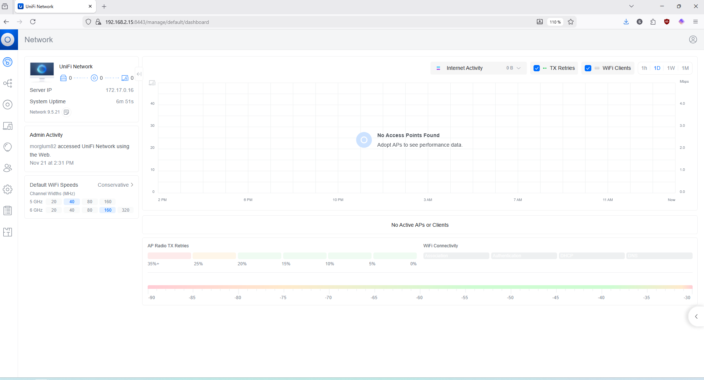
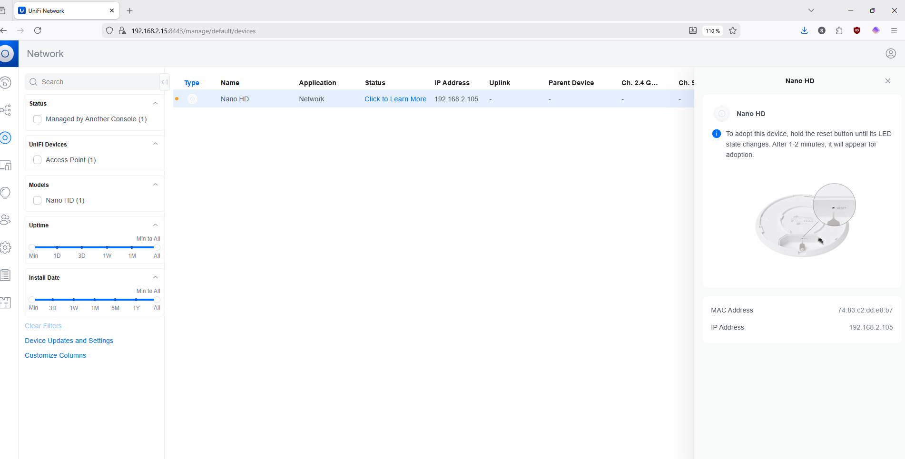
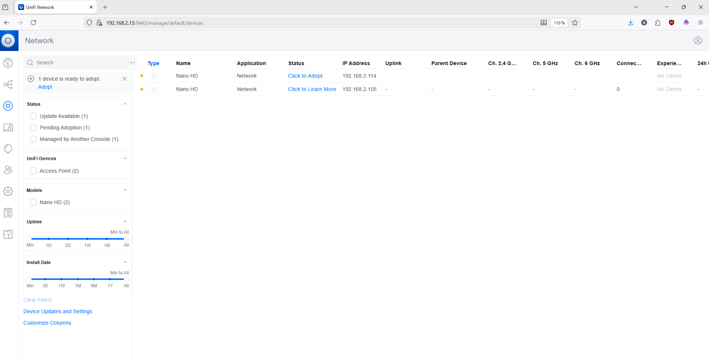
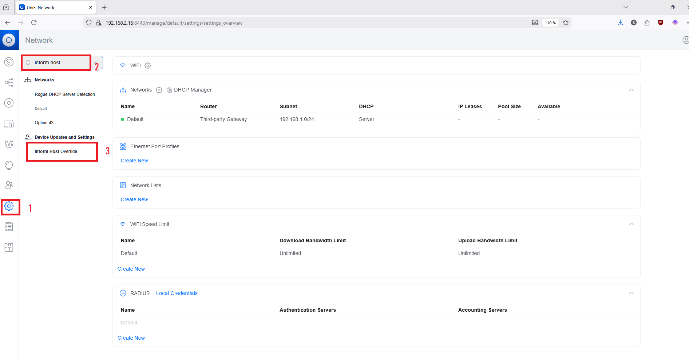
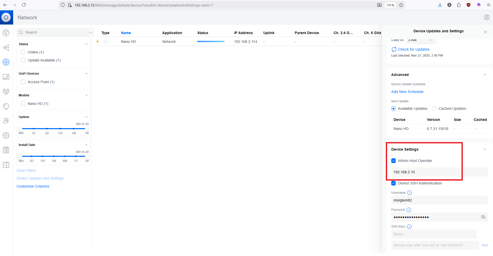
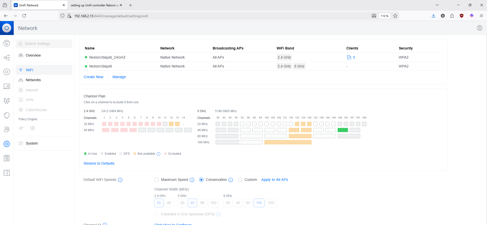

## Installer le controlleur sur unraid

-   Ce thread reddit m'a dit d'utiliser unifi-controller-reborn https://www.reddit.com/r/unRAID/comments/1dac4ii/unifi_controller_docker/

<!-- -->

-   Ce gars dans le thread m'a dit où aller pour savoir quelle version mettre dans le repository. J'ai 11notes/unifi:8.1.127-unraid. J'Ai pas trouvé "inform host" dans settings - system -advanced", mais j'explique plus loin ce que j'ai fait pour que adopting débloqe.

`As already mentioned: Unifi-Controller-Reborn works well. Make sure to read through the linked support forum post because it does not apply the latest version automatically.`

`Some things to note as far as my experience goes:`

```         
"Source" in the template needs to be set to 11notes/unifi:8.1.127-unraid or whatever is recent according to the support thread

I left the container in bridge mode as recommended

Had to change "Inform Host" (in Settings - System - Advanced) to Override with Unraid IP, because it would not adopt my AP 
```

-   Enfin, j'ai eu un problème parce que port 1900 était déjà utilisé par jellyfin. J'Ai pas investigué pcq chatgpt m'a dit que j'en avais pas besoin, alors j'Ai juste enlevé le mapping à ce port.

## Adopter le nanohd

Une fois connecté sur le controlleur ( login avec mon email addresse pour laquelle j'ai un compte sur ubiquiti), j'Ai eu peur pcq ça dit no access point found :



mais quand j'Ai cliqué à gauche sur unifi devices, j'ai vu mon nanohd, et quand j'Ai cliqué "click to learn more" je vois qu'il me dit de le reset pour qu'l appear for adoption:



et après avoir fait un refresh de mon interface j'ai vu un nouvel (?) nano hd avec bouton click to adopt



J'ai pas trouvé le "Inform Host" dans settings - advanced, mais quand j'ai fait un search pour "inform host" dans les settings j'Ai vu "Inform Host Override" .. je suis allé là et j'ai mis 192.168.2.15





## Créer le wifi

il a fallu aller dans "Wifi" pis create new . J'en ai créé un qui s'appelle "NestorUbiquiti_24GHZ" sur ce screenshot parce quqe ça marche l'ancien nom du wifi et j'Ai déjà qq clientsd qui se sont reconnecté.s J'ai exclus qq channels pour garder que le 11 et m'assurer de ne pas emmerder mon zigbee network.


